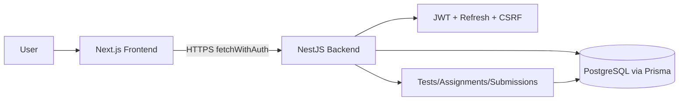

# SkillStorm – Learning Management Platform

## Overview
SkillStorm je moderní LMS pro školy, učitele a studenty. Umožňuje:
- spravovat organizace a role (RBAC, multitenancy)
- vytvářet a přiřazovat testy, sbírat výsledky a analytiku
- obsahovou knihovnu a gamifikaci pro motivaci studentů
- bezpečnou autentizaci (JWT + refresh hash, CSRF) a audit

## Tech Stack
### Frontend
- Next.js (App Router), TypeScript
- Tailwind CSS
- fetchWithAuth s auto-refresh a CSRF
- Role-based UI a permission gates

### Backend
- NestJS, TypeScript
- Prisma ORM + PostgreSQL
- JWT access + hashované refresh tokeny
- CSRF double-submit protection, org-scope enforcement
- Modulárně: Auth, Organizations, Tests, Assignments, Submissions, RBAC

### Deployment
- Docker + docker-compose
- Prisma migrations + seed (demo data)
- Dev/Prod konfigurace přes env

## Architektura
Frontend a backend komunikují přes HTTP API s jednotným envelopem `{ success, data|error }`. Backend je modulární (auth, tests, submissions, assignments) a využívá multitenancy (organizationId) a RBAC. Prisma modely pokrývají organizace, membershipy, třídy, testy, otázky, assignmenty a submissions.



## Deployment instructions
### 1) Start DB
```bash
docker-compose up -d postgres
```
### 2) Backend migrace + start
```bash
cd server
npx prisma migrate deploy
npm run start:dev
```
### Migrace (GDPR cleanup)
```bash
cd server
npx prisma migrate dev -n "gdpr_anonymization_cleanup"
npx prisma generate
```
### 3) Frontend start
```bash
cd client
npm run dev
```
### 4) Seed dat
```bash
cd server
npm run seed:demo
```

## API examples
### Login
```json
POST /auth/login
{
  "email": "teacher@demo.local",
  "password": "Passw0rd!"
}
```
### Create test
```json
POST /tests
{
  "title": "Demo Test",
  "description": "Basic math",
  "questions": [...]
}
```
### Assign test
```json
POST /tests/{id}/assign
```
### Submit test
```json
POST /submissions
```

## End-to-end scénář
1) Učitel vytvoří test a přiřadí ho třídě.  
2) Student se přihlásí, vyplní test a odešle.  
3) Backend vyhodnotí odpovědi a uloží score.  
4) Učitel vidí výsledky a statistiky testu.  
