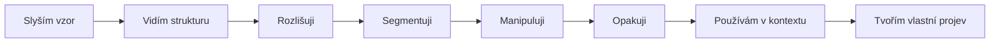
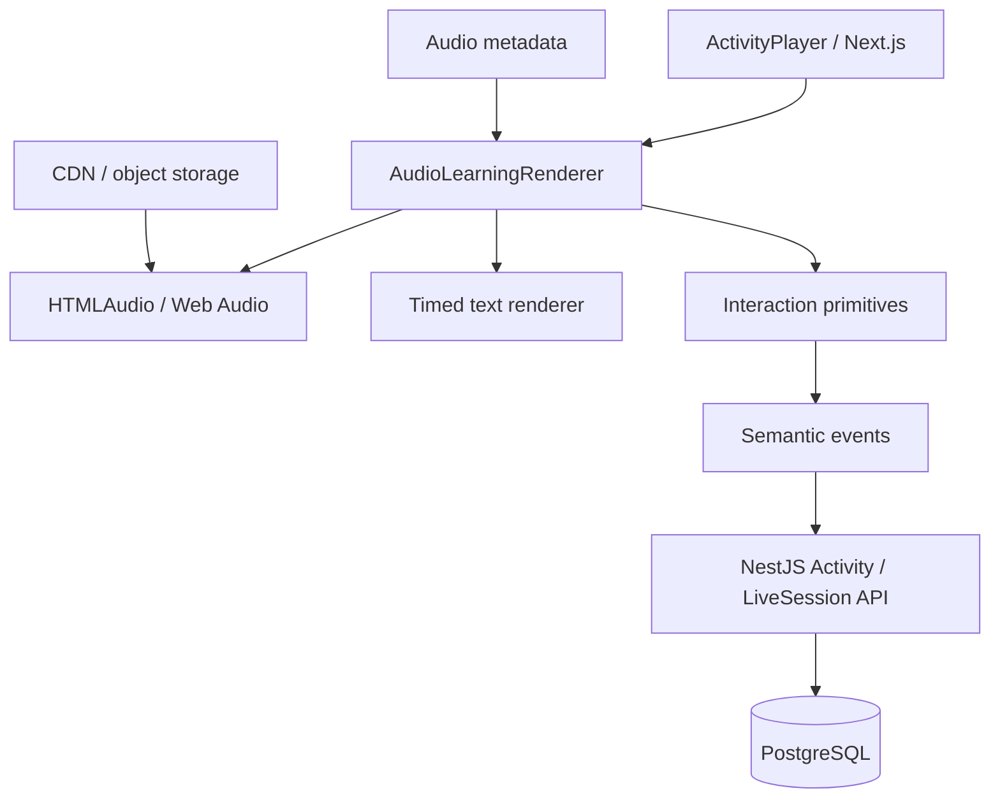
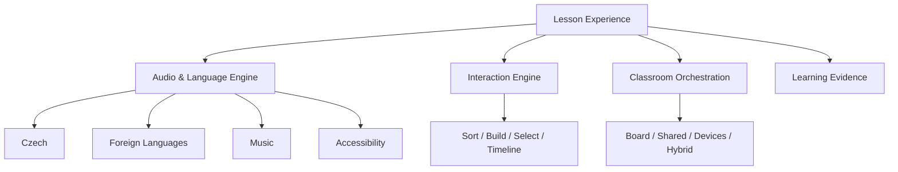

# SkillStorm Audio & Language Learning Engine

> **Status:** product, pedagogy & architecture blueprint  
> **Scope:** audio-first learning across ZŠ, with detailed recommended progression for Czech language 1.–9. grade  
> **Parent docs:** [Interactive Curriculum](./README.md) · [Master Use Cases](./USE-CASES.md)  
> **Last review:** 2026-08-07  
> **Core rule:** zvuk nesmí být dekorace. Každý audio prvek musí žákovi umožnit něco **slyšet, rozlišit, pochopit, napodobit, interpretovat nebo vytvořit**, co statický text neumí stejně dobře.

---

## 0. Proč tento dokument existuje

SkillStorm potřebuje společnou audio vrstvu, která nebude jednorázovou funkcí pro „přečti text nahlas“.

Správně navržený **Audio & Language Learning Engine** může obsloužit:

- český jazyk,
- cizí jazyky,
- hudební výchovu,
- prvouku a přírodovědu,
- literaturu,
- mediální výchovu,
- accessibility / předčítání instrukcí,
- budoucí volitelný nácvik vlastní mluvené produkce.

První hero use case je jednoduchý:

> dítě vidí **MÁ | MA**, slyší správně namluvené **„má–ma“**, první slabika se přesně v okamžiku přehrání zvýrazní a její délka je i vizuálně patrná.

To není TTS tlačítko. Je to synchronizovaný **multisenzorický learning object**.

---

## 1. Kurikulární hranice

Tento dokument navrhuje **SkillStorm recommended progression 1.–9. ročník**.

Není to státní ročníková osnova.

Revidovaný RVP ZV 2025 pracuje s očekávanými výsledky učení v uzlových bodech; konkrétní rozložení do jednotlivých ročníků řeší škola ve svém ŠVP. Proto platí:

```text
RVP / OVU
    ↓
ŠVP školy
    ↓
SkillStorm curriculum mapping
    ↓
recommended grade / age range
    ↓
konkrétní Lesson Experience
```

Produkční aktivita nesmí být publikována jako „RVP pokrytá“ pouze proto, že tematicky odpovídá tomuto dokumentu. Vazba na konkrétní OVU musí projít samostatným coverage auditem.

### Proč má audio kurikulární smysl i na 2. stupni

Audio není jen pomůcka pro prvňáky. V revidovaném RVP ZV jsou na 2. stupni výsledky spojené mimo jiné s:

- mluveným projevem přiměřeným komunikační situaci,
- využitím znalostí o jazyce a stylu,
- výslovností českých a běžně užívaných cizích slov v souladu s jazykovou normou,
- porozuměním a interpretací textu.

Audio vrstva se proto musí s věkem měnit: od **sluchového rozlišování** k **interpretaci, stylu, řečnickému projevu a kritickému poslechu**.

---

## 2. Pedagogická sekvence

Výchozí audio sekvence SkillStormu:



Ne každá lekce musí projít všemi kroky.

### 2.1 Slyším vzor

Žák nejprve dostane kvalitní model:

> 🔊 **máma**

Bez bodování. Bez nutnosti odpovídat.

### 2.2 Vidím strukturu

Audio je časově spojeno s textem:

```text
MÁ       MA
━━━━     ━━
^ právě zní
```

### 2.3 Rozlišuji

Žák rozhoduje podle sluchu:

> 🔊 „máma“

```text
[ MÁMA ]   [ MAMA ]
```

### 2.4 Segmentuji

Žák slyšené rozdělí:

```text
MÁ | MA
```

nebo později:

```text
PŘED | PON | A
```

podle cíle aktivity.

### 2.5 Manipuluji

Ze slyšeného skládá, řadí, označuje nebo porovnává.

### 2.6 Opakuji

Teprve zde může přijít vlastní hlas.

`REPEAT_AFTER_MODEL` je **volitelný režim**, nikoli podmínka audio výuky.

### 2.7 Používám v kontextu

Samostatné slovo přestává stačit. Žák pracuje s větou, dialogem, textem, situací a záměrem mluvčího.

### 2.8 Tvořím

Na vyšších ročnících je cílem vlastní:

- čtení,
- vysvětlení,
- argumentace,
- dramatizace,
- prezentace,
- podcast / audio reportáž,
- interpretace literárního textu.

---

## 3. Audio není automatické známkování výslovnosti

SkillStorm nesmí zaměnit automatickou analýzu hlasu za pedagogický soud.

### Zakázaný pattern

> „Výslovnost 63 % → známka 3.“

Důvody:

- mikrofony mají různou kvalitu,
- třída je hlučné prostředí,
- děti mají různé hlasové charakteristiky,
- automatické modely mohou být nespravedlivé k akcentům, řečovým odlišnostem nebo vadám řeči,
- jazykový projev není jedno číslo.

### Povolený pattern

> „Zkus ještě jednou. Poslechni si vzor pomalu.“

nebo pro učitele:

> „Žák použil model 3× a při třetím pokusu dokončil úlohu bez nápovědy.“

Pokud později vznikne automatická analýza vlastní produkce, má být primárně **formativní feedback**, nikoli autonomní klasifikace.

SkillStorm zároveň není logopedická diagnostika ani náhrada odborné péče.

---

## 4. Audio primitives

Activity Engine dostává společnou sadu audio interakcí.

| Primitive | Účel |
| --- | --- |
| `PLAY_AUDIO` | přehraje model / zvuk |
| `PLAY_AUDIO_SLOW` | pedagogicky připravená pomalá varianta |
| `PLAY_SEGMENT` | přehraje konkrétní hlásku, slabiku, slovo nebo úsek |
| `HIGHLIGHT_TIMED_TEXT` | synchronizuje zvuk a text |
| `LISTEN_AND_SELECT` | vyber podle toho, co slyšíš |
| `LISTEN_AND_MATCH` | spoj zvuk s textem / obrázkem / významem |
| `LISTEN_AND_ORDER` | seřaď slyšené části |
| `LISTEN_AND_BUILD` | sestav slovo / větu ze slyšeného |
| `LISTEN_AND_MARK` | označ délku, přízvuk, pauzu, významovou část apod. |
| `LISTEN_AND_COMPARE` | porovnej dva zvukové vzory |
| `READ_ALONG` | text se zvýrazňuje během modelového čtení |
| `SHADOW_MODEL` | žák opakuje po modelu bez automatického skóre |
| `RECORD_OPTIONAL` | volitelná vlastní nahrávka |
| `COMPARE_OWN_RECORDING` | přehraj model a vlastní záznam vedle sebe |
| `AUDIO_TIMELINE` | zobrazí rytmus, pauzy, segmenty nebo strukturu nahrávky |
| `DIALOGUE_TURN` | řízená replika v dialogu |
| `AUDIO_EVIDENCE` | uloží pedagogicky relevantní výsledek bez nutnosti ukládat raw audio |

Komplexní aktivita je kompozice těchto primitives.

---

## 5. Hero pattern: MÁ–MA

### 5.1 Poslech

```text
┌──────────────────────────────────────────────┐
│                👂 POSLOUCHEJ                 │
│                                              │
│                    MÁMA                      │
│                                              │
│              [ MÁ ]   [ MA ]                 │
│                 ↑                            │
│              právě zní                      │
│                                              │
│          🔊 normálně   🐢 pomalu              │
└──────────────────────────────────────────────┘
```

### 5.2 Vizuální délka

```text
MÁ      MA
━━━━    ━━
```

Délka čáry není „odpověď“. Je vizuální reprezentace zvukového trvání pro výukový účel.

### 5.3 Rozlišení

SkillStorm přehraje jedno slovo a nabídne dvě nebo více reprezentací.

### 5.4 Stavba

Žák slyší slovo a skládá ho z dostupných slabik.

### 5.5 Transfer

Po několika známých příkladech přijde nové slovo bez předchozího vizuálního modelu.

Teprve transfer poskytuje silnější learning evidence než prosté zopakování ukázky.

---

## 6. Audio asset doctrine

Ne všechno smí generovat TTS.

### 6.1 Tier A — kurátorované referenční nahrávky

Pro obsah, kde **samotná zvuková realizace je předmětem učení**, používáme lidsky nahrané a pedagogicky zkontrolované audio.

Typicky:

- hlásky,
- slabiky,
- délka samohlásek,
- problematické kontrasty,
- modelové čtení pro začínající čtenáře,
- výslovnost cílových slov,
- rytmické vzory,
- modelové dialogové repliky, pokud se hodnotí jejich zvuková podoba.

### 6.2 Tier B — kurátorovaný dlouhý obsah

Profesionálně nebo pedagogicky načtené:

- ukázky prózy,
- poezie,
- dialogy,
- dramatizace,
- poslechové texty.

### 6.3 Tier C — kvalitní TTS

TTS je vhodné pro:

- accessibility předčítání instrukcí,
- dynamicky generované delší texty,
- pomocné systémové hlášky,
- obsah, u kterého zvuk není cílovým jazykovým modelem.

### Hard rule

**TTS nesmí být automaticky považováno za referenční fonetický vzor.**

---

## 7. Audio metadata

Audio asset není jen URL na MP3.

Příklad:

```yaml
id: cs-word-mama-v1
locale: cs-CZ
text: "máma"
audioRole: PRONUNCIATION_MODEL
speakerProfile: adult-standard-czech-01
segments:
  - id: seg-1
    text: "má"
    startMs: 0
    endMs: 520
    kind: SYLLABLE
    vowelLength: LONG
  - id: seg-2
    text: "ma"
    startMs: 560
    endMs: 910
    kind: SYLLABLE
    vowelLength: SHORT
variants:
  normal: /audio/cs/mama/normal.opus
  slow: /audio/cs/mama/slow.opus
transcript: "máma"
qaStatus: APPROVED
version: 1
```

Metadata umožní:

- přesné highlighty,
- přehrání segmentu,
- alternativní tempo,
- automatickou tvorbu aktivit nad stejným assetem,
- pozdější lokalizaci.

---

## 8. Asset pipeline


### Minimální QA pro referenční jazykový asset

- text odpovídá nahrávce,
- jazykový model je vhodný pro cílovou úlohu,
- segment timing sedí,
- normální a pomalá varianta zachovávají cílový jev,
- není přítomný rušivý šum,
- hlasitost je normalizovaná,
- asset má textový ekvivalent,
- asset má verzi a audit trail.

---

## 9. Technická architektura

Audio engine nesmí vyžadovat nový technologický stack aplikace.



### 9.1 Playback layer

Základní playback musí podporovat:

- preload,
- play / pause,
- replay,
- segment playback,
- normální / pomalou variantu,
- synchronizované cue events,
- bezpečný restart po přerušení,
- touch ovládání na tabuli,
- klávesnici.

### 9.2 Mikrofon je samostatný capability

`microphoneRequired = false` je default.

Aktivita musí explicitně deklarovat:

```yaml
microphone:
  required: false
  optional: true
  purpose: REPEAT_AFTER_MODEL
```

Board-only lekce nesmí při otevření automaticky žádat přístup k mikrofonu.

---

## 10. Delivery modes

### `BOARD_ONLY`

Ideální zejména pro 1. stupeň a společný poslech.

Učitel:

- pustí vzor,
- zpomalí jej,
- přehraje segment,
- vyvolá žáka k tabuli,
- nechá třídu společně opakovat,
- zaznamená společný nebo individuální průchod pouze pokud chce.

### `SHARED_DEVICES`

Skupiny dostanou různé audio příklady.

Příklad:

- skupina A řeší délku samohlásek,
- B pořadí slabik,
- C význam podle intonace,
- D poslechový text.

Na tabuli se skládají agregované výsledky.

### `DEVICES`

Každý žák má sluchátka.

Výhody:

- individuální tempo,
- opakování bez rušení,
- personalizované scaffolding,
- volitelná vlastní nahrávka.

### `HYBRID`

Společný model na tabuli + individuální nebo skupinový transfer na zařízeních.

**Teacher decides.** Audio obsah nesmí být uzamčen na jediný hardware setup.

---

## 11. Teacher controls

Teacher toolbar pro audio aktivitu:

```text
┌─────────────────────────────────────────────────────┐
│ 🔊 Máma · modelový poslech                         │
│                                                     │
│ [▶ normálně] [🐢 pomalu] [◀ segment] [↻ znovu]     │
│                                                     │
│ Zobrazení:                                          │
│ ☑ zvýraznit právě znějící část                      │
│ ☑ zobrazit členění                                   │
│ ☐ zobrazit řešení                                    │
│                                                     │
│ Režim třídy: BOARD_ONLY ▾                           │
│                                                     │
│ [ Další příklad ]  [ Transfer úloha ]               │
└─────────────────────────────────────────────────────┘
```

Učitel musí mít možnost:

- přeskočit model,
- přehrát jej libovolněkrát,
- skrýt vizuální podporu,
- zapnout podporu až po chybě,
- přepnout skupinu / variantu,
- vypnout soutěžní prvky,
- ukončit automatické hodnocení.

---

## 12. Learning evidence

Playback není learning evidence.

Silnější důkazy jsou například:

- správně rozlišený nový zvukový kontrast,
- správně segmentované nové slovo,
- sestavení slova pouze podle zvuku,
- interpretace intonace v nové situaci,
- shrnutí poslechového textu,
- vhodně zvolená mluvená formulace pro situaci,
- vlastní argumentace / prezentace s učitelským rubrikovým hodnocením.

Příklad eventů:

```json
{"type":"AUDIO_MODEL_PLAYED","assetId":"cs-word-mama-v1","variant":"normal"}
{"type":"AUDIO_SEGMENT_REPLAYED","segmentId":"seg-1"}
{"type":"LISTEN_SELECT_SUBMITTED","itemId":"mama-long-first","correct":true}
{"type":"TRANSFER_COMPLETED","objective":"VOWEL_LENGTH_DISCRIMINATION","correct":true}
```

### Nezahlcovat analytiku

Teacher dashboard nepotřebuje vidět každý `PLAY`.

Primárně agregujeme:

- počet nápověd,
- počet replayů, pokud pedagogicky něco signalizují,
- misconception pattern,
- transfer performance,
- dokončený checkpoint.

---

## 13. Privacy

### Playback-only

Nepracuje s hlasem dítěte a nepotřebuje mikrofon.

### Volitelná nahrávka

Pokud žák nahrává vlastní hlas:

1. účel musí být jasně deklarován,
2. sběr má být minimalizovaný,
3. raw audio se defaultně neukládá dlouhodobě,
4. pokud stačí lokální playback „model vs. já“, může nahrávka zůstat pouze v klientovi,
5. dlouhodobé uchování vyžaduje explicitní produktový a právní důvod,
6. board projection nesmí veřejně přehrávat individuální žákovskou nahrávku bez učitelova vědomého kroku.

### Default

> **Do not store raw child audio unless the learning use case truly requires it.**

---

## 14. Accessibility / SVP

Audio zvyšuje dostupnost pro některé žáky, ale může ji zároveň snížit pro jiné.

Každý audio use case proto musí mít:

- textový ekvivalent,
- vizuální stav přehrávání,
- možnost replay,
- nastavitelné tempo pomocí připravené pedagogické varianty tam, kde mění tempo význam úlohy,
- titulky / transcript pro delší mluvený obsah,
- možnost splnit ne-audio cíl alternativním způsobem, pokud samotný sluch není cílem úlohy,
- žádný význam přenášený pouze barvou,
- velké ovládací prvky pro tabuli,
- keyboard access.

Pokud je **sluchové rozlišování samotným vzdělávacím cílem**, alternativa nesmí falešně předstírat, že měří totéž. V takovém případě se aktivita označí jako nevhodná pro danou potřebu a nabídne se pedagogická alternativa.

---

# 15. Český jazyk — recommended progression 1.–9. ročník

> **Pozor:** následující rozdělení je produktové doporučení SkillStormu. Konkrétní škola jej musí umět přemapovat na vlastní ŠVP a oficiální OVU.

Cílem není vytvořit devět izolovaných „ročníkových aplikací“.

Stejné enginy se postupně transformují:

```text
1.–2.  zvuk ↔ písmeno ↔ slabika ↔ slovo
3.–5.  věta ↔ význam ↔ čtení ↔ komunikace
6.–7.  jazykový systém ↔ styl ↔ kontext
8.–9.  interpretace ↔ argumentace ↔ veřejný a mediální projev
```

---

## 16. 1. ročník — Slovo ožije

### Produktový cíl

Dítě má získat zkušenost, že mluvené slovo:

- má zvukovou strukturu,
- lze rozdělit na části,
- souvisí s grafickou podobou,
- nese význam,
- lze znovu složit.

Audio je zde **core modality**, ne doplněk.

### Doporučené Lesson Experiences

#### CZ1-A01 — Slyšíš stejný začátek?

SkillStorm přehraje dvě až čtyři slova.

Žák určuje:

- stejnou počáteční hlásku,
- odlišný začátek,
- správný obrázek.

**Mode:** `BOARD_ONLY` / `SHARED_DEVICES`.

#### CZ1-A02 — MÁ–MA: délka ve slově

Pattern:

> poslech → timed highlight → porovnání → výběr → transfer.

Nejde o mechanické vysvětlování značek; dítě má nejprve **slyšet rozdíl**.

#### CZ1-A03 — Rozstříhej slovo ušima

🔊 „kočka“

Na tabuli jsou manipulovatelné segmenty.

Podle fáze výuky mohou být segmenty:

- slabiky,
- jednoduché zvukové části,
- později písmena.

#### CZ1-A04 — Slož, co slyšíš

Audio zahraje slovo a žák sestaví jeho grafickou podobu z omezené nabídky.

#### CZ1-A05 — Čti se mnou

Krátká věta je synchronizovaná s modelovým čtením.

SkillStorm zvýrazňuje právě čtenou část, ale nesmí dítě nutit sledovat karaoke rychlost; učitel může model kdykoli zastavit a vrátit.

#### CZ1-A06 — Co jsi slyšel?

Velmi krátká poslechová mikro-situace + jedna obsahová otázka.

Cílem není test paměti na detaily, ale porozumění.

### Teacher view

Učitel nepotřebuje skóre každé hlásky.

Potřebuje vidět například:

- třída opakovaně zaměňuje cílový kontrast,
- většina zvládla transfer bez vizuální podpory,
- doporučeno zopakovat model před dalším krokem.

### Co v 1. třídě nedělat

- veřejné leaderboardy rychlosti čtení,
- automatickou známku z mikrofonu,
- dlouhé instrukce,
- povinné přihlášení každého dítěte pro board activity,
- „gamifikaci“, která přehluší samotný zvuk.

---

## 17. 2. ročník — Od dekódování k plynulému významu

### Produktový cíl

Audio se posouvá od jednotlivých slov k větám, čtení a významu.

### Lesson Experiences

#### CZ2-A01 — Délka mění podobu slova

Poslechové porovnávání cílových dvojic a nových slov.

SkillStorm nesmí vyrábět umělé dvojice jen proto, aby hra vyšla; content team pracuje s jazykově smysluplnými příklady.

#### CZ2-A02 — Věta něco říká i hlasem

Stejná nebo podobná textová struktura v různých intonačních realizacích.

Žák rozlišuje například:

- otázku,
- oznámení,
- výzvu,
- emocionální zabarvení tam, kde je pro úlohu relevantní.

#### CZ2-A03 — Punctuation by listening

Žák slyší krátkou větu a doplňuje vhodné ukončení / členění.

Neučíme „intonace vždy jednoznačně diktuje interpunkci“. Aktivita je didakticky řízená a používá příklady, kde je spojení záměrně jasné.

#### CZ2-A04 — Echo reading

Model přečte krátký úsek, třída nebo žák jej opakuje.

Mikrofon není nutný.

#### CZ2-A05 — Poslechni a seřaď děj

Krátký příběh → 3–5 obrázků / vět → žák sestaví pořadí.

#### CZ2-A06 — Kdo to řekl?

Krátký dialog; žák přiřazuje repliky postavám a sleduje komunikační situaci.

### Learning evidence

- porozumění krátkému poslechu,
- správné pořadí děje,
- sluchové rozlišení cílového jevu,
- využití modelu bez nadměrného replay.

---

## 18. 3. ročník — Věta, význam a komunikace

### Produktový cíl

Dítě už nemá pracovat jen se zvukovou mechanikou. Audio se stává zdrojem **významu a komunikační situace**.

### Lesson Experiences

#### CZ3-A01 — Jedna věta, různé záměry

SkillStorm přehraje několik realizací podobné věty.

Žák určuje:

- prosbu,
- otázku,
- důraz,
- překvapení,
- neutrální sdělení.

Cílem není psychologicky hádat emoce, ale vnímat vztah zvukové podoby a komunikačního záměru v jasném kontextu.

#### CZ3-A02 — Poslechová mapa příběhu

Během krátkého poslechu žák skládá:

- kdo,
- kde,
- co se stalo,
- v jakém pořadí.

#### CZ3-A03 — Stopni nesmysl

Audio příběh obsahuje logickou nebo významovou nekonzistenci. Žák zastaví přehrávání v místě, kde ji zaznamená, a vysvětlí proč.

#### CZ3-A04 — Diktát jinak

Ne primárně „napiš celý diktát“.

Interaktivní varianty:

- vyber slyšené slovo,
- doplň chybějící část,
- sestav větu,
- porovnej vlastní zápis s modelem,
- vysvětli chybu.

#### CZ3-A05 — Čtenářské divadlo

Postavy, krátké repliky, modelové audio, následně skutečná společná dramatizace mimo obrazovku.

SkillStorm řídí průběh, ale **nenahrazuje živé mluvení**.

---

## 19. 4. ročník — Jazyk v situaci

### Produktový cíl

Přesun od techniky čtení k:

- slovní zásobě,
- významu,
- práci s delším textem,
- mluvenému projevu,
- perspektivě mluvčího.

### Lesson Experiences

#### CZ4-A01 — Slovo podle kontextu

Žák slyší stejné / příbuzné slovo v různých větách a pracuje s významem podle kontextu.

#### CZ4-A02 — Která replika sem patří?

Audio dialog se zastaví. Žák vybírá vhodné pokračování podle komunikační situace.

#### CZ4-A03 — Jak to přečteš?

Textový úsek + několik modelových interpretací.

Žák porovnává, která realizace odpovídá smyslu textu.

#### CZ4-A04 — Poslechni, vyber podstatné

Krátké sdělení; žák vybírá podstatné informace a odlišuje je od detailů.

#### CZ4-A05 — Audio komiks

Obrázkový příběh + zvukové repliky. Žáci skládají správné přiřazení a následně vytvářejí vlastní pokračování.

---

## 20. 5. ročník — Čtenář, posluchač, vypravěč

### Produktový cíl

Na konci 1. stupně má audio engine podporovat zejména:

- porozumění poslechu,
- práci s textem,
- slovní zásobu,
- tvořivou práci s literárním textem,
- vyjádření prožitku a interpretace,
- kultivovaný mluvený projev přiměřený věku.

To dobře navazuje na revidovaný RVP, který v uzlovém bodu 5. ročníku pracuje například s tvořivou prací s uměleckým textem a vyjadřováním prožitků ze čtení či poslechu.

### Lesson Experiences

#### CZ5-A01 — Poslechový detektiv

Krátký příběh / reportáž.

Žák:

1. nejprve predikuje,
2. poslouchá,
3. vybírá klíčové informace,
4. rozlišuje explicitní informace a vlastní závěr,
5. vysvětluje, z čeho závěr odvodil.

#### CZ5-A02 — Stejný text, jiná interpretace

Dvě kvalitní zvukové realizace stejného krátkého textu.

Žák porovnává tempo, důraz, pauzy a účinek.

Neexistuje automaticky jediná „správná herecká interpretace“.

#### CZ5-A03 — Tvořivé pokračování

Poslech se zastaví v rozhodujícím místě.

Třída nebo skupiny vytvoří vlastní pokračování a porovnají jej s originálem.

#### CZ5-A04 — Od poslechu k vlastnímu vyprávění

Strukturované body z poslechu → žák převypráví obsah vlastními slovy.

#### CZ5-A05 — Audio newsroom junior

Skupiny dostanou fakta a vytvoří krátké mluvené zpravodajství.

SkillStorm poskytne:

- časovou strukturu,
- checklist,
- modelový příklad,
- peer feedback rubriku.

---

## 21. 6. ročník — Zvuková stránka jazyka a komunikační situace

### Produktový cíl

Na 2. stupni už audio nesmí působit infantilně.

Vizuální styl přechází od „kartiček se slabikami“ k **Language Studio**.

### Lesson Experiences

#### CZ6-A01 — Language Studio: model vs. situace

Žák slyší několik variant sdělení a určuje, která je vhodná pro:

- rozhovor s kamarádem,
- komunikaci s učitelem,
- veřejné oznámení,
- formálnější situaci.

#### CZ6-A02 — Přízvuk, pauza a srozumitelnost

Práce s krátkou větou.

SkillStorm vizualizuje členění a umožní porovnat modely.

Cílem není naučit jedno mechanické „správné tempo“, ale ukázat, že zvukové členění ovlivňuje srozumitelnost.

#### CZ6-A03 — Poslechová editace

Žák slyší neobratné, příliš monotónní nebo komunikačně nevhodné sdělení a navrhuje úpravu.

#### CZ6-A04 — Literature Voice

Krátký literární text: modelové čtení → významové členění → vlastní interpretace ve dvojici / skupině.

#### CZ6-A05 — Instructions Lab

Žák poslouchá instrukci a podle ní sestaví postup / objekt / pořadí. Následně sám vytvoří instrukci pro jinou skupinu.

Audio zde měří **funkčnost komunikace**, ne krásu hlasu.

---

## 22. 7. ročník — Slovní zásoba, styl a význam

### Produktový cíl

Audio vrstva se používá k práci s:

- kontextem,
- významem slov,
- stylovou vhodností,
- přejatými slovy,
- dialogem,
- argumentačním zárodkem.

### Lesson Experiences

#### CZ7-A01 — Jedno sdělení, tři registry

Stejný obsah zazní jako:

- neformální zpráva,
- školní prezentace,
- veřejné oznámení.

Žák analyzuje rozdíly.

#### CZ7-A02 — Borrowed Words Studio

Modelová výslovnost běžně používaných přejatých slov v kontextu.

Žák pracuje s:

- poslechem,
- pravopisem,
- významem,
- vhodným použitím.

#### CZ7-A03 — Dialog Repair

Audio dialog obsahuje komunikační problém:

- nejasnost,
- nevhodnou formulaci,
- přerušování,
- nereagování na otázku.

Žáci navrhují opravu a sehrají lepší variantu.

#### CZ7-A04 — Podcast summary

Krátký audio vstup → poznámky → shrnutí do stanoveného času.

#### CZ7-A05 — Jak změnil důraz význam?

Dvě realizace jedné věty s různým důrazem v předem daném kontextu.

Žák vysvětluje účinek.

---

## 23. 8. ročník — Interpretace, syntax a veřejný projev

### Produktový cíl

Audio se stává nástrojem pro:

- interpretaci složitějšího sdělení,
- práci se syntaxí a členěním,
- argumentaci,
- prezentaci,
- literární interpretaci.

### Lesson Experiences

#### CZ8-A01 — Syntax through voice

Žák pracuje s delší větou a sleduje:

- pauzy,
- významové celky,
- možnou nejednoznačnost,
- vztah zvukového členění k porozumění.

Audio není důkaz syntaktické struktury samo o sobě; je další reprezentací pro její pochopení.

#### CZ8-A02 — Argument Clinic

Krátký mluvený argument.

Žák rozlišuje:

- tvrzení,
- důvod,
- příklad / doklad,
- emocionální apel.

#### CZ8-A03 — Interview Lab

Žáci připraví otázky, poslechnou modelové interview a následně vedou vlastní rozhovor.

SkillStorm hlídá strukturu a poskytuje rubriku, nikoli automatický soud kvality člověka.

#### CZ8-A04 — Literature Performance

Poezie nebo próza:

- poslech dvou interpretací,
- práce s textem,
- vlastní interpretační volba,
- reflexe „proč jsem četl právě takto“.

#### CZ8-A05 — Audio fact vs. opinion

Krátký mluvený mediální obsah. Žák rozlišuje tvrzení, hodnocení a argumentaci.

---

## 24. 9. ročník — Jazyk jako nástroj veřejné komunikace

### Produktový cíl

Na konci ZŠ má audio engine pomáhat žákovi **vědomě volit a hodnotit způsob mluvené komunikace**.

To navazuje na oficiální OVU 2. stupně zaměřené na vhodný mluvený/písemný projev podle situace a na výslovnost českých a běžně užívaných cizích slov v souladu s jazykovou normou.

### Lesson Experiences

#### CZ9-A01 — Pronunciation & Context Studio

Ne drill jednotlivých slov bez souvislosti.

Pattern:

```text
model slova
↓
model ve větě
↓
význam / původ / použití
↓
volba vhodné realizace v situaci
↓
volitelná vlastní produkce
```

#### CZ9-A02 — Rhetoric Lab

Žák slyší několik verzí krátkého projevu.

Analyzuje:

- strukturu,
- tempo,
- důraz,
- argumentaci,
- práci s publikem,
- přiměřenost situaci.

#### CZ9-A03 — Media Voice

Stejná událost prezentovaná různými mluvčími / styly.

Žák zkoumá:

- fakta vs. komentář,
- hodnotící formulace,
- práci s emocí,
- co ve sdělení chybí,
- jak zvuková realizace ovlivňuje dojem.

#### CZ9-A04 — 90-second explanation

Žák připraví a přednese krátké vysvětlení komplexnějšího tématu.

SkillStorm poskytuje:

- strukturu,
- timer,
- rubriku,
- možnost nahrát se pouze pokud je to zapnuté,
- self-reflection.

Automatické hodnocení může kontrolovat technické věci typu délky, nikoli nahrazovat učitele při hodnocení kvality argumentace.

#### CZ9-A05 — Debate Evidence

Týmová debata.

SkillStorm:

- rozdělí role,
- spravuje čas,
- zobrazuje tvrzení a doklady,
- umožní peer feedback,
- ukládá argumentační learning evidence.

#### CZ9-A06 — Graduation audio portfolio

Volitelný souhrn mluvených výstupů 9. ročníku:

- prezentace,
- interpretace textu,
- interview,
- argumentace.

Pokud škola ukládá audio, musí to být vědomý privacy režim, ne automatický default.

---

## 25. Vizuální transformace podle věku

Stejný engine nesmí v 9. třídě vypadat jako aplikace pro prvňáka.

### 1.–2.

- velké texty,
- minimum ovládání,
- obrázky,
- jasný stav „posloucháme“,
- velké replay tlačítko.

### 3.–5.

- více textu,
- příběhy,
- jednoduchá timeline,
- týmové úkoly.

### 6.–7.

- `Language Studio`,
- waveform / timeline pouze pokud má pedagogickou hodnotu,
- civilnější design,
- kontextové scénáře.

### 8.–9.

- mediální / studiový vzhled,
- argument map,
- transcript,
- annotation,
- rubriky,
- práce s více audio zdroji.

---

## 26. Scaffolding

Audio support se mění nezávisle na obtížnosti.

Příklady:

### High support

- obrázek + text,
- segmented playback,
- pomalá varianta,
- možnost přehrát jednotlivou část,
- menší počet možností,
- automatický highlight.

### Standard

- normální audio,
- text pouze podle potřeby,
- omezený replay bez penalizace.

### Low support

- audio bez předchozího vizuálního modelu,
- transfer na nový příklad,
- vlastní vysvětlení.

Replay nesmí být trestán jako „chyba“. Může být learning signal, ne penalty.

---

## 27. Authoring model

Content editor nesmí vyžadovat ruční programování každé audio aktivity.

Příklad definition:

```yaml
activityType: LISTEN_AND_SELECT
prompt: "Které slovo jsi slyšel?"
audio:
  assetId: cs-word-mama-v1
  defaultVariant: normal
  allowSlow: true
  allowSegmentReplay: true
options:
  - id: long-short
    text: "MÁMA"
    correct: true
  - id: short-short
    text: "MAMA"
    correct: false
scaffolding:
  high:
    timedHighlight: true
    showSegments: true
  standard:
    timedHighlight: false
  low:
    hideTextUntilAnswer: true
```

Authoring UI pak může generovat varianty nad stejným audio assetem bez duplikace nahrávek.

---

## 28. Suggested data model

Cílová doména, nikoli okamžitý Prisma migration plan:

```text
AudioAsset
  id
  locale
  kind
  currentVersionId

AudioAssetVersion
  id
  audioAssetId
  text
  transcript
  speakerProfile
  qaStatus
  metadataJson
  createdAt

AudioVariant
  id
  audioAssetVersionId
  variantType NORMAL | SLOW | EXPRESSIVE | OTHER
  storageKey
  durationMs

AudioSegment
  id
  audioAssetVersionId
  label
  text
  startMs
  endMs
  segmentType
  metadataJson

ActivityAudioBinding
  activityVersionId
  audioAssetVersionId
  role
  configJson
```

Raw child recordings, pokud někdy vzniknou, **nepatří automaticky do této knihovny assetů**. Mají vlastní privacy lifecycle.

---

## 29. Realtime / Live Session protocol

Do WebSocketu neposílat audio stream celé třídě, pokud není opravdu potřeba.

Board klient a studentské klienty si načtou asset přes CDN a session pouze synchronizuje významné události.

Například:

```text
AUDIO_CUE_START
AUDIO_CUE_PAUSE
AUDIO_CUE_SEEK
AUDIO_CUE_FINISH
ACTIVITY_STAGE_CHANGED
REVEAL_VISUAL_SUPPORT
```

U `BOARD_ONLY` je učitelův klient hlavním controllerem.

U `DEVICES` není nutné, aby všech 30 žáků slyšelo audio ve stejné milisekundě, pokud lesson design nevyžaduje synchronní poslech.

---

## 30. Offline / slabá školní Wi-Fi

Audio lekce nesmí selhat proto, že ve třídě na chvíli kolísá internet.

Před spuštěním lesson experience:

- preload klíčových audio assetů,
- indikátor readiness,
- lokální cache v mezích web platformy,
- žádné runtime generování zásadního referenčního audia přes vzdálené TTS API.

Teacher screen může před startem ukázat:

> **Audio připraveno · 18/18 assetů**

---

## 31. Quality gates

Referenční audio aktivita nemůže být `PUBLISHED`, pokud:

- chybí audio asset,
- chybí transcript / textový ekvivalent,
- segmenty odkazují mimo délku audia,
- aktivita používá `PLAY_SEGMENT`, ale asset nemá segment metadata,
- chybí pedagogické objective,
- chybí target age / grade range,
- referenční pronunciation asset nemá linguistic QA,
- audio-only aktivita neřeší accessibility contract.

### Automated validation

Co lze kontrolovat automaticky:

- existence assetu,
- duration,
- metadata schema,
- segment boundaries,
- duplicate IDs,
- broken references,
- chybějící transcript,
- podporované delivery modes.

### Human validation

Co musí zůstat lidské:

- kvalita jazykového vzoru,
- vhodnost pro věk,
- přirozenost,
- didaktická smysluplnost,
- zda slow variant nezkresluje cílový jev,
- zda příklad neučí zavádějící pravidlo.

---

## 32. Anti-goals

Audio Engine není:

- robotická čtečka každého textu,
- logopedická diagnostika,
- systém automatických známek z hlasu,
- povinný voice recorder dětí,
- karaoke efekt bez pedagogického cíle,
- cloud ASR dependency pro základní funkčnost,
- náhrada učitele při hodnocení argumentace nebo interpretace.

---

## 33. MVP roadmap

### Phase A — Playback foundation

- `AudioAssetVersion`,
- normal + slow variants,
- segment metadata,
- `PLAY_AUDIO`,
- `PLAY_SEGMENT`,
- timed text highlight,
- board controls,
- preload.

### Phase B — First-grade vertical slice

Hero pack:

- 30–50 pečlivě vybraných slov,
- hláskové / slabikové příklady,
- délka samohlásek,
- `LISTEN_AND_SELECT`,
- `LISTEN_AND_BUILD`,
- `READ_ALONG`,
- 2–3 plné 20–30min Lesson Experiences.

### Phase C — Listening comprehension

- krátké příběhy,
- ordering,
- key-information selection,
- teacher aggregate view.

### Phase D — Language Studio 2. stupně

- multiple audio models,
- transcript annotation,
- context / style activities,
- pronunciation model for selected Czech and commonly used foreign words,
- rhetoric / media analysis.

### Phase E — Optional microphone

Až poté:

- local recording,
- model vs. self playback,
- privacy controls,
- případně formativní acoustic feedback tam, kde je validovaný.

**Mikrofon není blocker MVP.**

---

## 34. Acceptance criteria prvního produkčního balíku

První audio vertical slice je úspěšný pouze pokud:

1. funguje na jedné interaktivní tabuli bez studentských zařízení,
2. dítě může model přehrát normálně i pomalu,
3. textové segmenty se přesně synchronizují,
4. učitel může vizuální podporu skrýt / odhalit,
5. existuje transfer úloha, ne jen replay,
6. aktivita vytváří learning evidence bez ukládání dětského hlasu,
7. audio funguje i po krátkém výpadku sítě díky prefetch,
8. referenční asset prošel linguistic + pedagogical QA,
9. UI je touch-friendly,
10. stejný engine umí alespoň tři různé activity patterns.

---

## 35. Hero lesson: 1. třída — Slyším, vidím, skládám

### Hardware

- učitelský notebook,
- interaktivní tabule,
- reproduktory,
- žádný tablet nutný.

### 0–3 min — Hook

Obrazovka je téměř prázdná.

SkillStorm pouze přehraje:

> 🔊 **MÁMA**

Učitel se ptá, co děti slyšely.

### 3–8 min — Zvuk dostane strukturu

Objeví se:

```text
MÁ      MA
━━━━    ━━
```

Přehrání je synchronizované se segmenty.

### 8–13 min — Rozlišení

SkillStorm pouští další krátké příklady a třída vybírá / označuje cílový jev.

### 13–18 min — Build

Dítě přijde k tabuli a ze slyšeného skládá slovo.

### 18–23 min — Transfer

Nové slovo bez předchozího vizuálního modelu.

### 23–27 min — Physical transfer

Obrazovka ustoupí.

Učitel vyslovuje / děti pracují s kartičkami, tabulkou nebo sešitem.

SkillStorm **neuzavírá dítě do obrazovky**.

### 27–30 min — Evidence

Krátký anonymní board checkpoint nebo individuální mini-úloha podle režimu třídy.

Teacher recap:

```text
Délku cílového zvuku v novém slově rozlišila většina třídy.
6 pokusů potřebovalo pomalý model.
Doporučení: příště začít transferem bez vizuální nápovědy.
```

---

## 36. Hero lesson: 9. třída — Jak zní přesvědčivý argument?

Stejný Audio Engine, úplně jiný zážitek.

### 0–5 min

Dvě 45sekundová audio sdělení na stejné téma.

### 5–12 min

Třída označuje:

- tvrzení,
- důvody,
- hodnotící formulace,
- místa se silným důrazem.

### 12–20 min

Skupiny porovnávají obsah vs. zvukový účinek.

### 20–30 min

Každá skupina upraví slabší argument.

### 30–38 min

Vlastní krátký přednes; recording pouze pokud učitel zvolí.

### 38–45 min

Reflexe pomocí rubriky:

- srozumitelnost,
- argumentační struktura,
- přiměřenost situaci,
- práce s posluchačem.

To je důkaz, že Audio Engine není feature „pro malé děti“.

---

## 37. Vztah k dalším SkillStorm engines



Audio engine tedy není nový produkt uvnitř produktu. Je to **shared capability**.

---

## 38. Budoucí přesah do cizích jazyků

Stejný základ dovolí:

```text
HEAR
↓
NOTICE
↓
DISTINGUISH
↓
MATCH MEANING
↓
SHADOW
↓
USE IN DIALOGUE
↓
CREATE OWN RESPONSE
```

Cizí jazyk bude mít vlastní subject blueprint; nesmí se pouze přeložit české aktivity.

---

## 39. Budoucí přesah do hudební výchovy

Audio timeline, timed cues a playback infrastruktura jsou znovupoužitelné pro:

- rytmus,
- délku,
- melodický model,
- poznávání nástrojů,
- formu skladby,
- společnou rytmickou práci.

Hudební engine ale bude potřebovat další primitives pro beat / pitch / musical timing; nemá být skrytě hardcodovaný do jazykového modelu.

---

## 40. Sources & validation notes

Kurikulární návrh je určen k mapování proti **revidovanému RVP ZV 2025** a ŠVP konkrétních škol. Pro produkční coverage se používají aktuální oficiální zdroje NPI / MŠMT; inspirativní ročníkové rozložení v tomto dokumentu samo o sobě není normativní.

Relevantní oficiální podpůrný zdroj:

- NPI MojeEdu — RVP 2025 a metodické materiály: https://mojeedu.npi.cz/

Technický foundation pro browser audio:

- MDN Web Audio API: https://developer.mozilla.org/en-US/docs/Web/API/Web_Audio_API

Před implementací produkčních pronunciation modelů je nutný samostatný linguistic content review a definice audio production standardu.

---

# Závěr

Nejsilnější verze SkillStorm Audio & Language Engine není:

> **„Klikni a počítač ti přečte slovo.“**

Je:

> **„Slyš jazyk, uvidíš jeho strukturu, pracuj s ní, použij ji v nové situaci a postupně vytvoř vlastní projev.“**

Pro 1. třídu to může znamenat **MÁ–MA** na jediné interaktivní tabuli.

Pro 9. třídu stejná infrastruktura umožní analyzovat argument, interpretaci, mediální sdělení a vlastní veřejný projev.

To je cílová laťka.