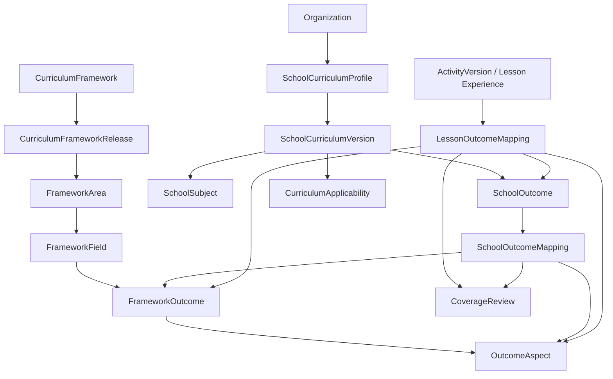

# SkillStorm Interactive Curriculum — Curriculum Data Contract

> **Status:** `CURRENT / NORMATIVE`  
> **Owner:** Curriculum + Product + Backend  
> **Last verified:** 2026-08-07  
> **Scope:** RVP/ŠVP versioning, school curriculum profiles, outcome mappings, coverage semantics, planning/delivery state a vazba na learning evidence  
> **Parent contract:** [`PRODUCTION-CONTRACT.md`](./PRODUCTION-CONTRACT.md)  
> **Migration rule:** tento dokument definuje cílový normativní model pro nový curriculum layer. Neříká, že všechny zde uvedené tabulky již existují.

---

## 0. Problém, který tento kontrakt řeší

SkillStorm nesmí zaměnit:

```text
RVP
ŠVP školy
předmět v rozvrhu
ročník
tematický plán
Lesson Experience
learning evidence
```

za jednu tabulku `Subject/Topic`.

Současný doménový model SkillStormu (`Subject`, `SubjectLevel`, `TopicLevel`, `Assignment` a další existující entity) zůstává důležitý pro obsah a výuku. Pro produkční ŠVP integraci však potřebujeme další **curriculum provenance + mapping layer**, která umožní:

- více RVP release současně,
- více verzí ŠVP jedné školy,
- jinou applicability podle školního roku a ročníku,
- integrované školní předměty,
- immutable historii,
- pedagogicky schvalované mappingy,
- poctivé coverage metriky,
- oddělit „máme obsah“ od „odučili jsme to“ a „žák to zvládl“.

---

# 1. Terminologie

## `CurriculumFramework`

Rodina kurikula, například:

```text
CZ_RVP_ZV
```

Neurčuje konkrétní release.

## `CurriculumFrameworkRelease`

Immutable snapshot konkrétní publikované/revidované verze frameworku.

Příklad:

```text
CZ_RVP_ZV_2025_RELEASE_X
```

Release není přepisován po změně externího zdroje. Nová verze = nový release.

## `FrameworkArea`

Vzdělávací oblast.

## `FrameworkField`

Vzdělávací obor.

## `FrameworkOutcome`

Canonical očekávaný výsledek učení / obdobná normativní jednotka.

## `OutcomeAspect`

Interní, pedagogicky reviewovaná atomizace širokého outcome pro poctivé coverage/evidence.

**Není to přepis RVP.** Je to SkillStorm review layer, která dovolí říct, že jedna aktivita pokrývá jen část širokého OVU.

## `SchoolCurriculumProfile`

Kontejner curriculum konfigurace organizace.

## `SchoolCurriculumVersion`

Immutable/published verze ŠVP nebo jeho importovaného snapshotu.

## `CurriculumApplicability`

Určuje, **která** verze ŠVP/framework release se používá pro konkrétní scope a čas.

## `SchoolSubject`

Předmět tak, jak ho nazývá konkrétní škola.

## `SchoolOutcome`

Školní cíl/OVU/kompetenční formulace z konkrétní verze ŠVP.

## `SchoolOutcomeMapping`

Reviewovaný mapping školního cíle na canonical framework outcome/aspects.

## `LessonOutcomeMapping`

Reviewovaný mapping konkrétní immutable `ActivityVersion`/Lesson Experience na framework/school outcomes a evidence capability.

## `CoverageReview`

Versioned pedagogický závěr o tom, zda konkrétní curriculum scope má dostatečné SkillStorm content coverage.

---

# 2. Základní model



---

# 3. Normativní entity

Níže je **konceptuální schema contract**, nikoli copy-paste hotový Prisma migration script. Při implementaci se musí sladit s aktuálním `server/prisma/schema.prisma`, naming conventions a existujícími audit/soft-delete invarianty.

## 3.1 `CurriculumFramework`

```ts
CurriculumFramework {
  id
  code                // e.g. CZ_RVP_ZV
  jurisdiction        // CZ
  educationType       // BASIC_EDUCATION
  title
  authorityName
  createdAt
  updatedAt
}
```

Unique:

```text
(code)
```

## 3.2 `CurriculumFrameworkRelease`

```ts
CurriculumFrameworkRelease {
  id
  frameworkId
  releaseCode
  title
  sourceUrl
  sourceAuthority
  sourcePublishedAt?
  effectiveFrom?
  effectiveTo?
  importedAt
  sourceChecksum
  sourceMetadataJson
  status              // IMPORTED | VERIFIED | SUPERSEDED
  verifiedAt?
  verifiedBy?
  createdAt
}
```

Invarianty:

- `sourceChecksum` je immutable po `VERIFIED`,
- změna externího obsahu vytváří nový release/snapshot,
- `SUPERSEDED` neznamená smazání,
- historické school mappings zůstávají vázané na původní release.

## 3.3 `FrameworkArea` / `FrameworkField`

```ts
FrameworkArea {
  id
  frameworkReleaseId
  externalCode
  title
  description?
  sortOrder
}

FrameworkField {
  id
  frameworkReleaseId
  areaId
  externalCode
  title
  description?
  sortOrder
}
```

Unique musí být release-scoped.

## 3.4 `FrameworkOutcome`

```ts
FrameworkOutcome {
  id
  frameworkReleaseId
  fieldId
  externalCode
  title
  description?
  nodeGrade?
  metadataJson
  sourceAnchor?
  checksum
  createdAt
}
```

Nikdy nepoužívat pouze text outcome jako identity key.

## 3.5 `OutcomeAspect`

```ts
OutcomeAspect {
  id
  frameworkOutcomeId
  code
  title
  description
  requiredForFullCoverage Boolean
  reviewVersion
  status              // ACTIVE | RETIRED
  createdAt
  updatedAt
}
```

### Proč aspect existuje

Příklad širokého OVU může vyžadovat:

- vyhledat informaci,
- interpretovat ji,
- vysvětlit vztah,
- aplikovat ji v novém problému.

Jedna pěkná aktivita může pokrýt pouze první dva body. Bez aspects by systém chybně ukázal `COVERED`.

`OutcomeAspect` je interní review artefakt a nesmí být zobrazován jako oficiální text RVP bez jasného označení.

---

# 4. School curriculum versioning

## 4.1 `SchoolCurriculumProfile`

```ts
SchoolCurriculumProfile {
  id
  organizationId
  title
  status              // ACTIVE | ARCHIVED
  createdAt
  updatedAt
}
```

Organizace může mít více profilů v historii, ale jen explicitně vybrané aktivní konfigurace pro daný scope.

## 4.2 `SchoolCurriculumVersion`

```ts
SchoolCurriculumVersion {
  id
  profileId
  versionLabel
  sourceType          // UPLOAD | MANUAL | TEMPLATE | IMPORT
  sourceFileId?
  sourceChecksum?
  sourceDocumentName?
  sourceImportedAt?
  validFrom?
  validTo?
  status              // DRAFT | REVIEW | PUBLISHED | RETIRED
  publishedAt?
  publishedBy?
  createdAt
  updatedAt
}
```

Published verze je immutable v kurikulárně významných polích. Oprava vytvoří novou version/revision.

## 4.3 `CurriculumApplicability`

Toto je kritická entita pro přechod 2028–2032.

```ts
CurriculumApplicability {
  id
  organizationId
  schoolCurriculumVersionId
  frameworkReleaseId
  academicYearId
  grade?
  classSectionId?
  validFrom?
  validTo?
  priority
  status              // ACTIVE | RETIRED
  createdAt
  updatedAt
}
```

### Resolution pořadí

Nejspecifičtější matching scope vyhrává:

```text
classSection + academicYear
    > grade + academicYear
    > school-wide academicYear default
```

Pokud existují dva stejně specifické aktivní conflicting records, resolver **failne explicitně**. Nesmí náhodně vybrat první DB řádek.

### Příklad přechodu

Ve školním roce 2029/30 může škola mít:

```text
GRADE_1, GRADE_2     -> SchoolCurriculumVersion NEW
GRADE_3..GRADE_5     -> SchoolCurriculumVersion LEGACY
GRADE_6, GRADE_7     -> NEW
GRADE_8, GRADE_9     -> LEGACY
```

Jediný `Organization.curriculumVersion` by byl chybný model.

---

# 5. School subject model

## `SchoolSubject`

```ts
SchoolSubject {
  id
  schoolCurriculumVersionId
  code?
  title
  shortTitle?
  gradeScopeJson
  metadataJson
  createdAt
}
```

Názvy jsou school-local.

SkillStorm nesmí předpokládat, že:

```text
SchoolSubject.title === FrameworkField.title
```

## Integrované předměty

Jeden `SchoolSubject` může obsahovat outcomes z více framework fields.

Příklad:

```text
SchoolSubject: Přírodní vědy
  ↳ Fyzika
  ↳ Chemie
  ↳ Přírodopis
```

Proto žádný FK typu `SchoolSubject.frameworkFieldId` nesmí být jediným mapping mechanismem.

---

# 6. School outcomes

## `SchoolOutcome`

```ts
SchoolOutcome {
  id
  schoolCurriculumVersionId
  schoolSubjectId?
  externalCode?
  title
  description?
  gradeScopeJson
  orderIndex?
  metadataJson
  sourceAnchor?
  checksum
  createdAt
}
```

`checksum` umožní zjistit, že při novém importu školy se text změnil a mapping potřebuje review.

---

# 7. Mapping workflow

## 7.1 `SchoolOutcomeMapping`

```ts
SchoolOutcomeMapping {
  id
  schoolOutcomeId
  frameworkOutcomeId
  outcomeAspectId?
  mappingType          // EXACT | PARTIAL | SUPPORTING | RELATED
  confidence?          // machine suggestion confidence, not truth
  rationale
  status               // PROPOSED | REVIEWED | APPROVED | REJECTED | STALE
  proposedByType       // HUMAN | SYSTEM | AI
  proposedById?
  reviewedBy?
  reviewedAt?
  frameworkReleaseId
  schoolCurriculumVersionId
  createdAt
  updatedAt
}
```

### AI pravidlo

AI může vytvořit `PROPOSED` mapping.

AI sama nesmí změnit stav na `APPROVED`.

## 7.2 Stale detection

Mapping se přepne nebo označí `STALE`, pokud se změní:

- school outcome checksum,
- framework outcome release/reference,
- relevantní outcome aspect review version.

Stale mapping se nesmí započítat do production `RVP aligned` claimu.

---

# 8. Lesson / Activity mapping

## `LessonOutcomeMapping`

```ts
LessonOutcomeMapping {
  id
  activityVersionId
  frameworkOutcomeId?
  outcomeAspectId?
  schoolOutcomeId?
  role                 // PRIMARY | SECONDARY | SUPPORTING
  evidenceCapability   // NONE | PRACTICE | OBSERVABLE | ASSESSABLE
  evidenceDescription
  rationale
  status               // PROPOSED | APPROVED | REJECTED | STALE
  reviewedBy?
  reviewedAt?
  createdAt
  updatedAt
}
```

Mapping je na **immutable ActivityVersion**, ne pouze mutable Activity shell.

Pokud se obsah pedagogicky významně změní, nová `ActivityVersion` potřebuje nový review.

---

# 9. Coverage semantics

## 9.1 Čtyři oddělené metriky

### A. `ContentCoverage`

> Má SkillStorm schválené experiences, které umožňují příslušný outcome/aspekt učit a/nebo ověřovat?

### B. `MappingCoverage`

> Jaká část school curriculum je reviewovaně napojená na canonical framework a SkillStorm content?

### C. `DeliveryProgress`

> Co škola/třída naplánovala nebo skutečně odučila v daném období?

### D. `LearningEvidenceStatus`

> Jaké evidence máme o učení konkrétního žáka/skupiny/třídy?

Nikdy je nesčítat do jediného neurčitého procenta.

## 9.2 `CoverageState`

```ts
MISSING
PARTIAL
COVERED
NOT_APPLICABLE
NEEDS_REVIEW
```

## 9.3 Výpočet `COVERED`

`COVERED` nevzniká pravidlem:

```text
count(approved lessons) >= 1
```

Správně:

1. pedagog definuje required `OutcomeAspect` pro daný coverage scope,
2. existují approved `LessonOutcomeMapping` pro každý required aspect,
3. evidence capabilities odpovídají minimálnímu coverage policy,
4. nejsou stale mappings,
5. `CoverageReview` je schválený.

## 9.4 `CoverageReview`

```ts
CoverageReview {
  id
  scopeType            // FRAMEWORK_OUTCOME | SCHOOL_OUTCOME | SUBJECT | GRADE | RELEASE
  scopeId
  schoolCurriculumVersionId?
  frameworkReleaseId
  state
  rationale
  missingAspectsJson
  evidenceSummaryJson
  reviewPolicyVersion
  reviewedBy
  reviewedAt
  expiresAt?
  createdAt
}
```

Coverage je **review artefakt**, ne jen live SQL count.

---

# 10. Planning a delivery progress

## 10.1 Nezaměňovat curriculum s harmonogramem

Curriculum říká **co** má být pokryto.

Teaching plan říká **kdy** škola/učitel plánuje výuku.

Session/submission říká **co se skutečně stalo**.

## 10.2 Doporučené stavy

```ts
TeachingPlanStatus:
  NOT_PLANNED
  PLANNED
  IN_PROGRESS
  TAUGHT
  SKIPPED
```

`TAUGHT` neznamená `MASTERED`.

## 10.3 Evidence source

Delivery progress může vzniknout z:

- explicitního teacher confirmation,
- dokončené Lesson Session,
- importu školního plánu,
- jiného auditovaného workflow.

Nikdy pouze z toho, že teacher otevřel detail materiálu.

---

# 11. Learning evidence

## 11.1 Raw vs. derived

```text
RAW EVIDENCE
student connected nodes A-B-C
student selected explanation X
teacher observed demonstration

        ↓ policy

DERIVED INTERPRETATION
aspect demonstrated
needs reinforcement
```

Derived interpretation musí uchovávat policy/version provenance.

## 11.2 Doporučený model

```ts
LearningEvidence {
  id
  organizationId
  membershipId?
  groupId?
  activityVersionId
  sessionId?
  frameworkOutcomeId?
  outcomeAspectId?
  schoolOutcomeId?
  evidenceType
  rawPayloadJson?
  interpretationJson?
  interpretationPolicyVersion?
  strength?
  observedAt
  source             // SYSTEM | TEACHER | IMPORT
  createdAt
}
```

Data retention musí respektovat privacy policy; `rawPayloadJson` nesmí být univerzální odpadkový koš pro neomezenou telemetry.

## 11.3 Mastery

Pokud platforma později zavede mastery state, musí být versioned a explainable.

Například:

```ts
MasteryState {
  membershipId
  outcomeAspectId
  state
  confidenceBand?
  evidenceWindow
  policyVersion
  calculatedAt
}
```

Mastery se nesmí odvozovat pouze z jednoho completion eventu.

---

# 12. Curriculum source import

## 12.1 Official framework import

Pipeline:

```text
authoritative source
→ fetch/snapshot
→ checksum
→ structural validation
→ diff against previous release
→ human curriculum review
→ VERIFIED
```

Pokud parser narazí na neznámou strukturu:

> **fail closed** — nevytvořit potichu neúplný „verified“ framework.

## 12.2 School ŠVP import

Pipeline:

```text
school upload
→ immutable source attachment
→ extraction
→ proposed structure
→ teacher/curriculum-admin review
→ PUBLISHED SchoolCurriculumVersion
```

Automatická extrakce z PDF/DOCX může být chybná. Proto import není published source of truth bez review.

## 12.3 Provenance

Každý extracted school object musí být pokud možno dohledatelný zpět na:

- source file,
- page/section/anchor,
- imported version.

Teacher musí být schopný zjistit:

> „Proč mi SkillStorm tvrdí, že toto patří do našeho ŠVP?“

---

# 13. Curriculum-aware teacher query

Teacher UI nesmí dělat pouze:

```text
WHERE subject = 'CHEMISTRY' AND grade = 8
```

Cílový resolver:

```text
teacher + class + academic year
→ resolve CurriculumApplicability
→ resolve published SchoolCurriculumVersion
→ school subject / current plan
→ SchoolOutcomes
→ approved mappings
→ approved Lesson Experiences
→ filter by hardware/mode/time/support
→ rank recommendations
```

Každé doporučení musí být explainable:

```text
Doporučeno, protože:
✓ odpovídá ŠVP 8.A
✓ pokrývá CHE-8-14
✓ 35 min
✓ funguje BOARD_ONLY
```

---

# 14. Integrated subjects

Teacher může učit school subject, který nemá 1:1 canonical field.

Resolver proto pracuje přes mappings.

Příklad:

```text
Přírodní vědy 7
  SchoolOutcome A → CAP/FYZ outcome
  SchoolOutcome B → CAP/CHE outcome
  SchoolOutcome C → CAP/PRI outcome
```

Lesson search nesmí ztratit relevantní content jen proto, že `SchoolSubject.title` není `Chemie`.

---

# 15. Curriculum version migration

## 15.1 Žádný destructive remap

Při přechodu z release A na B:

- původní mappings zůstávají,
- vytvoří se nové proposed mappings,
- curriculum team řeší diff,
- published school curriculum versions si zachovají historickou pravdu.

## 15.2 Diff categories

Framework release diff minimálně:

```text
ADDED_OUTCOME
REMOVED_OUTCOME
TEXT_CHANGED
CODE_CHANGED
FIELD_MOVED
METADATA_CHANGED
```

Relevantní change může označit mapping `STALE`.

---

# 16. Multi-tenancy a RBAC

## 16.1 Global vs. school-local

`CurriculumFrameworkRelease` je platform-global reference data.

`SchoolCurriculumProfile`, `SchoolCurriculumVersion`, `SchoolSubject`, `SchoolOutcome`, school-specific mappings a teaching plans jsou tenant data.

## 16.2 Navrhované permission domains

Přesné názvy se sladí s existujícím RBAC, ale capabilities musí být oddělené:

```text
curriculum.view
curriculum.manage_school
curriculum.publish_school_version
curriculum.review_mapping
curriculum.view_coverage
curriculum.manage_global_framework   // SUPERADMIN/content governance only
```

Teacher běžně nepotřebuje právo editovat canonical RVP.

## 16.3 Audit

Auditovat minimálně:

- publish/retire SchoolCurriculumVersion,
- změnu applicability,
- approve/reject mappings,
- publish framework release,
- coverage approval.

---

# 17. Soft delete / history

Normativní curriculum reference data a published mappings se **nesmějí fyzicky mazat**, pokud jsou referencované historií.

Použít:

- retired/superseded status,
- případně `deletedAt` jen pro non-published draft objekty podle hlavního data policy.

Historical report musí být reprodukovatelný.

---

# 18. API contract principles

## 18.1 IDs + release context

API odpověď s curriculum mappingem musí obsahovat dost kontextu, aby klient nezobrazil mapping z jiné release.

## 18.2 No silent fallback

Pokud pro class/academic-year nelze jednoznačně resolve curriculum applicability:

```text
409/explicit domain error
CURRICULUM_APPLICABILITY_AMBIGUOUS
```

Nikoli náhodný fallback na „nejnovější RVP“.

## 18.3 Missing mapping

Chybějící mapping není server error.

Je to explicitní produktový stav:

```text
UNMAPPED / NEEDS_REVIEW
```

---

# 19. Search/index contract

Search index může denormalizovat curriculum labels pro výkon, ale source of truth zůstává relational/versioned mapping layer.

Po publish nové curriculum version musí být reindex deterministický a opakovatelný.

Search result má zobrazit:

- school relevance,
- canonical relevance,
- delivery mode,
- review status.

---

# 20. Import integrity

Pro CSV/JSON/machine import curriculum dat:

- schema version required,
- UTF-8,
- deterministic IDs/external codes,
- duplicate detection,
- transactional publish,
- dry-run diff,
- reject unknown required fields/structures,
- report warnings vs. blocking errors odděleně.

Import nesmí napůl publikovat curriculum version.

---

# 21. Coverage UI contract

Povolené dashboard cards:

```text
Curriculum mapping
92 % reviewed

Content availability
78 % covered
17 % partial
5 % missing

Teaching plan
64 % planned for this term

Delivery
41 % taught

Learning evidence
separate cohort/outcome view
```

Zakázané:

```text
ŠVP PROGRESS: 73 %
```

pokud není explicitně definováno, **co** těch 73 % měří.

---

# 22. School onboarding contract

Curriculum onboarding musí být progresivní.

Škola nemusí před prvním použitím kompletně ručně mapovat stovky outcome.

Doporučený flow:

```text
1. choose/import curriculum version
2. choose transition mode by grades
3. import/define school subjects
4. import ŠVP
5. system proposes mappings
6. curriculum admin reviews high-impact mappings
7. teachers can already use generic/approved canonical content
8. mapping completeness improves iteratively
```

Systém musí jasně ukazovat, co je:

- approved,
- proposed,
- missing.

---

# 23. Czech RVP transition metadata

K poslednímu ověření 2026-08-07 authoritative harmonogram uvádí:

```text
2028-09-01 -> minimálně grades 1, 6
2029-09-01 -> minimálně grades 1–2, 6–7
2030-09-01 -> minimálně grades 1–3, 6–8
2031-09-01 -> minimálně grades 1–4, 6–9
2032-09-01 -> všechny grades 1–9
```

Source:

`https://revize.rvp.cz/zv/blog/harmonogram-implementace-rvp-zv`

Tato tabulka je dokumentační snapshot, **ne implementační enum**. Produkční curriculum release má vlastní effective metadata a musí být aktualizovatelný bez code deploymentu.

---

# 24. Compatibility se současným SkillStorm modelem

Tento layer se má přidat **vedle**, ne destruktivně přepsat současné:

- `CatalogSubject`,
- `CatalogTopic`,
- `Subject`,
- `SubjectLevel`,
- `TopicLevel`,
- `LearningMaterial`,
- `Test`,
- `Assignment`.

Cílový princip:

```text
CURRENT CONTENT TAXONOMY
co máme v knihovně

        ↕ explicit mappings

CURRICULUM LAYER
proč / kde je to relevantní v RVP/ŠVP
```

Content taxonomy a curriculum authority nejsou totéž.

---

# 25. Implementation phases

## Phase C0 — source model

- `CurriculumFramework`
- `CurriculumFrameworkRelease`
- area/field/outcome
- immutable source provenance

## Phase C1 — school curriculum

- profile/version
- subjects/outcomes
- applicability resolver
- import + review

## Phase C2 — mappings

- school ↔ framework
- lesson ↔ outcome/aspect
- review workflow

## Phase C3 — coverage

- aspect policy
- coverage review
- separate dashboards

## Phase C4 — planning/evidence integration

- teacher plan
- session delivery state
- learning evidence linkage

Každá fáze musí mít migration/rollback/test plán před implementací.

---

# 26. Test matrix

Povinné scénáře minimálně:

### Versioning

- dvě framework releases existují současně,
- historical mapping zůstane na původní release,
- source change označí relevantní mapping stale.

### Transition

- jedna škola má v jednom academic year grades na legacy i new curriculum,
- resolver vybere správnou version,
- ambiguous config failne explicitně.

### Integrated subject

- `Přírodní vědy` najde mapped Chem/Fyz/Přírodopis experiences.

### Coverage

- jedna aktivita pokrývající 1/3 aspects = `PARTIAL`, nikoli `COVERED`,
- stale mapping se nepočítá,
- all required aspects + approved review = `COVERED`.

### Tenant

- school A nevidí ŠVP/mapping school B,
- global framework je read-only pro běžné org role.

### Audit

- publish/approval změny mají actor/time/before-after context.

---

# 27. Release gate pro curriculum layer

Před production enablement:

```text
[ ] authoritative source snapshot imported
[ ] checksums/versioning verified
[ ] transition resolver covered by tests
[ ] tenant isolation covered by tests
[ ] mapping review workflow implemented
[ ] no AI auto-approval path
[ ] coverage semantics aspect-aware
[ ] metrics separated (content/mapping/delivery/evidence)
[ ] audit log
[ ] import dry-run + transactional publish
[ ] rollback/recovery plan
[ ] teacher-facing provenance explanation
[ ] curriculum team acceptance
```

---

# 28. Anti-corruption rules

Zakázané zkratky:

```text
Organization.rvpVersion = '2025'             // nedostatečné samo o sobě
SchoolSubject.frameworkFieldId               // jako jediný mapping
Lesson.topic = 'ekosystem' => RVP covered    // ne
openedMaterial => taught                     // ne
finishedActivity => mastered                 // ne
AI confidence 0.94 => approved mapping        // ne
one lesson exists => COVERED                  // ne
```

---

# 29. Výsledný invariant

Na jakoukoli učitelskou otázku:

> „Proč mi SkillStorm doporučuje tuto hodinu pro moji 7.B?“

musí být možné dohledat řetězec:

```text
7.B + academic year
→ CurriculumApplicability
→ published SchoolCurriculumVersion
→ SchoolSubject / SchoolOutcome
→ approved SchoolOutcomeMapping
→ canonical framework release/outcome/aspect
→ approved LessonOutcomeMapping
→ immutable ActivityVersion
→ supported delivery mode
```

A na otázku vedení:

> „Co znamená, že máme 82 % coverage?“

musí existovat přesná, reprodukovatelná definice metriky a review evidence.

Pokud to neumíme vysvětlit, data model není production-ready.