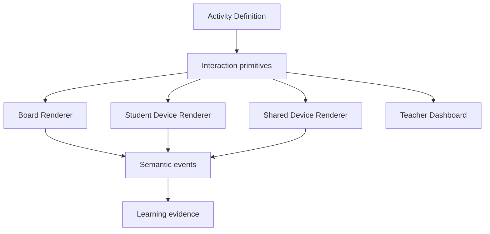
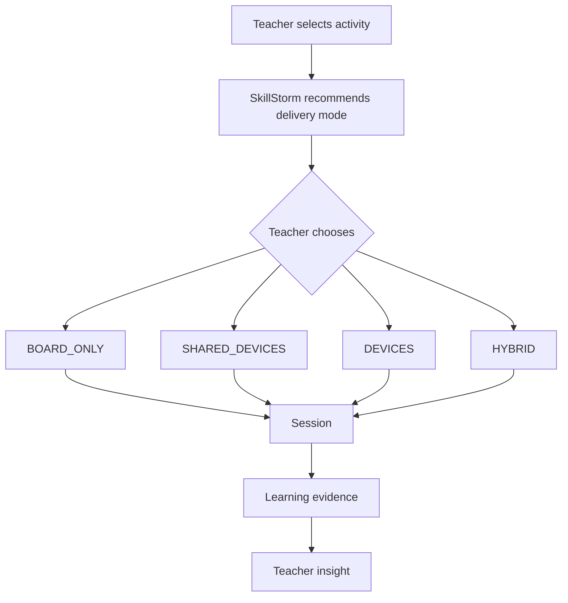
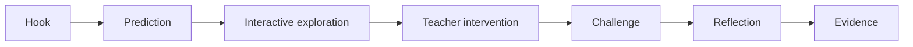

# SkillStorm Interactive Curriculum

> **Status:** product & architecture north star  
> **Scope:** ZŠ napříč předměty; později rozšiřitelné na SŠ  
> **Last review:** 2026-08-07  
> **Core principle:** Ne každá škola má zařízení pro každého žáka a ne každý předmět potřebuje stejný typ interakce. SkillStorm proto odděluje **obsah aktivity** od **způsobu, jakým se aktivita ve třídě odehraje**.

---

## 1. Produktová severka

SkillStorm nemá být sbírka digitálních pracovních listů ani sada kvízů.

Cílem je vytvořit **interaktivní výukovou platformu pro celou školu**, ve které má každý předmět vlastní typ zážitku:

- informatika může být praktická laboratoř na počítačích,
- chemie může být společný virtuální experiment na interaktivní tabuli,
- zeměpis může být práce s živou mapou, klimatem a rozhodováním,
- fyzika může simulovat síly, elektřinu a pohyb,
- matematika může pracovat s manipulativními objekty, konstrukcemi a vizualizacemi,
- dějepis může být časová osa, mapa, prameny a rozhodovací scénáře,
- přírodopis může umožnit rozebrat organismus, ekosystém nebo buňku,
- jazyky mohou pracovat s poslechem, dialogem, větami a společnými hrami,
- český jazyk může vizualizovat větnou stavbu, slovotvorbu a práci s textem,
- občanská výchova může využívat simulace rozhodování, rozpočtu nebo společenských situací.

**Nesmí vzniknout jeden univerzální „game template“, který se jen přebarví podle předmětu.**

Každý předmět potřebuje vlastní interakční jazyk.

### Product statement

> **SkillStorm promění učivo v činnost. Učitel zvolí způsob práce podle třídy a vybavení; platforma dodá interaktivní prostředí, diferenciaci, okamžitý přehled a důkaz o učení.**

---

## 2. Zásadní princip: obsah != zařízení

Aktivita nesmí být pevně navázaná na tablet, počítač nebo interaktivní tabuli.

Jedna aktivita může mít více způsobů doručení.

### Lesson Delivery Modes

| Režim | Popis | Typická učebna |
| --- | --- | --- |
| `BOARD_ONLY` | celá třída pracuje společně přes interaktivní tabuli / projektor | 1 tabule, žádná další zařízení |
| `SHARED_DEVICES` | žáci pracují po skupinách na omezeném počtu tabletů / PC | 4–10 zařízení pro třídu |
| `DEVICES` | každý žák nebo dvojice má vlastní klient | PC učebna / 1:1 zařízení |
| `HYBRID` | tabule řídí společnou část, část žáků/skupin pracuje na zařízeních | běžná heterogenní škola |

### Doctrine

SkillStorm může podle aktivity a předmětu zobrazit doporučení:

> **Doporučeno: BOARD_ONLY**  
> Tato chemická simulace funguje nejlépe jako řízený společný experiment.

Ale učitel může přepnout:

> `BOARD_ONLY` → `SHARED_DEVICES`

pokud má například 6 tabletů a chce práci ve skupinách.

**Platforma doporučuje. Učitel rozhoduje.**

---

## 3. Proč je to kritické

Předpoklad „30 žáků = 30 tabletů“ by SkillStorm zbytečně omezil na technologicky nejlépe vybavené školy.

Reálná platforma musí být skvělá i ve třídě, která má:

- jednu interaktivní tabuli,
- učitelův notebook,
- několik sdílených tabletů,
- starší PC učebnu,
- nebo kombinaci všeho.

Hardware školy je **constraint**, nikoli produktový předpoklad.

---

## 4. Jedna lekce, více způsobů použití

Příklad: **Chemie — pH a neutralizace**.

### `BOARD_ONLY`

Učitel na tabuli přidává virtuální roztoky, mění koncentraci a třída předpovídá výsledek.

```text
┌───────────────────────────────────────────────────────┐
│ CHEM LAB · Neutralizace                              │
│                                                       │
│   HCl                 BEAKER               NaOH       │
│  [ 25 ml ]        ┌──────────┐           [ 10 ml ]   │
│                   │          │                       │
│                   │  pH 2.3  │                       │
│                   │          │                       │
│                   └──────────┘                       │
│                                                       │
│  [ Přidat 5 ml NaOH ]     [ Změřit pH ]              │
│                                                       │
│  TŘÍDA PŘEDPOVÍDÁ: pH poroste / klesne / stejné      │
└───────────────────────────────────────────────────────┘
```

### `SHARED_DEVICES`

Šest skupin dostane šest tabletů. Každá provede jinou variantu experimentu a výsledky se automaticky skládají na tabuli.

### `DEVICES`

Každý žák experimentuje samostatně; učitel vidí chyby a pochopení v Mission Control.

### `HYBRID`

Experiment probíhá společně na tabuli, ale žáci přes telefony/tablety posílají predikce nebo řeší krátké navazující úlohy.

**Obsah je jeden. Orchestrace hodiny se mění.**

---

## 5. Teacher-first orchestrace

Před spuštěním aktivity učitel neřeší technickou konfiguraci.

```text
┌──────────────────────────────────────────────┐
│ Neutralizace kyselin a zásad                 │
│ 8. ročník · Chemie · 25–35 min               │
│                                              │
│ Jak dnes chcete pracovat?                    │
│                                              │
│ ● Společně na tabuli           DOPORUČENO    │
│ ○ Skupiny na sdílených zařízeních            │
│ ○ Každý na vlastním zařízení                  │
│ ○ Hybrid                                      │
│                                              │
│ Obtížnost:   Standardní ▾                    │
│ Podpora:     Adaptivní ▾                     │
│                                              │
│             [ Spustit hodinu ]                │
└──────────────────────────────────────────────┘
```

Učitel může výchozí režim změnit kdykoli před spuštěním.

---

## 6. Interaction Engine, ne sada hardcoded her

SkillStorm potřebuje znovupoužitelný **Activity Engine** složený z interakčních primitív.

### Základní primitiva

- `SELECT`
- `MATCH`
- `SORT`
- `ORDER`
- `DRAG_PLACE`
- `HOTSPOT`
- `CONNECT`
- `DRAW`
- `MEASURE`
- `MANIPULATE`
- `SIMULATE`
- `PREDICT`
- `COMPARE`
- `BUILD`
- `DIAGNOSE`
- `TIMELINE`
- `MAP_LAYER`
- `LABEL`
- `DIALOGUE`
- `AUDIO_RESPONSE`
- `COLLABORATIVE_DECISION`

Komplexní aktivita je kompozice těchto primitív, nikoli samostatná aplikace od nuly.



---

## 7. Předmět určuje interakční jazyk

### Informatika

**Primárně:** `DEVICES` / `HYBRID`

Interakce:

- stavba,
- propojení,
- simulace systémů,
- diagnostika,
- programování,
- síťové topologie.

Showcase:

> **Build a PC** — viz [Interactive IT Lab](../interactive-it-lab/README.md).

---

## 8. Chemie — virtuální laboratoř

**Primárně:** `BOARD_ONLY`

**Sekundárně:** `SHARED_DEVICES`, `HYBRID`, volitelně `DEVICES`.

Chemie je ideální pro společné řízené experimenty, protože tabule může být současně:

- pracovní plocha,
- virtuální laboratoř,
- měřicí zařízení,
- vizualizace mikrosvěta,
- místo společného rozhodování.

### Typy aktivit

#### Virtuální experiment

Žáci společně:

- přidávají látky,
- nastavují množství,
- měří pH,
- mění teplotu,
- sledují reakci,
- předpovídají výsledek.

#### Molekulární pohled

Po reakci lze přepnout:

```text
MAKROSKOPICKY              ČÁSTICOVÝ MODEL

[ kádinka ]       →      H⁺  Cl⁻  Na⁺  OH⁻
                             ↓
                           H₂O
```

Žák tak vidí propojení pozorovaného jevu s modelem částic.

#### Bezpečnost laboratoře

Simulované situace:

> Na stole je rozlitá neznámá látka. Co uděláš?

Třída rozhoduje; systém rozvine důsledky jednotlivých voleb.

### Grafický směr

Chemie nemá vypadat jako otázka A/B/C.

Má připomínat **digitální experimentální stůl**.

---

## 9. Zeměpis — živý svět na tabuli

**Primárně:** `BOARD_ONLY` / `HYBRID`

Zeměpis má obrovský potenciál, protože interaktivní tabule je přirozeně velká mapa.

### Map Lab

```text
┌────────────────────────────────────────────────────────┐
│ EUROPE · CLIMATE LAB                                  │
│                                                        │
│      [ interaktivní mapa Evropy ]                     │
│                                                        │
│ vrstvy:                                                │
│ ☑ reliéf                                               │
│ ☑ oceánské proudy                                      │
│ ☐ srážky                                               │
│ ☐ hustota zalidnění                                    │
│                                                        │
│ Mise: Proč je v Británii mírnější zima než             │
│       ve vnitrozemí ve stejné zeměpisné šířce?         │
└────────────────────────────────────────────────────────┘
```

Žáci mohou:

- zapínat datové vrstvy,
- měřit vzdálenost,
- kreslit trasu,
- přesouvat hranice / objekty,
- skládat mapu,
- porovnávat regiony,
- řešit migraci, dopravu nebo klima,
- pracovat s časovou změnou.

### Geography missions

- naplánuj nejvhodnější místo pro město,
- najdi trasu obchodní expedice,
- vysvětli klima regionu,
- reaguj na povodeň / sucho,
- sestav energetický mix země,
- najdi optimální trasu železnice,
- odhadni dopady růstu hladiny moře.

Zeměpis tak není „poznávání států“, ale **práce se systémem světa**.

---

## 10. Fyzika — manipulovatelný model reality

**Primárně:** `BOARD_ONLY` / `SHARED_DEVICES`

### Physics Lab

Žák/učitel na tabuli:

- mění hmotnost,
- nastavuje sílu,
- mění sklon roviny,
- zapojuje elektrický obvod,
- měří napětí/proud,
- pozoruje graf v reálném čase.

```text
F = 10 N                   v(t)
       →                    │       /
   [ BOX ]                  │     /
──────────────              │___/________ t
```

Nejde pouze o animaci. Hodnota vzniká tím, že žák **nejdřív predikuje a potom experimentuje**.

Pattern:

> PREDICT → MANIPULATE → OBSERVE → EXPLAIN

---

## 11. Přírodopis — rozebrat živý systém

**Primárně:** `BOARD_ONLY` / `HYBRID`

### Biology Explorer

- sestavení buňky,
- orgány lidského těla,
- potravní síť,
- genetické dědičnosti,
- stavba rostliny,
- ekosystémy,
- adaptace organismů.

Příklad:

> Postav stabilní rybniční ekosystém.

Žák přidá:

- producenty,
- konzumenty,
- predátory,
- rozkladače.

SkillStorm simuluje důsledky.

> Přidal jsi příliš mnoho predátorů → populace drobných ryb klesá → systém se mění.

To je silnější než pouhé spojování názvů.

---

## 12. Matematika — manipulace před abstrakcí

**Primárně:** `BOARD_ONLY` / `HYBRID`

Matematika nemusí být pouze automaticky opravovaný příklad.

### Manipulativní matematika

- zlomkové kruhy,
- číselná osa,
- algebra tiles,
- geometrické konstrukce,
- grafy funkcí,
- pravděpodobnostní experimenty,
- měření a odhad.

Příklad:

> Dokaž, že 1/2 = 2/4.

Žák místo zadání čísla fyzicky skládá části na tabuli.

Později se systém přepne do symbolické reprezentace.

```text
KONKRÉTNÍ → VIZUÁLNÍ → SYMBOLICKÉ
```

---

## 13. Dějepis — rozhodování v kontextu

**Primárně:** `BOARD_ONLY` / `HYBRID`

Dějepis není optimální pro gamifikované „uhodni rok“.

Silnější model:

- živá časová osa,
- mapy územního vývoje,
- historické prameny,
- porovnávání perspektiv,
- kauzální řetězce,
- scénáře rozhodování.

### Decision Scenario

> Rok 1348. Jsi radní města během epidemie.

Třída dostane omezené informace a musí rozhodnout.

SkillStorm nezobrazuje „správnou historii“, ale pomáhá rozlišit:

- co aktéři tehdy věděli,
- jaké měli možnosti,
- jaké byly možné důsledky,
- co víme retrospektivně dnes.

**Cíl není měnit dějepis v strategickou hru. Cíl je zpřítomnit kontext.**

---

## 14. Český jazyk — vidět strukturu jazyka

**Primárně:** `BOARD_ONLY` / `HYBRID`

Interakce:

- stavba věty,
- větné členy,
- slovní druhy,
- morfologie,
- práce s textem,
- argumentace,
- stylistika.

Příklad:

```text
Petr      rychle      doběhl      domů.
 │           │           │          │
 PODMĚT    ?        PŘÍSUDEK       ?
```

Žáci fyzicky přesouvají části věty a sledují, co změna udělá se syntaxí či významem.

---

## 15. Cizí jazyky — třída musí mluvit, ne klikat

**Primárně:** `BOARD_ONLY` / `SHARED_DEVICES` / `HYBRID`

Riziko digitální jazykové výuky je vytvořit aplikaci, ve které žák 45 minut pouze kliká na slovíčka.

To nechceme.

SkillStorm má vyvolávat **skutečný jazykový výkon**.

Aktivity:

- poslech a reakce,
- skládání dialogu,
- role-play,
- práce s obrázkem,
- společné příběhy,
- popis situace,
- pronunciation practice tam, kde je technicky a pedagogicky vhodná.

Tabule může řídit situaci:

> **AIRPORT CHECK-IN**

Dvojice žáků následně vedou dialog mimo zařízení.

SkillStorm tedy není vždy místo, kde se odehrává celá aktivita. Někdy je **režisérem aktivity ve skutečné třídě**.

---

## 16. Občanská výchova / finanční gramotnost

**Primárně:** `BOARD_ONLY` / `SHARED_DEVICES`

Silné jsou simulační scénáře:

- domácí rozpočet,
- rozhodování obce,
- média a ověřování informací,
- volby / demokratické instituce bez politického přesvědčování,
- pracovní právo,
- digitální identita,
- spotřebitelská rozhodnutí.

Příklad:

> Rodina má příjem 48 000 Kč. Rozdělte rozpočet tak, aby zvládla povinné výdaje a vytvořila rezervu.

Skupiny vytvoří řešení. Tabule je porovná podle důsledků, nikoliv podle jednoho „správného“ čísla.

---

## 17. Hudební výchova

**Primárně:** `BOARD_ONLY`

- rytmické patterny,
- skládání taktu,
- rozpoznávání nástrojů,
- vrstvení zvuku,
- vizualizace hudební struktury,
- společná rytmická hra.

Důležité: platforma nesmí nahrazovat skutečné hraní a zpěv. Digitální část má podporovat orientaci, poslech a společnou koordinaci.

---

## 18. Výtvarná výchova

**Primárně:** `BOARD_ONLY`

Používat velmi selektivně.

Smysluplné oblasti:

- kompozice,
- perspektiva,
- barva,
- vizuální analýza,
- dějiny umění,
- společné anotování obrazu.

Nesmí vzniknout tlak, aby se výtvarná výchova změnila v kreslení na tabletu.

---

## 19. Tělesná výchova

**Primárně:** `BOARD_ONLY` jako krátký podpůrný nástroj, ne hlavní médium.

Příklady:

- demonstrace pohybu,
- taktika,
- rozestavení,
- pravidla,
- rotační stanoviště,
- krátký reflexní warm-up / cool-down.

**Non-goal:** držet děti u obrazovky během TV.

Toto je příklad předmětu, kde digitální intenzita musí být záměrně nízká.

---

## 20. Prvouka / vlastivěda / přírodověda

**Primárně:** `BOARD_ONLY`

Na prvním stupni má interakce být:

- velká,
- vizuální,
- čitelná,
- pomalá,
- s minimem textu,
- vhodná pro společnou práci.

Příklady:

- roční období,
- počasí,
- lidské tělo,
- obec a doprava,
- orientace v mapě,
- rostliny a zvířata,
- bezpečné chování.

---

## 21. Předmětová matice

| Předmět | Default režim | Silný typ interakce | Čemu se vyhnout |
| --- | --- | --- | --- |
| Informatika | `DEVICES` | BUILD / CONNECT / DIAGNOSE | pouhé kvízy |
| Chemie | `BOARD_ONLY` | SIMULATE / MEASURE / PREDICT | falešné experimenty bez modelu |
| Zeměpis | `BOARD_ONLY` | MAP_LAYER / COMPARE / DECIDE | slepé poznávání vlajek |
| Fyzika | `BOARD_ONLY` | MANIPULATE / MEASURE | animace bez predikce |
| Přírodopis | `BOARD_ONLY` | BUILD_SYSTEM / LABEL / SIMULATE | memorování názvů jako hlavní režim |
| Matematika | `HYBRID` | MANIPULATE / DRAW / EXPLAIN | jen automatické příklady |
| Dějepis | `BOARD_ONLY` | TIMELINE / SOURCE / DECIDE | trivializace historie |
| Český jazyk | `HYBRID` | BUILD / LABEL / TEXT | pouze pravopisné multiple-choice |
| Cizí jazyk | `HYBRID` | DIALOGUE / AUDIO / ROLEPLAY | 45 min klikání |
| Občanská výchova | `BOARD_ONLY` | SCENARIO / DECISION | normativní indoktrinace |
| Hudební výchova | `BOARD_ONLY` | AUDIO / RHYTHM | náhrada skutečného muzicírování |
| Výtvarná výchova | `BOARD_ONLY` | ANALYZE / COMPOSE | náhrada fyzické tvorby |
| Tělesná výchova | `BOARD_ONLY` | DEMO / TACTICS | zvyšování screen time |

Default je **doporučení**, ne zákaz jiného režimu.

---

## 22. Adaptivní obtížnost není jen informatika

Stejný princip jako v Interactive IT Lab musí fungovat napříč předměty.

Ale obtížnost má dvě nezávislé osy:

### A. Cognitive difficulty

Co musí žák skutečně vyřešit.

### B. Scaffolding

Kolik podpory dostává.

Příklad zeměpis:

**Level A**

> Najdi Alpy. Oblast je zvýrazněna.

**Level B**

> Najdi Alpy bez zvýraznění.

**Level C**

> Pomocí mapových vrstev vysvětli jejich vliv na srážky.

Stejné téma, jiná kognitivní úroveň.

---

## 23. Učitel musí mít možnost uzamknout obtížnost

Adaptivita je nástroj, ne autorita.

Učitel může nastavit:

- jednotnou obtížnost pro třídu,
- skupiny,
- konkrétní žáky,
- adaptivní režim,
- vlastní kombinaci obtížnosti a podpory.

To je důležité pro didaktický záměr, SVP, smíšené skupiny i konkrétní plán hodiny.

---

## 24. Accessibility a SVP od základů

Activity Engine musí počítat s alternativními způsoby ovládání.

Každá interaktivita nemůže existovat pouze jako přesný drag & drop.

Podporovat podle typu aktivity:

- drag & drop,
- tap + tap,
- klávesnici,
- větší hit areas,
- high contrast,
- reduced motion,
- prodloužený čas,
- text-to-speech tam, kde dává smysl,
- čitelnější instrukce,
- postupné odkrývání,
- omezení distraktorů,
- alternativní reprezentaci úlohy.

**Stejný vzdělávací cíl, jiná cesta k němu.**

---

## 25. Board UX je samostatná disciplína

UI určené pro notebook není automaticky vhodné pro interaktivní tabuli.

Board design pravidla:

- hlavní touch targety výrazně větší než desktop UI,
- žádné kritické hover-only chování,
- minimum drobného textu,
- důležité ovládání mimo okraje, kde bývá horší přesnost,
- velké drop zóny,
- jasný feedback po dotyku,
- práce z několika metrů,
- kontrast vhodný pro projektor i panel,
- možnost fullscreen,
- nulová závislost na přesnosti myši.

---

## 26. Classroom Orchestration Engine

Activity Engine řeší **co se děje uvnitř aktivity**.

Classroom Orchestration Engine řeší **jak se aktivita odehrává ve třídě**.



### Teacher controls

Podle režimu může učitel:

- pause all,
- resume,
- reveal,
- vyslat nápovědu,
- změnit fázi,
- rozdělit skupiny,
- otevřít bonusovou misi,
- přepnout ze společné části na individuální,
- ukončit aktivitu,
- přepsat automatický pedagogický soud.

---

## 27. SHARED_DEVICES je first-class režim

Nesmí být pouze nouzový fallback.

Příklad třídy:

- 30 žáků,
- 6 tabletů,
- 5 skupin po 6.

SkillStorm vytvoří skupiny a každý tablet reprezentuje tým.

```text
TABLET 1 → Skupina Modří
TABLET 2 → Skupina Zelení
TABLET 3 → Skupina Oranžoví
...
```

Teacher Mission Control pak sleduje skupiny místo jednotlivců.

To otevírá kvalitní digitální výuku i školám s omezeným hardwarem.

---

## 28. Hybrid může být nejsilnější režim vůbec

Hybrid neznamená „něco napůl“.

Může vytvořit velmi dobrou didaktickou sekvenci:

```text
TABULE
společný problém
    ↓
SKUPINY / ŽÁCI
vlastní řešení
    ↓
TABULE
porovnání výsledků
    ↓
UČITEL
vysvětlení
    ↓
KRÁTKÁ INDIVIDUÁLNÍ KONTROLA
```

Tím technologie podporuje rytmus hodiny místo toho, aby ho diktovala.

---

## 29. Evidence učení

SkillStorm nesmí sbírat telemetrii jen proto, že ji sbírat může.

Ukládat primárně pedagogicky významné informace:

- dokončené checkpointy,
- typické miskoncepce,
- počet / typ potřebné pomoci,
- úroveň zvládnutí cíle,
- relevantní pokusy,
- výsledek reflexe / kontroly.

Neukládat jako základní produktový pattern:

- každý pixel pohybu myši,
- přesné trajektorie dotyku,
- zbytečné behaviorální metriky,
- pseudo-analytics bez výukové hodnoty.

---

## 30. Teacher Mission Control podle režimu

### BOARD_ONLY

Učitel vidí:

- průběh aktivity,
- anonymní agregované odpovědi,
- společné chyby,
- stav experimentu.

### SHARED_DEVICES

Učitel vidí:

- týmy,
- postup skupin,
- kdo je blokovaný,
- výsledky jednotlivých týmů.

### DEVICES

Učitel vidí:

- jednotlivé žáky,
- postup,
- checkpoint,
- nápovědy,
- signalizaci zaseknutí.

### HYBRID

Dashboard kombinuje společnou fázi a stav zařízení podle aktuální části hodiny.

---

## 31. Obsah musí být curriculum-aware

Interaktivní aktivita není izolovaná hra.

Musí být navázaná na:

- předmět,
- ročník,
- téma,
- learning objectives,
- prerequisites,
- obtížnost,
- doporučený delivery mode,
- podporované delivery modes,
- očekávanou délku,
- typ evidence.

Současná doména SkillStormu už má `CatalogSubject`, `CatalogTopic`, `SubjectLevel`, `TopicLevel`, `objectives`, `prerequisites` a `Difficulty`; interaktivní vrstva na tuto kurikulární mapu navazuje.

Přesné mapování na RVP/ŠVP je samostatná obsahová práce a tento dokument jej nenahrazuje.

---

## 32. Návrh cílových metadat aktivity

Konceptuálně:

```ts
type DeliveryMode =
  | 'BOARD_ONLY'
  | 'SHARED_DEVICES'
  | 'DEVICES'
  | 'HYBRID';

interface ActivityDefinition {
  subject: string;
  topic: string;
  gradeRange: string[];
  objectives: string[];
  prerequisites: string[];

  recommendedMode: DeliveryMode;
  supportedModes: DeliveryMode[];

  durationMinutes: number;
  interactionTypes: string[];
  difficultyProfiles: string[];
  accessibilityProfile: object;

  contentVersion: number;
}
```

Nejde zatím o závazné Prisma schema. Je to produktový kontrakt pro budoucí návrh.

---

## 33. Grafický standard

SkillStorm nesmí působit jako jeden dashboard obalený kolem různých pracovních listů.

Každý předmět může mít vlastní vizuální prostředí, ale sdílí společný design language.

### Příklady

**Chemie**  
Laboratorní stůl, sklo, měřidla, částicové modely.

**Zeměpis**  
Mapa přes celou plochu, vrstvy, časová osa, datové karty.

**Fyzika**  
Čistý experimentální prostor + grafy + měřidla.

**Přírodopis**  
Organické vizualizace, řezy, struktury, systémové vazby.

**Dějepis**  
Mapa, časová osa, archivní materiál, dokumenty.

**Informatika**  
Technická laboratoř, komponenty, síť, terminál.

Design musí být rozpoznatelně SkillStorm, ale **ne identický napříč předměty**.

---

## 34. Zvuk a animace

Používat účelně.

Dobré:

- zacvaknutí komponenty,
- reakce experimentu,
- jemné potvrzení správného kroku,
- přechod fáze,
- zvuk potřebný pro jazykovou / hudební aktivitu.

Špatné:

- casino-like odměny,
- konstantní particles,
- agresivní leaderboard efekty,
- animace zpomalující učitele,
- zvuk za každý klik.

Interaktivita musí působit živě, ne manipulativně.

---

## 35. Gamifikace

Gamifikace je sekundární vrstva.

Priorita:

1. zvědavost,
2. manipulace,
3. pochopení,
4. společný problém,
5. okamžitá zpětná vazba,
6. teprve potom odměna.

Pokud aktivita funguje pouze díky XP, streakům a konfeti, je její didaktický základ slabý.

---

## 36. AI role

AI nemá automaticky generovat každou hodinu.

Smysluplné použití:

- návrh variant scénáře,
- diferenciace textu,
- tvorba distractorů pod kontrolou učitele,
- sumarizace typických chyb,
- návrh navazující aktivity,
- pomoc autorům obsahu,
- generování bezpečně omezených parametrů existující simulace.

Core simulace musí mít deterministická pravidla tam, kde výsledek musí být odborně správný.

Například chemická rovnováha nesmí záviset na tom, co si jazykový model „myslí“.

---

## 37. Autor obsahu nesmí programovat

Dlouhodobě potřebujeme **Activity Builder**.

Autor vybere:

> Chemistry Lab

potom nastaví:

- dostupné látky,
- počáteční stav,
- měřidla,
- očekávané predikce,
- checkpointy,
- nápovědy,
- obtížnost,
- delivery modes.

Podobně Geography Map Builder umožní vybrat mapu, vrstvy, regiony a úkoly.

Cíl:

> Nový kvalitní obsah musí jít vytvářet rychleji než nový software.

---

## 38. Subject Engines

Některé předměty budou potřebovat specializované enginy postavené nad společným Activity Enginem.

### Kandidáti

- `MapEngine`
- `ChemLabEngine`
- `PhysicsLabEngine`
- `SystemBuilderEngine`
- `TimelineEngine`
- `LanguageDialogueEngine`
- `MathManipulativeEngine`

Tyto enginy sdílí:

- session model,
- teacher controls,
- accessibility,
- telemetry/evidence,
- difficulty/scaffolding,
- content lifecycle.

Ale mají vlastní doménovou logiku.

---

## 39. Technologický směr

Preferovat webové technologie tak dlouho, dokud splňují UX a výkon.

### Shared app

- Next.js / React
- TypeScript
- Tailwind pro standardní UI
- NestJS backend
- PostgreSQL / Prisma
- WebSockets pro realtime orchestrace

### Activity rendering

Podle typu:

- React + DOM pro jednoduché interakce,
- SVG pro diagramy a mapové anotace,
- Canvas / Phaser pro hernější 2D/2.5D aktivity,
- React Flow pro uzlové / síťové problémy,
- specializovaná mapová knihovna pro Geography Engine,
- Three.js pouze tam, kde 3D zásadně zlepšuje pochopení.

**Nepoužívat 3D jako status symbol.**

---

## 40. Offline / špatná konektivita

Školní internet není spolehlivý předpoklad.

Postupně navrhovat:

- cache assetů,
- přednačtení lekce,
- graceful reconnect,
- lokální průběh activity playeru,
- event queue pro krátký výpadek,
- jasnou signalizaci učiteli.

BOARD_ONLY aktivita by neměla spadnout jen proto, že na několik sekund vypadne Wi-Fi.

---

## 41. Co bude SkillStorm prodávat škole

Ne:

> „Máme 5 000 interaktivních cvičení.“

Ale:

> **„Učitel otevře téma a dostane hotovou kvalitní hodinu, kterou spustí podle vybavení své třídy.“**

To je větší hodnota.

Obsah musí být kurátorovaný, scénářovaný a didakticky použitelný.

---

## 42. Hodina jako produktová jednotka

Nejdůležitější jednotkou není Question ani Activity.

Dlouhodobě je jí **Lesson Experience**.



Aktivita je komponenta hodiny.

To umožní SkillStormu nabídnout učiteli skutečně připravenou výuku, ne pouze databázi materiálů.

---

## 43. Připravené scénáře vs. svoboda učitele

SkillStorm má nabídnout nejlepší doporučený scénář, ale nesmí učitele uzamknout.

Učitel může:

- přeskočit část,
- prodloužit experiment,
- změnit režim,
- vynechat individuální fázi,
- použít jen jednu aktivitu,
- přidat vlastní vysvětlení,
- upravit obtížnost.

**Opinionated defaults, flexible execution.**

---

## 44. Non-goals

SkillStorm nesmí směřovat k tomu, aby:

- každá hodina byla digitální,
- každý žák musel mít tablet,
- učitel byl nahrazen automatickým tutorem,
- každý předmět vypadal stejně,
- každá aktivita byla hra,
- soutěž byla default,
- AI rozhodovala odbornou pravdu,
- množství screen time bylo samo o sobě KPI.

---

## 45. Quality bar předmětového modulu

Nový předmět / engine má smysl teprve tehdy, když umíme odpovědět **ano**:

1. Přináší interaktivita něco, co tabule, učebnice nebo běžný formulář neumí stejně dobře?
2. Je zřejmé, proč je aktivita právě v tomto předmětu?
3. Funguje v realistické české třídě?
4. Má smysluplný režim bez 1:1 zařízení, pokud to povaha předmětu dovoluje?
5. Učitel ji spustí bez technické přípravy?
6. Je ovladatelná na tabuli z běžné vzdálenosti?
7. Je dostupná i pro žáky potřebující alternativní ovládání/podporu?
8. Produkuje pedagogicky užitečnou informaci?
9. Nevytváří zbytečné screen time?
10. Je obsah odborně kontrolovatelný a verzovaný?

---

## 46. Priorita implementace

**Nedoporučuje se stavět všechny předměty paralelně.**

To by vytvořilo mnoho polovičních dem.

Správnější pořadí:

### Phase 1 — společný základ

- Delivery Modes
- ActivityDefinition
- Classroom Orchestration
- Board shell
- Teacher Session controls
- shared accessibility layer
- semantic event model

### Phase 2 — dva extrémně odlišné vertical slices

**Informatika — Build a PC**  
`DEVICES`-first.

**Chemie — Chem Lab**  
`BOARD_ONLY`-first.

Pokud stejná platforma kvalitně zvládne tyto dva protiklady, architektura je pravděpodobně dost obecná.

### Phase 3 — Geography Map Lab

Ověřit mapové vrstvy, práci s velkou tabulí a decision scenarios.

### Phase 4 — Physics / Biology / Math

Rozšířit reusable subject engines a manipulativní modely.

### Phase 5 — Humanities & languages

Timeline, source analysis, dialogue, text manipulation, audio.

### Phase 6 — curriculum completeness

Systematické mapování témat, ročníků, RVP/ŠVP a mezer pokrytí.

---

## 47. Proč začít IT + chemií

Jsou to dva opačné konce stejného problému.

```text
INFORMATIKA                         CHEMIE
────────────────                  ────────────────
1 zařízení / žák                   1 tabule / třída
individuální práce                 společný experiment
silná per-student telemetry        silná orchestrace učitelem
BUILD / DIAGNOSE                   SIMULATE / PREDICT
```

Pokud Activity + Classroom Engine pokryje oba kvalitně bez speciálních hacků v session vrstvě, získáme velmi silný základ pro další předměty.

---

## 48. Metrika úspěchu

Ne:

- počet kliknutí,
- délka session,
- počet získaných XP.

Primární produktová otázka:

> **Umožnil SkillStorm učiteli udělat kvalitnější výukovou činnost s menší přípravou a zároveň lépe pochopit, co žáci umí?**

Sekundárně:

- aktivní účast větší části třídy,
- nižší čas na přípravu,
- rychlejší odhalení miskoncepcí,
- použitelnost s existujícím hardwarem školy,
- ochota učitele aktivitu znovu použít.

---

## 49. Vztah k existujícím Live Sessions

Současné Bleskovky jsou důležitý první základ.

- `BOARD_ONLY` již reprezentuje společnou práci na tabuli.
- interaktivní kola už dokazují touch-first interakce.
- připravený `DEVICES` šev je základ pro budoucí práci studentů na vlastních zařízeních.

Tato vize tento základ **neruší**.

Rozšiřuje ho z:

> Bleskovka

na:

> **Classroom Orchestration Platform**.

Viz:

- [Live Sessions](../live-sessions.md)
- [Live Sessions interactions](../live-sessions-interactions.md)
- [Interactive IT Lab](../interactive-it-lab/README.md)

---

## 50. Severka

SkillStorm nebude nejlepší tím, že digitalizuje nejvíce pracovních listů.

Musí být nejlepší v tom, že **pro každý předmět najde digitální interakci, která skutečně zlepšuje výuku** — a umožní ji spustit i v obyčejné škole s jednou tabulí.

> **Jedna platforma. Různé předměty. Různé způsoby práce. Učitel řídí. Technologie zesiluje výuku.**
