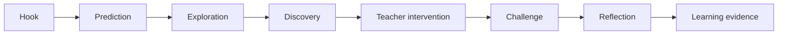

# SkillStorm Interactive Curriculum — Master Use Cases

> **Status:** product, pedagogy & architecture north star  
> **Scope:** 1.–9. ročník ZŠ; navrženo pro mapování na RVP ZV 2025 a konkrétní ŠVP školy  
> **Audience:** product, pedagogové, content team, design, engineering, vedení školy  
> **Last review:** 2026-08-07  
> **Rule #1:** SkillStorm nemá převádět učebnici na obrazovku. Má převádět učivo na **činnost, rozhodování, experiment, tvorbu, manipulaci, komunikaci nebo řešení problému**.

---

## 0. Proč tento dokument existuje

Tento dokument je hlavní katalog use cases pro budoucí **SkillStorm Interactive Curriculum**.

Nejde o seznam funkcí aplikace. Jde o popis toho, jak má SkillStorm reálně měnit vyučovací hodinu od 1. do 9. ročníku.

Každý use case musí odpovědět na pět otázek:

1. **Co má žák pochopit nebo umět?**
2. **Co během aktivity skutečně dělá?**
3. **Proč je interaktivní forma lepší než PDF / prezentace / kvíz?**
4. **Co během hodiny vidí a může ovlivnit učitel?**
5. **Jaký důkaz o učení po aktivitě zůstane?**

Pokud aktivita neumí obhájit otázku č. 3, **nemá vzniknout jako interaktivní aktivita**.

---

## 1. Kurikulární kontrakt

SkillStorm se nesmí stát paralelním kurikulem.

Každá produkční aktivita má být mapovatelná na:

- vzdělávací oblast,
- vzdělávací obor,
- tematický celek / lokální téma školy,
- očekávaný výsledek učení (OVU),
- ročník nebo věkový rozsah,
- klíčové kompetence,
- základní gramotnosti,
- průřezová témata,
- případně konkrétní ŠVP školy.

### Důležitá hranice

Tento dokument je **coverage blueprint**, nikoli normativní přepis RVP.

Konkrétní vazba `ActivityVersion -> OVU` musí být před publikací obsahu ověřena proti aktuální závazné verzi RVP a případně proti ŠVP konkrétní školy.

### Produktový důsledek

SkillStorm nesmí ukládat jen `téma = zlomky`. Musí umět uložit i **learning evidence**: co žák během činnosti skutečně prokázal.

---

## 2. Základní produktová doktrína

### 2.1 Lesson Delivery Modes

| Mode | Typická realita | Princip |
| --- | --- | --- |
| `BOARD_ONLY` | učitel + jedna interaktivní tabule | společné objevování, manipulace, predikce, diskuze |
| `SHARED_DEVICES` | 4–10 tabletů / PC | skupiny řeší varianty a výsledky se skládají na tabuli |
| `DEVICES` | PC učebna / 1:1 | každý žák nebo dvojice řeší vlastní úkol; učitel má Mission Control |
| `HYBRID` | běžná škola s různým vybavením | tabule drží společný příběh, zařízení řeší dílčí činnost |

**SkillStorm doporučuje. Učitel rozhoduje.**

### 2.2 Jedna aktivita ≠ jeden režim

Například aktivita „Neutralizace“ může existovat jako:

- společný experiment na tabuli,
- šest variant experimentu pro šest skupin,
- individuální simulace,
- hybrid s predikcí žáků a společným experimentem.

Obsahový cíl je stejný. Orchestrace se mění.

### 2.3 Obtížnost ≠ podpora

SkillStorm musí oddělit:

- **cognitive difficulty** — jak složitý problém žák řeší,
- **scaffolding** — kolik pomoci při tom dostává.

Žák může řešit stejný koncept jako ostatní, ale s:

- zvýrazněním relevantních prvků,
- menším počtem možností,
- čtením instrukce nahlas,
- vizuálním krokováním,
- prodlouženým časem,
- alternativou k drag & drop,
- nápovědou po chybě.

---

## 3. Standard každého use case

Každý produkční use case má mít tento kontrakt:

```yaml
id: CHEM-8-NEUTRALIZATION-01
title: Neutralizace v Chem Labu
recommendedGrades: [8, 9]
subject: CHEMISTRY
recommendedMode: BOARD_ONLY
supportedModes: [BOARD_ONLY, SHARED_DEVICES, DEVICES, HYBRID]
durationMin: 30
interactionPrimitives:
  - PREDICT
  - MANIPULATE
  - MEASURE
  - SIMULATE
  - EXPLAIN
learningEvidence:
  - prediction
  - sequenceOfActions
  - measurements
  - explanation
rvpMappings: [] # explicitně validovat před publikací
```

### Povinné UX stavy

Každá aktivita musí definovat:

- `INTRO`
- `MISSION`
- `ACTIVE`
- `HINT`
- `TEACHER_PAUSE`
- `REFLECTION`
- `FINISH`
- `RECONNECT`
- `OFFLINE_DEGRADED` tam, kde je technicky a didakticky možné.

---

## 4. Lesson Experience — nejdůležitější jednotka produktu

SkillStorm nemá optimalizovat jednotlivou otázku. Má optimalizovat **celou učební zkušenost**.



Typická 45min hodina:

| Čas | Fáze | SkillStorm |
| --- | --- | --- |
| 0–5 | Hook | problém, příběh, konflikt, otázka |
| 5–10 | Prediction | třída se zaváže k předpovědi |
| 10–25 | Exploration | manipulace / experiment / řešení |
| 25–30 | Intervention | učitel reaguje na data z třídy |
| 30–40 | Challenge | přenos poznatku do nového problému |
| 40–45 | Reflection | vysvětlení + evidence + doporučení |

---

# ČÁST I — 1. STUPEŇ

## 5. 1.–2. ročník: konkrétní, fyzický a jednoduchý SkillStorm

U mladších žáků nesmí systém vyžadovat dlouhé čtení, přesný drag & drop ani složitou navigaci.

Preferované prvky:

- velké dotykové cíle,
- audio instrukce,
- obrázky a manipulativní objekty,
- jedna jasná činnost na obrazovce,
- okamžitá nenegativní zpětná vazba,
- práce celé třídy nebo dvojic,
- fyzické pokračování mimo obrazovku.

### UC-P1-CZ-01 — Továrna na slova

**Mode:** `BOARD_ONLY` / `SHARED_DEVICES`  
**Cíl:** skládat slova ze zvuků/slabik a chápat pořadí a strukturu slova.

Na tabuli přijíždějí „vagónky“ se slabikami. Žák je přesouvá do pořadí, pustí si výslovnost a třída rozhoduje, zda vzniklé slovo dává smysl.

Varianty:

- 1. ročník: obrázek → sestav slovo,
- 2. ročník: slyšené slovo → sestav bez obrázku,
- vyšší scaffolding: barevně zvýrazněné první slabiky,
- nižší scaffolding: rušivé slabiky navíc.

**Evidence:** pořadí tahů, počet oprav, schopnost vytvořit nové slovo bez nápovědy.

### UC-P1-CZ-02 — Věta jako stavebnice

Slova jsou fyzické bloky. Třída skládá větu, mění pořadí a sleduje změnu významu a interpunkce.

SkillStorm nehodnotí jen finální pořadí. Sleduje, zda žák dokáže vysvětlit, proč některé varianty fungují a jiné ne.

### UC-P1-MATH-01 — Číselná krajina

Čísla nejsou kartičky, ale pozice na vizuální ose. Žáci odhadují, posouvají a porovnávají vzdálenosti.

Použití:

- více / méně,
- sousední čísla,
- skoky po 2/5/10,
- mentální odhad,
- později záporná čísla stejným enginem.

### UC-P1-MATH-02 — Obchod třídy

Virtuální obchod na tabuli. Žáci dostanou rozpočet a musí nakoupit kombinaci předmětů.

SkillStorm může měnit ceny, rozpočet, počet mincí/bankovek a nutnost vracet.

**Cross-curricular:** matematická a finanční gramotnost.

### UC-P1-WORLD-01 — Moje cesta do školy

Na mapě fiktivní čtvrti třída plánuje bezpečnou cestu dítěte do školy.

Musí řešit přechody, silnice, semafory, nebezpečná místa a orientační body.

`BOARD_ONLY` je vhodnější než individuální zařízení, protože cílem je společná argumentace.

### UC-P1-WORLD-02 — Rok jako živý systém

Třída manipuluje počasím, délkou dne, oblečením, přírodou a činnostmi během roku.

Ne „přiřaď jaro k obrázku“, ale:

> Je březen, ráno 2 °C, odpoledne 12 °C. Co se v přírodě pravděpodobně mění a jak se připravíš?

### UC-P1-MUSIC-01 — Rytmická zeď

Velké bloky reprezentují rytmické hodnoty. Třída sestaví sekvenci a SkillStorm ji přehraje.

Digitální část vede k **reálnému tleskání, zpěvu a hraní**, ne je nahrazuje.

### UC-P1-ART-01 — Míchání barev

Virtuální míchání barev je bezpečný rychlý experiment před skutečnou výtvarnou činností.

Žáci předpoví výsledek, smíchají barvy digitálně a poté jej ověří fyzicky.

### UC-P1-PE-01 — Pohybová výzva třídy

Tabule zobrazuje krátké pohybové mise, rytmus nebo reakční podněty. Systém nesbírá biometriku ani skóre jednotlivců bez jasného důvodu.

---

## 6. 3.–5. ročník: přechod od manipulace k modelům

### UC-P1-MATH-03 — Zlomková kuchyně

Žák mění počet porcí a sleduje, co se stane s množstvím.

Aktivita přechází:

1. konkrétní objekt,
2. obrázkový model,
3. zlomek,
4. jednoduchý problém.

### UC-P1-MATH-04 — Geometrické staveniště

Žáci navrhují jednoduchý půdorys dětského hřiště a používají délku, obvod, obsah, pravoúhlost a podle úrovně i měřítko.

### UC-P1-CZ-03 — Detektiv významu

Třída dostane krátký text s informacemi, které se částečně překrývají a částečně odporují.

Úkol:

- označ důkaz v textu,
- odděl domněnku od informace,
- vysvětli závěr.

### UC-P1-LANG-01 — Město v cizím jazyce

Interaktivní město na tabuli. Učitel říká nebo přehrává instrukce a žák naviguje postavu.

Později žáci dávají instrukce sobě navzájem a SkillStorm pouze poskytuje scénu.

### UC-P1-WORLD-03 — Česká republika jako živá mapa

Vrstvy:

- kraje,
- významná města,
- řeky,
- reliéf,
- doprava,
- památky.

Scénář:

> Naplánujte cestu školního výletu. Máte jeden den, autobus a dvě zastávky. Co navštívíte a proč?

### UC-P1-WORLD-04 — Ekosystém školní zahrady

Žáci staví jednoduchou potravní síť, mění vodu, teplotu a počet organismů a pozorují důsledky.

SkillStorm musí jasně ukazovat, že jde o **model**, ne absolutní předpověď skutečné přírody.

### UC-P1-INF-01 — Robot doručuje balík

Programování bez syntaxe. Žáci sestaví sekvenci příkazů, objeví opakování a podmínku.

Režimy:

- board: třída programuje jednoho robota,
- shared: skupiny řeší různé mapy,
- devices: každý vlastní úroveň.

### UC-P1-INF-02 — Datový detektiv

Třída sbírá jednoduchá data, vytvoří reprezentaci a hledá v ní vzorce.

Graf není obrázek „k přečtení“; graf vznikne z dat třídy.

---

# ČÁST II — 2. STUPEŇ

## 7. Český jazyk a literatura

### UC-CZ-6-01 — Větný parser

Věta je vizuální struktura. Žák manipuluje členy, vazbami a interpunkcí.

V pokročilém režimu SkillStorm nabídne více možných interpretací a žák musí obhájit výběr.

### UC-CZ-7-01 — Text pod mikroskopem

Žáci vrství fakta, tvrzení, argumenty, emoce, manipulativní formulace a zdroje.

Vhodné pro `BOARD_ONLY` i `HYBRID`.

### UC-CZ-8-01 — Redakce

Třída dostane neupravenou zprávu. Skupiny mají role editor, fact-checker, headline editor a čtenář.

Cílem je vytvořit verzi, která je přesná, srozumitelná a nepřekrucuje zdroj.

### UC-CZ-9-01 — Argumentační aréna

SkillStorm poskytuje scénář, tvrzení, důkazy a časování. Samotnou argumentaci musí dělat lidé.

Systém může evidovat použitý důkaz, reakci na protiargument a sebereflexi. Nemá automaticky vyhlašovat „vítěze názoru“.

### UC-LIT-01 — Příběh jako mapa rozhodnutí

Literární děj se zobrazí jako síť rozhodnutí, vztahů a následků. Žáci rekonstruují motivace postav a odkazují na textové důkazy.

---

## 8. Cizí jazyky

### UC-LANG-6-01 — Airport / Station Mission

Virtuální prostředí slouží jako kontext pro reálnou dvojicovou komunikaci. SkillStorm řídí role a informace, které každý účastník zná jinak.

### UC-LANG-7-01 — Lost in the City

Dvojice mají asymetrické informace: jeden mapu, druhý cíl. Musí se domluvit cílovým jazykem.

### UC-LANG-8-01 — Restaurant Crisis

Objednávka se mění: alergie, chyba v účtu, nedostupná položka. Žák nerecituje dialog, ale reaguje na situaci.

### UC-LANG-9-01 — Real-world mediation

Žák převádí význam mezi dvěma lidmi/situacemi, nikoli doslovně větu po větě.

Automatické jazykové hodnocení je podpůrné, ne jediný soud.

---

## 9. Matematika

### UC-MATH-6-01 — Fraction / Ratio Lab

Žák mění poměr ingrediencí, rozměry modelu nebo měřítko mapy a okamžitě vidí důsledky.

### UC-MATH-7-01 — Měřítko záchranné mise

Na mapě je nutné naplánovat trasu a odhadnout reálné vzdálenosti a čas. Výsledek není jen číslo — trasa musí být realizovatelná.

### UC-MATH-7-02 — Procenta v reálném nákupu

Virtuální obchod obsahuje slevy, balení, dopravu a rozpočet. Žák musí rozhodnout, která nabídka je skutečně výhodnější.

### UC-MATH-8-01 — Algebra Tiles Engine

Výrazy a rovnice jsou zpočátku manipulativní objekty. Postupně se vizuální opora odstraňuje.

### UC-MATH-8-02 — Geometry Construction Lab

Žák konstruuje objekt podle podmínek. Engine nesoudí pixelovou podobnost, ale geometrické vztahy.

### UC-MATH-9-01 — Funkce jako stroj

Žák manipuluje parametry modelu a současně sleduje tabulku, graf, rovnici a reálnou situaci.

Cíl je překládat mezi reprezentacemi.

### UC-MATH-9-02 — Data Room

Třída dostane dataset s chybami, odlehlými hodnotami a různými možnostmi vizualizace.

Úkol:

> Jakou interpretaci můžeme obhájit a jakou už data nepodporují?

---

## 10. Informatika — Interactive IT Lab

Detailní blueprint je v `../interactive-it-lab/README.md`.

### UC-IT-6-01 — Algoritmická továrna

Žáci staví postup pro virtuální výrobní linku. Učí se sekvenci, opakování a podmínky bez závislosti na konkrétním programovacím jazyce.

### UC-IT-7-01 — Inside the Computer

Úvodní úroveň před Build a PC.

Žák:

- pozná hlavní komponenty,
- přiřadí funkci,
- sleduje tok dat a energie,
- teprve potom komponenty osazuje.

### UC-IT-7/8-02 — Build a PC

Hero use case.

Úrovně:

- `Explorer`: co je CPU/RAM/SSD,
- `Builder`: fyzické osazení,
- `Technician`: kompatibilita,
- `Engineer`: diagnostika závady a optimalizace sestavy.

### UC-IT-8-01 — Network Builder

PC, switch, router, AP, server a internet jsou uzly skutečného modelu s validací spojení a konfigurace.

### UC-IT-8-02 — Data Pipeline

Žák sleduje, jak data vzniknou, změní formát, projdou zpracováním a vytvoří výstup.

### UC-IT-9-01 — Cyber Incident

Bezpečnostní scénář: phishing, kompromitované heslo, veřejná Wi-Fi, ztracené zařízení, záloha a oprávnění.

Cíl není strašit, ale rozhodovat podle rizika.

### UC-IT-9-02 — Debug the System

Žák dostane systém s více symptomy a musí odlišit příčinu od následku.

---

## 11. Zeměpis — Geography Map Lab

### Produktový princip

Mapa není obrázek. Je to **interaktivní datový model světa**.

### UC-GEO-6-01 — Planet Engine

Žáci manipulují sklonem osy, polohou Země vůči Slunci a časem. Sledují den/noc a roční období.

### UC-GEO-6-02 — Tectonic Lab

Posouvání desek generuje hranice, vulkanismus a zemětřesení v zjednodušeném modelu.

### UC-GEO-7-01 — Climate Layers

Na jedné mapě se vrství zeměpisná šířka, nadmořská výška, oceánské proudy, srážky, teploty a vegetace.

Mise:

> Vysvětlete, proč dvě místa na podobné šířce nemají stejné klima.

### UC-GEO-7-02 — River System

Žák mění reliéf, vegetaci a zástavbu povodí a sleduje, co model předpovídá o odtoku.

### UC-GEO-8-01 — Population Explorer

Vrstvy věkové struktury, urbanizace, hustoty a migrace. Žák porovnává regiony a hledá možné vysvětlení, nikoli jen extrémy v tabulce.

### UC-GEO-8-02 — Supply Chain World

Třída sleduje cestu výrobku přes zdroje, výrobu, dopravu a spotřebu.

### UC-GEO-9-01 — Sustainable City

Skupiny plánují město s omezeními: bydlení, doprava, voda, energie, zeleň, finance a rizika.

Každé rozhodnutí má trade-off.

### UC-GEO-9-02 — Crisis Map

Učitel spustí scénář sucha, povodně nebo dopravního výpadku. Třída používá vrstvy mapy k rozhodování.

SkillStorm nesimuluje „jednu správnou politiku“; hodnotí práci s daty a zdůvodnění.

---

## 12. Dějepis

### UC-HIST-6-01 — Archeologická vrstva

Třída odkrývá naleziště. Předměty nemají okamžitý popisek; žáci vytvářejí hypotézy a odlišují důkaz od domněnky.

### UC-HIST-6-02 — Ancient City Builder

Město není sandbox bez pravidel. Každý prvek je spojen s konkrétním historickým kontextem a zdroji.

### UC-HIST-7-01 — Středověké město

Role měšťana, řemeslníka, panovníka a církve vytvářejí konfliktní potřeby. Třída analyzuje strukturu společnosti.

### UC-HIST-8-01 — Industrial Revolution System

Žáci mění technologie, pracovní sílu, dopravu a urbanizaci a sledují systémové dopady.

### UC-HIST-8-02 — Source Detective

Stejnou událost popisují různé prameny. Žák zkoumá autora, čas, účel a rozpory.

### UC-HIST-9-01 — Timeline of Causes

Události 20. století nejsou jen chronologické kartičky. Žáci skládají síť příčin, následků a nejistot.

### UC-HIST-9-02 — Propaganda Lab

Žáci rozebírají historické komunikační techniky a vytvářejí analytickou anotaci. Produkce vlastního propagandistického materiálu musí být pedagogicky jasně ohraničená a reflektovaná.

---

## 13. Výchova k občanství a finanční gramotnost

### UC-CIV-6-01 — Třída jako obec

Skupina má omezený rozpočet a několik legitimních potřeb. Musí vytvořit rozhodnutí a zdůvodnit priority.

### UC-CIV-7-01 — Rodinný rozpočet

Příjem, fixní náklady, neočekávaná událost, úspora a půjčka.

Systém nesugeruje jediný životní styl; učí trade-offs a riziko.

### UC-CIV-8-01 — Media Feed

Simulovaný feed kombinuje zprávu, reklamu, názor, manipulativní obsah a satiru.

Úkol je klasifikovat typ obsahu a doložit proč.

### UC-CIV-8-02 — Contract Decision

Žák pracuje se zjednodušenými podmínkami služby, předplatného nebo nákupu a hledá klíčová rizika.

### UC-CIV-9-01 — Public Budget Lab

Rozpočet obce má omezené zdroje a transparentní constraints. Třída porovnává varianty a jejich dopady.

### UC-CIV-9-02 — Rights & Responsibilities Scenario

Žák rozhoduje v modelových situacích školy, rodiny, veřejného prostoru a digitálního prostředí. Hodnotí se argumentace opřená o pravidla a práva, nikoli shoda s názorem systému.

---

## 14. Fyzika — Physics Lab

### UC-PHY-6-01 — Measurement Lab

Virtuální měření má chybu, přesnost a volbu nástroje. Žák nemá jen odečíst krásné celé číslo.

### UC-PHY-7-01 — Force Playground

Síly jsou vektory, které lze manipulovat. Objekt reaguje v reálném čase.

### UC-PHY-7-02 — Motion Lab

Současně se zobrazuje pohyb, čas, vzdálenost a graf.

### UC-PHY-8-01 — Circuit Builder

Baterie, vodič, žárovka, rezistor, spínač a měřidla tvoří manipulovatelný model. Chyby musí být bezpečně simulované a diagnostikovatelné.

### UC-PHY-8-02 — Energy House

Model domu umožní měnit izolaci, zdroj, spotřebiče a podmínky. Výsledek ukazuje energii, ne marketingové skóre.

### UC-PHY-9-01 — Optics Bench

Čočky, zrcadla a paprsky; manipulace vytváří okamžitý geometrický model.

### UC-PHY-9-02 — Engineering Failure

Žák dostane systém, který nefunguje podle očekávání, a musí vytvořit hypotézu, měření a opravu.

---

## 15. Chemie — Chem Lab

### Produktový princip

Chemie je jeden z nejsilnějších `BOARD_ONLY` předmětů SkillStormu.

Virtuální experiment nesmí nahrazovat bezpečně proveditelný reálný experiment. Má umožnit:

- vizualizovat neviditelné,
- bezpečně ukázat rizikové nebo nedostupné situace,
- rychle měnit proměnné,
- vracet experiment zpět,
- spojit makroskopický jev s částicovým modelem.

### UC-CHEM-8-01 — Particle World

Látka přepíná mezi makro pohledem, částicovým modelem a jednoduchým symbolickým zápisem.

### UC-CHEM-8-02 — Periodic Table Explorer

Periodická tabulka není katalog kartiček. Žák zvýrazňuje vlastnosti a hledá vzorce.

### UC-CHEM-8-03 — Separation Lab

Směs má být rozdělena výběrem vhodného postupu. Žák volí techniku podle vlastností složek.

### UC-CHEM-8-04 — Reaction Evidence

Žák sleduje pozorovatelné změny a rozhoduje, co lze a nelze z pozorování vyvodit.

### UC-CHEM-8/9-05 — Neutralization

Hero `BOARD_ONLY` lesson:

```text
PREDICT → ADD → MEASURE → OBSERVE → PARTICLE VIEW → EXPLAIN
```

### UC-CHEM-9-01 — Reaction Balancer

Ne mechanické přehazování koeficientů. Žák nejdřív vidí počet částic/atomů a teprve potom symbolickou rovnici.

### UC-CHEM-9-02 — Materials Decision

Mise:

> Vyber vhodný materiál pro konkrétní výrobek podle vlastností, ceny, bezpečnosti a environmentálních dopadů.

---

## 16. Přírodopis / biologie

### UC-BIO-6-01 — Classification Tree

Žák staví klasifikační strom na základě znaků. Systém může přidat nový organismus, který odhalí slabinu jeho pravidla.

### UC-BIO-6-02 — Ecosystem Web

Potravní síť reaguje na změny populací a podmínek. Model má ukázat nejistotu a zjednodušení.

### UC-BIO-7-01 — Cell Explorer

Buňka je prostorový/2.5D systém. Organely jsou propojeny s funkcemi a toky látek/informací.

### UC-BIO-7-02 — Plant Transport

Voda, světlo a průduchy jsou propojeny do modelu. Žák mění podmínky a interpretuje výsledek.

### UC-BIO-8-01 — Human Systems

Orgánové soustavy nejsou izolované kapitoly. Mise ukazuje vztahy dýchání, krevního oběhu, pohybu a energie.

### UC-BIO-9-01 — Genetics Probability Lab

Jednoduchý model dědičnosti odděluje pravděpodobnost od jistoty a upozorňuje na limity modelu.

### UC-BIO-9-02 — Ecosystem Decision

Třída řeší zásah do krajiny z pohledu více ukazatelů, ne jedním „eko skóre“.

---

## 17. Člověk, zdraví a bezpečí

Digitální simulace je vhodná tam, kde umožní bezpečný nácvik rozhodování. Nesmí nahrazovat kontakt s pedagogem ani odbornou metodiku.

### UC-HEALTH-01 — Safety Scenario

Žák identifikuje rizika v domácnosti, škole, dopravě a online prostředí.

### UC-HEALTH-02 — Emergency Decision Tree

Modelová situace učí pořadí kroků a rozpoznání situace. Obsah musí projít odbornou kontrolou.

### UC-HEALTH-03 — Digital Wellbeing

Žák pracuje s fiktivním týdenním režimem, notifikacemi, spánkem a povinnostmi a hledá udržitelnější nastavení.

### UC-HEALTH-04 — Relationships & Boundaries

Situace jsou věkově přiměřené a zaměřené na komunikaci, hranice a hledání pomoci. Žádné veřejné bodování citlivých odpovědí.

---

## 18. Polytechnika, praktické činnosti a svět práce

### UC-POLY-01 — Workshop Planner

Žák dostane výrobek a musí určit materiál, nástroje, pořadí, bezpečnost a kontrolní body.

Digitální část připravuje reálnou práci v dílně.

### UC-POLY-02 — Material Lab

Materiály se porovnávají podle vlastností a účelu, nikoli jen názvů.

### UC-POLY-03 — Repair, Don’t Replace

Žák analyzuje jednoduchou poruchu předmětu a rozhoduje, zda a jak je možné ji bezpečně opravit.

### UC-WORK-01 — Career System

Místo testu „jaké povolání se k tobě hodí“ SkillStorm ukazuje profese jako kombinaci činností, prostředí, dovedností a vzdělávacích cest.

### UC-WORK-02 — Project Sprint

Tým dostane malý projekt, rozpočet, role, termín a změnu zadání. Systém sleduje plánování a reflexi, ne osobnostní ranking.

---

## 19. Umění a kultura

### UC-ART-6-01 — Composition Lab

Žák manipuluje kompozicí, kontrastem, měřítkem a rytmem obrazu a porovnává účinek.

### UC-ART-7-01 — Visual Story

Storyboard engine spojuje výtvarnou a filmovou výchovu. Žák plánuje záběr, pořadí a význam.

### UC-ART-8-01 — Artwork Layers

Dílo lze zkoumat přes kontext, techniku, kompozici a různé interpretace. SkillStorm nesmí vydávat jedinou interpretaci za definitivní.

### UC-MUSIC-6-01 — Rhythm Constructor

Rytmus vznikne manipulací a následně se fyzicky zahraje.

### UC-MUSIC-7-01 — Arrangement Lab

Třída skládá vrstvy jednoduchého aranžmá a slyší, jak se mění celek.

### UC-MUSIC-8/9-01 — Music Context Map

Hudba je zasazena do času, místa a společenského kontextu. Poslech zůstává centrem aktivity.

---

## 20. Tělesná výchova

SkillStorm má podporovat organizaci, názornost, taktiku a reflexi. **Nemá přesunout tělocvik na obrazovku.**

### UC-PE-01 — Tactical Board

Učitel kreslí a animuje jednoduché situace z her. Následuje okamžitý reálný nácvik.

### UC-PE-02 — Station Rotation

Tabule řídí intervaly a stanoviště. Výkon jednotlivých dětí se veřejně nesrovnává.

### UC-PE-03 — Movement Analysis

Pokud škola používá video, analýza musí mít jasný účel, přiměřené uchovávání dat a respekt k soukromí.

---

# ČÁST III — CROSS-CURRICULAR MISSIONS

## 21. Mise, které propojí školu

### UC-X-01 — Sustainable School

**Oblasti:** matematika, fyzika, zeměpis, občanství, informatika.

Žáci analyzují školou schválená nebo fiktivní data o energii, vodě, odpadech a dopravě. Navrhují zásah, počítají dopad a obhajují trade-offs.

### UC-X-02 — School Garden

**Oblasti:** přírodopis, matematika, člověk a jeho svět, polytechnika.

Plán záhonů, světlo, voda, rozpočet, sezóna a péče.

### UC-X-03 — Plan a School Trip

**Oblasti:** zeměpis, matematika, jazyk, finanční gramotnost.

Rozpočet, trasa, jízdní řád, časový plán a argumentace.

### UC-X-04 — Information Crisis

**Oblasti:** čeština, informatika, občanství, dějepis.

Třída řeší soubor zdrojů různé kvality a musí vytvořit ověřený briefing.

### UC-X-05 — Disaster Response

**Oblasti:** zeměpis, fyzika, občanství, matematika.

Mapový scénář s omezenými zdroji. Nehodnotí se „zachránil jsi nejvíc bodů“, ale práce s informacemi, prioritami a zdůvodněním.

### UC-X-06 — Build a Tiny House

**Oblasti:** matematika, fyzika, polytechnika, výtvarná výchova, finanční gramotnost.

Rozměry, materiály, teplo, rozpočet a design.

---

# ČÁST IV — POKRYTÍ 1.–9. ROČNÍKU

## 22. Coverage matrix

Tato matice neurčuje školám pořadí učiva. Ukazuje, že platforma musí mít smysluplnou nabídku pro každý ročník.

| Ročník | Hero zkušenosti |
| --- | --- |
| 1. | Továrna na slova, číselná krajina, bezpečná cesta, rytmická zeď |
| 2. | věta jako stavebnice, obchod, roční období, jednoduché mapy |
| 3. | zlomková kuchyně, čtenářský detektiv, město v AJ, živá ČR |
| 4. | geometrické staveniště, ekosystém, data třídy, algoritmický robot |
| 5. | mapové mise, práce se zdroji, modely přírody, úvod do dat a systémů |
| 6. | algoritmická továrna, Planet Engine, archeologie, měření, větný parser |
| 7. | Inside the Computer, Climate Layers, síly/pohyb, poměr/měřítko, komunikace |
| 8. | Build a PC, Chem Lab, Circuit Builder, Source Detective, Algebra Lab |
| 9. | Cyber Incident, Sustainable City, Data Room, Engineering Failure, Public Budget |

### Coverage gate pro produkt

Před označením SkillStorm Interactive Curriculum za „ZŠ coverage ready“ musí existovat:

- minimálně 1 hero lesson pro každý ročník,
- minimálně 1 kvalitní interaktivní use case pro každou hlavní vzdělávací oblast,
- minimálně 3 různé interaction engines na 1. stupni,
- minimálně 6 subject-specific engines na 2. stupni,
- alespoň jeden scénář pro `BOARD_ONLY`, `SHARED_DEVICES`, `DEVICES` a `HYBRID`,
- accessibility audit,
- pilot s reálnými učiteli různých předmětů.

To je pouze **produktový gate**. Kurikulární úplnost vyžaduje samostatné OVU coverage ověření.

---

# ČÁST V — UČITELSKÉ USE CASES

## 23. UC-TEACH-01 — Najdu hotovou hodinu do 60 sekund

Učitel vybere:

> 8. ročník → Chemie → Kyseliny a zásady

SkillStorm ukáže délku, learning outcomes, doporučený mode, potřebné vybavení, obtížnost, accessibility a preview průběhu.

Jeden primární CTA:

> **Spustit hodinu**

**Acceptance criterion:** učitel, který aktivitu nikdy neviděl, musí pochopit způsob použití bez manuálu.

## 24. UC-TEACH-02 — Mám pouze tabuli

Filtr:

> `Hardware available: Interactive board only`

SkillStorm nesmí nabízet ochuzené device aktivity. Musí nabídnout obsah **navržený pro společnou tabuli**.

## 25. UC-TEACH-03 — Mám šest tabletů

SkillStorm doporučí:

> 28 žáků → 6 skupin → `SHARED_DEVICES`

Automaticky vytvoří skupiny, ale učitel je může změnit.

## 26. UC-TEACH-04 — Vidím, kde je problém

Mission Control musí odpovědět:

- kdo nepracuje,
- kdo se pravděpodobně zasekl,
- jaký koncept dělá problém celé třídě,
- kdo je připravený na rozšíření,
- zda je čas zastavit a vysvětlovat.

`Adam: 452 events` je technická telemetrie, ne učitelská informace.

## 27. UC-TEACH-05 — Pause All → Teach → Resume

Když velká část třídy selhává na stejném konceptu:

1. SkillStorm problém zvýrazní,
2. učitel klikne `PAUSE ALL`,
3. tabule přepne do vysvětlovacího režimu,
4. učitel manipuluje s modelem,
5. `RESUME` vrátí každého žáka na jeho místo.

## 28. UC-TEACH-06 — Diferencuji bez nálepek

Učitel může nastavit společný cíl, různé challenge levels a různé scaffolding profily.

Žák nemá vidět:

> „Jsi slabý — EASY.“

Vidí:

> „Explorer Mission“ / „Builder Mission“ / „Challenge unlocked“.

## 29. UC-TEACH-07 — Vytvořím lokální variantu

Učitel duplikuje aktivitu jako organization-scoped variantu a mění pouze povolené parametry: text mise, čísla, dataset, mapové vrstvy, počet kroků, scaffolding a čas.

Nemá být nutné programovat novou herní scénu kvůli změně zadání.

---

# ČÁST VI — LEARNING EVIDENCE

## 30. Co ukládáme

Klasický test ukládá odpověď. Interaktivní činnost může vytvářet bohatší důkaz:

- první predikce,
- finální výsledek,
- významné změny strategie,
- použitá nápověda,
- checkpointy,
- měření,
- vytvořený model,
- zdůvodnění,
- týmové rozhodnutí,
- reflexe.

### Co neukládáme bez důvodu

- každý pixel pohybu myši,
- video obrazovky,
- biometriku,
- permanentní detailní behaviorální profil,
- raw data jen proto, že je technicky možné je sbírat.

### Event principle

Posílají se **semantic events**:

```text
PREDICTION_SUBMITTED
COMPONENT_PLACED
MEASUREMENT_TAKEN
MODEL_CHANGED
HINT_REQUESTED
CHECKPOINT_COMPLETED
EXPLANATION_SUBMITTED
```

ne continuous pointer stream.

---

# ČÁST VII — SVP, ACCESSIBILITY A INKLUZE

## 31. Accessibility není režim po dokončení produktu

Každý interaction primitive musí mít accessible kontrakt.

### Motorické omezení

- keyboard alternative,
- tap-select + tap-target místo nutného drag & drop,
- velké hit targets,
- žádný časový tlak jako default.

### Zrakové potřeby

- vysoký kontrast,
- zoom bez rozbití layoutu,
- textové ekvivalenty,
- screen reader semantics tam, kde je interakce vhodná.

### Sluchové potřeby

- žádná informace pouze zvukem,
- titulky/transkript,
- vizuální signalizace.

### Dyslexie / obtíže se čtením

- stručné instrukce,
- audio přečtení,
- postupné odkrytí,
- omezení vizuálního chaosu.

### Pozornost / exekutivní funkce

- jeden současný úkol,
- jasný checkpoint,
- progress,
- možnost návratu,
- dekorativní animace lze vypnout.

### Kognitivní podpora

Vizuální podpora, strukturované učivo, opakování a individualizace musí být systémové vlastnosti enginu, nikoli speciální kopie každé aktivity.

---

# ČÁST VIII — SUBJECT ENGINES

## 32. Společný Activity Engine

Společná primitiva:

```text
SELECT
MATCH
SORT
ORDER
DRAG_PLACE
HOTSPOT
CONNECT
DRAW
MEASURE
MANIPULATE
SIMULATE
PREDICT
COMPARE
BUILD
DIAGNOSE
TIMELINE
MAP_LAYER
LABEL
DIALOGUE
AUDIO_RESPONSE
COLLABORATIVE_DECISION
REFLECT
```

## 33. Specializované enginy

| Engine | Použití |
| --- | --- |
| `MapEngine` | zeměpis, historie, 1. stupeň |
| `ChemLabEngine` | chemie |
| `PhysicsLabEngine` | fyzika |
| `SystemBuilderEngine` | informatika, technika |
| `MathManipulativeEngine` | matematika |
| `TimelineSourceEngine` | dějepis |
| `LanguageScenarioEngine` | jazyky |
| `TextEvidenceEngine` | čeština, občanství, historie |
| `BioSystemsEngine` | přírodopis |
| `MediaCompositionEngine` | výtvarná/filmová/hudební tvorba |

### Strategický invariant

Nový předmět nemá automaticky znamenat nový engine.

Nejdřív se ptáme:

> Lze jeho didaktickou potřebu vyjádřit kombinací existujících primitives/engines?

Teprve pokud ne, vzniká nový engine.

---

# ČÁST IX — DETAILNÍ HERO LESSONS

## 34. HERO: Chemie 8 — Neutralizace

### Setup

- 8. ročník,
- 28 žáků,
- jedna tabule,
- bez tabletů,
- 35 minut.

### Flow

**0–4 min — Hook**  
Na tabuli dva roztoky bez výsledného pH.

> Co se stane, když je začneme míchat?

**4–8 min — Prediction**  
Třída hlasuje gestem / učitel zapíše agregát.

**8–18 min — Experiment**  
Žáci chodí k tabuli, přidávají objem a měří.

**18–23 min — Particle view**  
Přepnutí z makro pozorování do částicového modelu.

**23–30 min — New challenge**  
Jiná koncentrace; třída musí využít objevený princip.

**30–35 min — Reflection**  
Krátké vysvětlení a teacher outcome.

### Proč je to SkillStorm use case

Bez interaktivity by učitel mohl ukázat animaci. SkillStorm ale umožní třídu **nechat predikovat, manipulovat, měřit a měnit proměnné**.

## 35. HERO: Zeměpis 7 — Proč má Evropa takové klima?

### Setup

- jedna tabule,
- `BOARD_ONLY`,
- 45 minut.

Mapa začíná téměř prázdná. Třída postupně odemyká zeměpisnou šířku, oceány, proudy, reliéf, teplotu a srážky.

Mise:

> Vysvětlete rozdíl mezi dvěma vybranými místy pomocí alespoň tří vrstev.

### Evidence

Ne „správně klikl na proud“, ale zvolené vrstvy, pořadí hypotéz a finální vysvětlení.

## 36. HERO: Informatika 7/8 — Build a PC

### Setup

- PC učebna,
- `DEVICES`,
- 30 žáků,
- 45 minut.

### Teacher dashboard

```text
28 connected
6 finished
17 working
3 struggling
2 inactive

Class bottleneck:
RAM installation / dual channel — 11 students
```

### Flow

1. Identify components.
2. Install motherboard/CPU/RAM/storage.
3. Connect power.
4. Boot.
5. Diagnose failure or unlock challenge.

Učitel může zastavit celou třídu a na tabuli zobrazit stejný model.

## 37. HERO: Matematika 9 — Function Machine

Na tabuli se zobrazuje reálná situace. Žáci na zařízeních mění parametry a současně vidí tabulku, graf a rovnici.

Challenge:

> Najděte bod, kdy se dvě nabídky vyrovnají, a vysvětlete, co tento bod znamená v realitě.

## 38. HERO: Dějepis 8 — Source Detective

Na tabuli se postupně otevírají čtyři prameny stejné události.

Žáci musí vytvořit claim, evidence, confidence a unresolved question.

SkillStorm explicitně podporuje odpověď:

> „Z dostupných pramenů to nevíme.“

To je plnohodnotný výsledek, ne chyba.

## 39. HERO: 4. ročník — Zachraňme školní zahradu

Integrovaná hodina: matematika, člověk a jeho svět, čtení a jednoduchá data.

Třída má plán zahrady, počasí a omezenou vodu. Musí rozhodnout, jak zalévat a proč. Potom má následovat reálná činnost nebo pozorování, pokud ji škola může provést.

---

# ČÁST X — AUTORING A CONTENT OPERATIONS

## 40. Obsah nesmí být hardcoded v klientovi

Activity definition musí oddělit:

- didaktický obsah,
- assets,
- engine,
- pravidla simulace,
- lesson orchestration,
- evidence rules,
- mode adapters.

Content designer musí být schopen vytvořit variantu aktivity bez zásahu do core rendereru.

## 41. Globální vs. lokální obsah

Navazuje na současný SkillStorm model:

- `GLOBAL` — kurátorovaný obsah,
- `ORGANIZATION` — lokální ŠVP / učitel,
- případně bezpečně řízené `SHARED`.

Lokální varianta nesmí přepsat globální originál.

## 42. RVP/ŠVP mapper

Dlouhodobý UI:

```text
Activity: Climate Layers

RVP mappings
✓ Geography / OVU ...
✓ Data literacy ...
✓ Problem solving competency ...

School ŠVP
7. ročník → Zeměpis → Atmosféra a podnebí

[ Add local mapping ]
```

---

# ČÁST XI — TECHNOLOGICKÉ A PRODUKTOVÉ GATES

## 43. Board UX gate

`BOARD_ONLY` aktivita nesmí jít do produkce, pokud:

- klíčový text nelze přečíst ze zadní části běžné třídy,
- hlavní dotykové cíle jsou malé,
- vyžaduje přesnost myši,
- scrolluje se v kritické fázi,
- učitel neví, co udělat do 5 sekund,
- po výpadku stránky nelze bezpečně pokračovat.

## 44. Shared-device gate

Musí podporovat skupinu místo identity každého jednotlivce, reconnect, teacher override a tabulový agregát výsledků.

## 45. Device-mode gate

Musí zvládnout simulaci třídy minimálně 30 klientů bez degradace UX.

Realtime server dostává sémantické eventy, ne continuous input stream.

## 46. Low-tech degradation

Tam, kde to dává didaktický smysl, aktivita má nabídnout fallback:

- board-only,
- printable cards,
- teacher-led variant.

Ne každá simulace může mít papírový ekvivalent a systém to nesmí předstírat.

---

# ČÁST XII — CO ZÁMĚRNĚ NEDĚLÁME

## 47. Anti-goals

SkillStorm Interactive Curriculum není:

- Netflix animací,
- Kahoot s lepší grafikou,
- učebnice převedená do HTML,
- náhrada učitele,
- náhrada reálné laboratoře/dílny/pohybu/umění,
- systém veřejných leaderboardů dětí,
- generátor AI obsahu bez odborné kontroly,
- jeden univerzální game template pro všechny předměty.

## 48. Největší riziko projektu

Největší riziko není technologie. Je to **šířka**.

Pokud současně rozestavíme Chem Lab, Map Lab, Physics Lab, Bio Lab, Math Lab, Language Lab a History Lab bez společných primitives a bez pilotního ověření, spálíme kapitál na sedmi nedokončených produktech.

---

# ČÁST XIII — ROLLOUT

## 49. Phase A — Classroom Foundation

Postavit:

- Activity definition,
- versioning,
- delivery modes,
- Live Session / orchestration,
- semantic event protocol,
- Teacher Mission Control foundation,
- evidence model,
- accessibility contracts.

## 50. Phase B — dva protiklady

### B1 — IT: Build a PC

Testuje `DEVICES`, realtime 30 klientů, individuální progres a complex build interaction.

### B2 — Chemistry: Neutralization

Testuje `BOARD_ONLY`, velkou dotykovou plochu, teacher-led flow, simulaci a měření.

Pokud foundation elegantně zvládne oba use cases, má šanci být správná.

## 51. Phase C — Geography Map Lab

Testuje mapový engine, vrstvy, zoom/pan, prostorová data a společnou argumentaci.

## 52. Phase D — Math / Physics / Biology

Teprve po ověření primitives.

## 53. Phase E — Humanities / Languages / Arts

Zvlášť důležité je nesklouznout k tomu, že SkillStorm nahrazuje lidskou komunikaci nebo tvorbu.

## 54. Phase F — Kurikulární coverage program

```text
RVP OVU
↓
SkillStorm capability
↓
existing activity / missing activity
↓
coverage status
↓
pedagogical review
↓
pilot evidence
```

---

# ČÁST XIV — DEFINITION OF REVOLUTIONARY

## 55. Co znamená „revoluční“ v SkillStormu

Neznamená to více animací, více AI, více 3D, více bodů ani více obsahu.

Znamená to, že učitel dokáže udělat něco, co předtím bylo obtížné, drahé nebo prakticky nemožné.

**Chemie**  
Celá třída manipuluje s modelem reakce, bezpečně zkouší varianty a okamžitě přechází mezi makrojevem a částicovým vysvětlením.

**Zeměpis**  
Místo memorování atlasu třída skládá vysvětlení světa z datových vrstev.

**Informatika**  
Učitel vidí stav 30 žáků při praktické práci a ví, kde zasáhnout.

**Matematika**  
Abstraktní vztah vznikne z manipulace a teprve potom se formalizuje.

**Dějepis**  
Nejistota pramenů není problém testu, ale samotný předmět činnosti.

**Jazyk**  
Obrazovka nevytlačí mluvení; vytvoří důvod, proč musí žáci komunikovat.

## 56. North-star metric

Ne počet spuštěných aktivit ani počet minut v aplikaci.

Silnější produktová otázka:

> **Kolikrát SkillStorm pomohl učiteli vytvořit kvalitní činnost, kterou by bez něj v dané třídě reálně neudělal — a zároveň mu poskytl lepší přehled o tom, co se žáci naučili?**

To je hodnota, kterou má Interactive Curriculum maximalizovat.

---

# ČÁST XV — NEXT DOCUMENTS

Z tohoto master dokumentu mají postupně vzniknout detailní subject blueprints:

1. `interactive-it-lab/README.md` — existuje,
2. `chem-lab/README.md`,
3. `geography-map-lab/README.md`,
4. `physics-lab/README.md`,
5. `math-lab/README.md`,
6. `bio-lab/README.md`,
7. `history-lab/README.md`,
8. `language-lab/README.md`,
9. `arts-lab/README.md`.

Každý blueprint musí být odvozen z tohoto dokumentu a nesmí si vytvořit vlastní nekompatibilní realtime, evidence nebo accessibility architekturu.

---

# Zdroje a kurikulární ukotvení

Při mapování produkčního obsahu používat aktuální oficiální zdroje, zejména:

- MŠMT — revidovaný Rámcový vzdělávací program pro základní vzdělávání vydaný od 1. 9. 2025,
- NPI OpenData — aktuální závazná část RVP ZV a metodická podpora,
- NPI / MojeEdu — ilustrace OVU a metodická podpora,
- konkrétní ŠVP školy při organization-scoped mapování.

Tento dokument záměrně nepřebírá celý text RVP. Je produktovým překladačem mezi kurikulárním cílem a interaktivní učební zkušeností.
