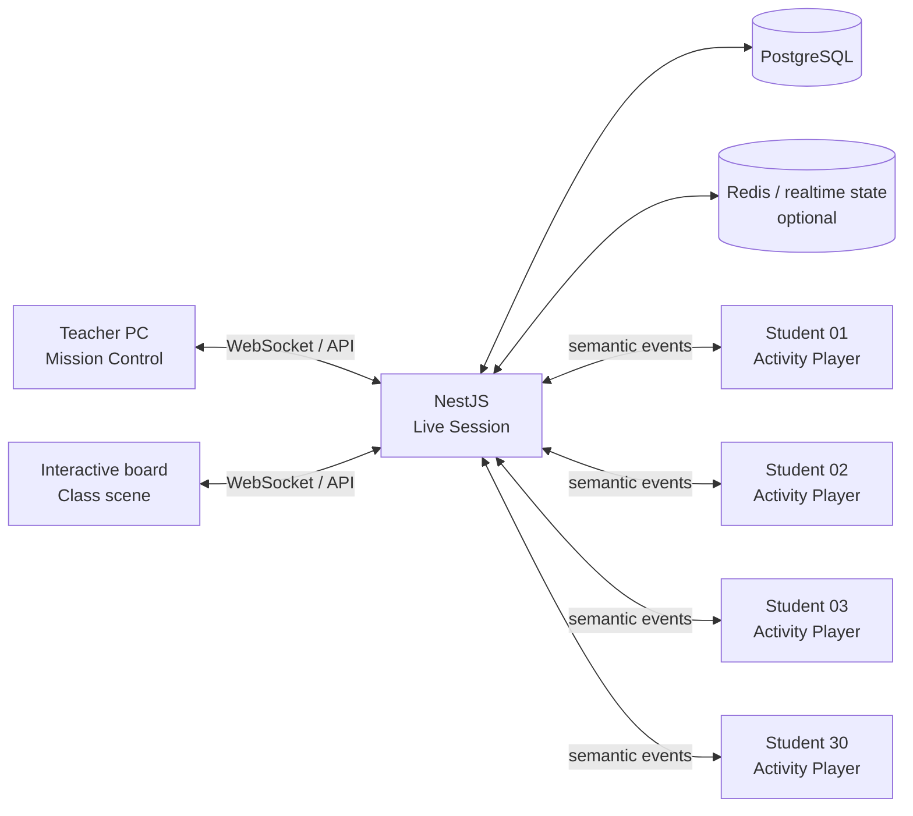
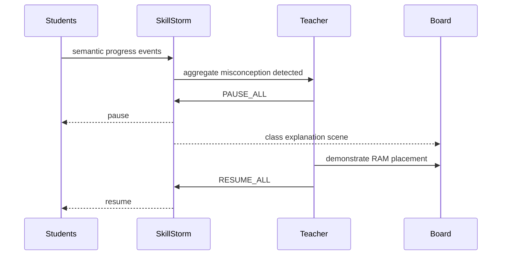
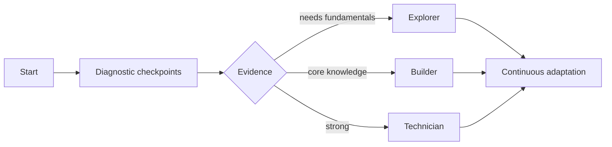
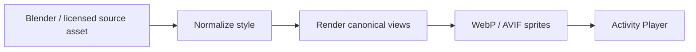
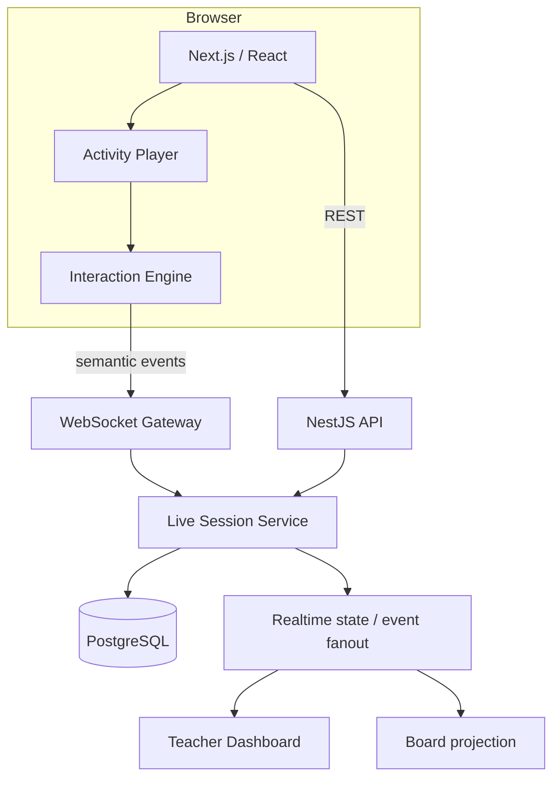
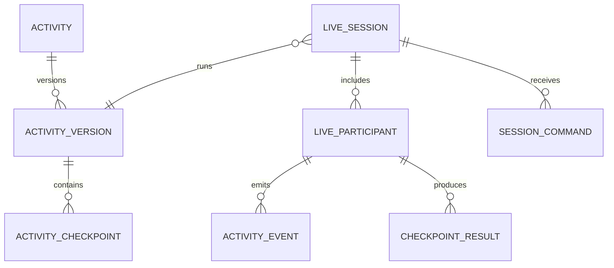

# SkillStorm Interactive IT Lab

> **Status:** product & architecture vision  
> **Target:** dlouhodobý směr nad existujícími Live Sessions  
> **Last review:** 2026-08-07  
> **Princip:** tabule není hlavní zařízení. Tabule je společná scéna, žák pracuje na vlastním zařízení a učitel řídí celou třídu z jednoho dashboardu.  
> **Parent vision:** [SkillStorm Interactive Curriculum](../interactive-curriculum/README.md)

---

## 1. Proč tento směr existuje

SkillStorm nemá být jen knihovna PDF, testů a kvízů. Pro informatiku může vzniknout výrazně silnější vrstva: **interaktivní laboratoř**, ve které celá třída současně řeší praktický problém a učitel v reálném čase vidí průběh všech žáků.

Typická hodina nemá vypadat tak, že jeden žák pracuje na interaktivní tabuli a zbytek třídy čeká. Správný model je distribuovaný:

- **žák** řeší vlastní interaktivní misi,
- **učitel** má Mission Control se stavem celé třídy,
- **tabule** zobrazuje společný postup, vysvětlení a společné zásahy,
- **server** synchronizuje pouze významné události, ne obrazovku nebo pohyb myši,
- **SkillStorm** ukládá výsledky jako důkaz zvládnutých kompetencí.

### Product statement

> **SkillStorm je interaktivní laboratoř informatiky pro celou třídu — praktické simulace, adaptivní obtížnost, živý učitelský dohled a okamžitá zpětná vazba.**

---

## 2. Vazba na současný stav

Tato vize **nenahrazuje** existující Bleskovky / Live Sessions.

Současný režim `BOARD_ONLY` zůstává lehký, rychlý a anonymní režim pro společnou práci na tabuli. Existující interaktivní kola (`MATCH_PAIRS`, `ORDER`, `SORT_BINS`) zůstávají vhodná pro krátké aktivity přímo na projekci.

Nová vrstva navazuje na připravený budoucí režim `DEVICES` a rozšiřuje ho o plnohodnotné interaktivní aktivity.

Související dokumentace:

- [Interactive Curriculum](../interactive-curriculum/README.md)
- [Live Sessions](../live-sessions.md)
- [Live Sessions — interactive rounds](../live-sessions-interactions.md)

### Důležitý invariant

**Nevydávat cílovou architekturu za již implementovanou funkcionalitu.** Každá část tohoto dokumentu je buď:

- `CURRENT` — existuje v mainu,
- `NEXT` — doporučený nejbližší krok,
- `VISION` — cílový stav.

---

## 3. Základní classroom model



### Role zařízení

| Zařízení | Úloha |
| --- | --- |
| Student PC / tablet | vlastní interaktivní aktivita |
| Teacher PC | přehled celé třídy, zásahy, pomoc, řízení tempa |
| Interaktivní tabule | společná mise, agregovaný postup, vysvětlení, demonstrace |
| Backend | autoritativní stav session, persistence, bezpečnost, agregace |

---

## 4. Killer feature: Teacher Mission Control

Hlavní hodnota není samotná hra. Hlavní hodnota je, že učitel **nemusí běhat naslepo mezi 30 monitory**.

### Cílový pohled

```text
┌────────────────────────────────────────────────────────────────────┐
│ 9.A · BUILD A PC                                  18:32 remaining  │
├────────────────────────────────────────────────────────────────────┤
│ CLASS PROGRESS  ████████████░░░░  67 %                            │
│                                                                    │
│ ✅ 6 hotovo    🟢 14 pracuje    🟠 6 problém    🔴 2 stojí         │
│                                                                    │
│ Největší problém třídy                                             │
│ 11 žáků chybuje u RAM / dual-channel                              │
│ [ Zastavit a vysvětlit ]                                           │
├────────────────────────────────────────────────────────────────────┤
│ Adam       72 %   GPU            1 chyba    0 hints     🟢          │
│ Barbora    68 %   RAM            0 chyb     1 hint      🟢          │
│ David      34 %   CPU            4 chyby    2 hints     🟠          │
│ Eliška     21 %   Motherboard    6 chyb     3 hints     🔴 2:13     │
│ Filip     100 %   DONE           1 chyba    0 hints     ✅          │
└────────────────────────────────────────────────────────────────────┘
```

### Učitel potřebuje vědět

- kdo pokračuje bez problému,
- kdo se pravděpodobně zasekl,
- na kterém checkpointu,
- jaké typy chyb se opakují napříč třídou,
- kdo opakovaně žádá o nápovědu,
- kdo je hotový a může dostat challenge,
- kdy má smysl přerušit práci celé třídy.

### Učitel nepotřebuje

- stream 30 obrazovek,
- každý pohyb kurzoru,
- detailní behaviorální dohled,
- desítky dashboardových metrik bez pedagogické akce.

**Mission Control musí být intervention dashboard, ne surveillance dashboard.**

---

## 5. Teacher intervention loop



### Příklad

1. 12 z 28 žáků udělá podobnou chybu u RAM.
2. SkillStorm zobrazí učiteli doporučení.
3. Učitel stiskne **Pause all**.
4. Žákovské activity playery se bezpečně zastaví.
5. Tabule přepne na vysvětlující scénu.
6. Učitel nebo žák problém ukáže.
7. Učitel dá **Resume all**.
8. Každý pokračuje ve svém stavu.

---

## 6. Role interaktivní tabule

Tabule není administrátorský dashboard a nemá veřejně vystavovat pořadí nebo individuální chyby.

### Board view

```text
┌──────────────────────────────────────────────────────┐
│ 9.A · BUILD A PC                                    │
│                                                      │
│                 SPOLEČNÝ POSTUP                      │
│                       67 %                           │
│                                                      │
│ CPU          ██████████████████  92 %                │
│ RAM          ███████████████░░░  78 %                │
│ GPU          ████████████░░░░░░  61 %                │
│ POWER        ████████░░░░░░░░░░  39 %                │
│                                                      │
│              6 sestav dokončeno                      │
│                                                      │
│ BOSS CHALLENGE                                       │
│ Zapoj 24pin ATX + CPU EPS + GPU power.               │
└──────────────────────────────────────────────────────┘
```

### Board může zobrazovat

- společný postup,
- checkpoint hodiny,
- anonymní agregované problémy,
- společnou challenge,
- demonstraci,
- countdown,
- společnou reflexi.

### Board defaultně nezobrazuje

- jména slabších žáků,
- individuální počet chyb,
- veřejný leaderboard žáků,
- data, která nepotřebuje třída vidět.

---

## 7. Obtížnost: ne Easy / Medium / Hard

Výuková obtížnost musí reflektovat skutečný stav znalostí.

### Úrovně

#### Explorer

Pro žáka, který se s tématem seznamuje.

- komponenty pojmenované,
- větší hit zones,
- zvýrazněné oblasti,
- krokování,
- vysvětlení funkcí,
- omezený počet distractorů.

Příklad:

> Najdi CPU.

> Co CPU přibližně dělá?

> Přetáhni CPU do zvýrazněného socketu.

#### Builder

Žák zná základní komponenty.

- žádné zvýrazněné cíle,
- komponenty pojmenované,
- základní kompatibilita,
- méně explicitní nápověda.

> Sestav funkční kancelářský počítač.

#### Technician

Žák dostává problém místo návodu.

- katalog komponent,
- budget,
- socket compatibility,
- RAM type,
- PSU sizing,
- form factor.

> Sestav herní počítač do 25 000 Kč.

#### Engineer

Diagnostický režim.

> PC se zapne, ventilátory běží, ale monitor nemá obraz.

Žák musí najít příčinu.

---

## 8. Obtížnost a scaffolding jsou dvě různé osy

Toto nesmí být jeden parametr.

### Difficulty

Určuje **náročnost problému**.

### Scaffolding

Určuje **množství podpory**.

Příklad stejného checkpointu:

```text
High scaffolding
────────────────
Vlož RAM do správného slotu.
[ DIMM slot zvýrazněn ]

Standard scaffolding
────────────────────
Vlož RAM do správného slotu.

Low scaffolding
───────────────
Nakonfiguruj paměť pro dual-channel.
```

Tím lze podporovat:

- heterogenní třídu,
- SVP,
- nadané žáky,
- individuální intervenci,
- adaptivní cestu.

---

## 9. Adaptivní režim

`VISION`

Učitel může zvolit:

```text
Úroveň
● Adaptivní
○ Explorer
○ Builder
○ Technician
○ Engineer
```

V adaptivním režimu začne student krátkou diagnostickou sekvencí.



Žák **nemá být veřejně označen jako slabý / basic**. Úrovně mají fungovat jako mise, ne stigma.

---

## 10. Teacher override je autorita

Adaptivní systém nesmí učiteli odebrat kontrolu.

Učitel musí být schopen:

- nastavit jednu úroveň celé třídě,
- nastavit úroveň skupině,
- přepsat úroveň konkrétního žáka,
- vypnout adaptivitu,
- změnit scaffolding,
- otevřít challenge.

Pedagogický kontext může algoritmus neznat.

---

## 11. SVP / accessibility

Přístupnost nesmí být dodatečný skin.

Activity Engine musí od začátku podporovat alternativní ovládání a prezentaci.

### Input

- pointer / mouse,
- touch,
- keyboard,
- tap + tap jako alternativa drag & drop,
- dostatečně velké targety.

### Presentation

- reduced motion,
- high contrast,
- škálování UI,
- omezení distraktorů,
- čitelnější instrukce,
- postupné odkrývání kroků,
- text-to-speech tam, kde dává smysl.

### Assessment

**Stejný learning objective nemusí znamenat stejný způsob interakce.**

Žák, pro kterého je jemný drag & drop bariéra, nesmí dostat horší pedagogický výsledek jen kvůli motorickému omezení.

---

## 12. První showcase: Build a PC

### Vertical slice

První produkční simulace má pokrýt pouze:

1. PC case,
2. motherboard,
3. CPU,
4. cooler,
5. RAM,
6. SSD,
7. GPU,
8. PSU,
9. základní napájecí kabeláž,
10. power-on / POST.

### Explicitní non-goals MVP

- šroubování každého šroubu,
- thermal paste physics,
- stovky komerčních SKU,
- custom water cooling,
- RGB konfigurátor,
- fotorealistická fyzika kabelů,
- simulace celého BIOSu.

To jsou drahé detaily s nízkou počáteční pedagogickou návratností.

---

## 13. Student player — grafický směr

Cílem není vizuál školního formuláře.

Cílem je **lehké výukové herní prostředí**.

```text
╭─────────────────────────────────────────────────────╮
│ SKILLSTORM · BUILD LAB                    BUILDER   │
│ Mission 03 · Install memory                         │
│                                                     │
│        ╭─────────────────────────────╮              │
│        │                             │              │
│        │          PC CASE            │              │
│        │                             │              │
│        │    ┌────────────────┐       │              │
│        │    │ MOTHERBOARD    │       │              │
│        │    │ CPU            │       │              │
│        │    │ [DIMM][DIMM]   │       │              │
│        │    └────────────────┘       │              │
│        │                             │              │
│        ╰─────────────────────────────╯              │
│                                                     │
│ INVENTORY                                           │
│ [ DDR5 ] [ SSD ] [ GPU ] [ PSU ]                    │
│                                                     │
│ Progress ███████████░░░░░ 64 %                      │
╰─────────────────────────────────────────────────────╯
```

### Microinteraction quality bar

Při uchopení komponenty:

- mírný scale-up,
- stín,
- jemný tilt,
- validní drop zóna reaguje,
- invalidní umístění se nezesměšňuje agresivní červenou,
- po validním položení magnetic snap,
- jemný zvuk zacvaknutí,
- krátká completion animace.

---

## 14. 2.5D před plným 3D

Výchozí strategie je **2.5D**.

### Asset pipeline



### Proč

- výrazně nižší HW požadavky,
- lepší kompatibilita starších školních PC,
- snazší touch hit testing,
- rychlejší tvorba obsahu,
- konzistentní vizuální styl,
- menší bundle/runtime complexity.

### 3D použít když

3D přináší **výukovou hodnotu**, kterou 2.5D nedokáže rozumně poskytnout.

Ne proto, že působí technologicky impozantněji.

---

## 15. Rendering stack

Doporučený směr:

| Potřeba | Technologie |
| --- | --- |
| standardní SkillStorm UI | React / Next.js / Tailwind |
| jednoduché UI DnD | DOM / pointer events / případně dnd-kit |
| herní 2D/2.5D scény | Phaser |
| síťové a uzlové diagramy | React Flow nebo vlastní graph layer |
| budoucí skutečné 3D | Three.js |
| realtime | NestJS WebSocket gateway |
| persistence | PostgreSQL + Prisma |

Technologie jsou doporučení pro spike; před adopcí konkrétní externí knihovny se ověří aktuální licence, bundle size, accessibility a browser support.

---

## 16. Compatibility model

Aktivita nesmí znát pouze obrázky.

Komponenty potřebují doménová metadata.

Konceptuálně:

```ts
type Cpu = {
  socket: 'AM5' | 'LGA1700';
  tdpW: number;
};

type Motherboard = {
  socket: 'AM5' | 'LGA1700';
  memoryType: 'DDR4' | 'DDR5';
  formFactor: 'ATX' | 'mATX' | 'ITX';
};
```

Validace potom vyhodnocuje pravidla:

```text
CPU socket == motherboard socket
RAM type == motherboard memory type
motherboard form factor ∈ case supported formats
GPU length <= case clearance
PSU capacity >= required system power + policy reserve
```

**Přesná pravidla musí být odborně verzovaná a testovaná.**

---

## 17. Virtual Tech Store

Vyšší úrovně mohou pracovat s katalogem.

```text
SKILLSTORM TECH STORE
────────────────────────────────
Budget                         25 000 Kč

CPU        Ryzen-class         4 500 Kč
Board      B-series            3 300 Kč
RAM        32 GB DDR5          2 100 Kč
SSD        1 TB NVMe           1 800 Kč
GPU        Mid-range           8 000 Kč
PSU        650 W               1 700 Kč
Case                            1 500 Kč
────────────────────────────────
Total                         22 900 Kč
Remaining                      2 100 Kč
```

Mise mohou být:

- kancelářské PC,
- školní počítač,
- herní sestava,
- počítač pro střih videa,
- budget build,
- diagnostika nekompatibilního návrhu.

Pro MVP preferovat **generické komponenty**, ne závislost na živých cenách reálných obchodů.

---

## 18. Power-on a diagnostika

Po sestavení musí přijít důsledek.

```text
[ POWER ON ]

POST SUCCESSFUL
CPU ........ detected
RAM ........ 32 GB
SSD ........ detected
GPU ........ detected
```

nebo:

```text
NO DISPLAY
Fans spinning: YES
POST: FAILED

Diagnose the system.
```

Možné příčiny:

- RAM není správně osazená,
- chybí CPU power,
- GPU power,
- monitor je ve špatném výstupu,
- komponenta je nekompatibilní.

To propojuje deklarativní znalost s troubleshootingem.

---

## 19. Activity Engine

Build a PC nesmí být hardcoded special case.

Cílem je obecný model.

### Navržené activity families

```text
QUIZ
MATCH
SORT
ORDER
HOTSPOT
BUILD
CONNECT
CONFIGURE
DIAGNOSE
SIMULATE
```

### IT příklady

| Family | Příklad |
| --- | --- |
| `HOTSPOT` | označ CPU socket |
| `SORT` | input vs output devices |
| `ORDER` | boot sequence / algoritmus |
| `BUILD` | sestav PC |
| `CONNECT` | vytvoř LAN |
| `CONFIGURE` | nastav síť / BIOS-lite |
| `DIAGNOSE` | PC nemá obraz |
| `SIMULATE` | phishing / security incident |

---

## 20. Další budoucí IT laboratoře

### Network Lab

```text
[PC1] ─────┐
           │
        [SWITCH] ─── [ROUTER] ─── INTERNET
           │
[PC2] ─────┘
           │
        [SERVER]
```

Mise:

> Propoj učebnu tak, aby klienti viděli server i internet.

### Cybersecurity Lab

Simulace:

- phishing,
- password hygiene,
- permissions,
- ransomware incident,
- suspicious USB,
- social engineering.

### Algorithm Lab

```text
[ INPUT x ]
     ↓
[ x > 10 ? ]
  ↙      ↘
YES      NO
```

### Database Lab

Žák vizuálně skládá:

- tabulky,
- klíče,
- vazby,
- queries.

### Operating System Lab

- process / memory model,
- files and permissions,
- storage,
- troubleshooting.

---

## 21. Runtime architektura



### Důležitá hranice

Rendering hry je převážně **client-local**.

Server není remote graphics engine.

---

## 22. Semantic event protocol

Přes realtime kanál neposílat:

```text
POINTER_MOVE x=254 y=481
POINTER_MOVE x=255 y=483
POINTER_MOVE x=257 y=488
```

Posílat pouze významné události.

Příklad:

```json
{
  "type": "COMPONENT_PLACED",
  "component": "RAM_DDR5_1",
  "target": "DIMM_A2",
  "checkpoint": "MEMORY_INSTALL"
}
```

```json
{
  "type": "PLACEMENT_REJECTED",
  "reason": "INVALID_TARGET",
  "checkpoint": "MEMORY_INSTALL"
}
```

```json
{
  "type": "HINT_REQUESTED",
  "checkpoint": "MEMORY_INSTALL",
  "hintLevel": 1
}
```

```json
{
  "type": "CHECKPOINT_COMPLETED",
  "checkpoint": "MEMORY_INSTALL"
}
```

Výhody:

- nízký network traffic,
- jednoduchá agregace,
- lepší privacy,
- server dostává pedagogicky smysluplná data,
- hra zůstává responsive i při krátkém network jitteru.

---

## 23. Event reliability

Student klient musí být odolný proti přechodným problémům Wi-Fi.

`VISION` pravidla:

- event má client-generated ID,
- odeslání je idempotentní,
- klient drží krátkou lokální queue,
- reconnect obnoví session a server checkpoint,
- server nepočítá duplicate event dvakrát,
- kritické checkpointy se potvrzují.

Nesnažit se držet server a klient pixel-perfect synchronizované.

---

## 24. Cílový doménový model

Nesnažit se vtlačit simulace do současného `Question` / `Response` modelu.

Testování a komplexní interaktivní aktivity mají jinou životnost a telemetry.

Konceptuální cílové entity:



### `Activity`

Identita aktivity.

- title,
- type,
- subject/topic mapping,
- scope,
- author.

### `ActivityVersion`

Immutable publikovaná definice.

Live session vždy běží proti konkrétní verzi.

### `ActivityCheckpoint`

Pedagogické kroky / kompetence.

Např.:

- identify_cpu,
- install_cpu,
- install_memory,
- connect_power,
- diagnose_post.

### `LiveSession`

Jedna reálná hodina / spuštění.

### `LiveParticipant`

Student + session-local stav.

### `ActivityEvent`

Append-oriented významné eventy.

### `CheckpointResult`

Kompaktní pedagogický výsledek checkpointu.

### `SessionCommand`

Např.:

- pause,
- resume,
- show_explanation,
- change_stage,
- assign_challenge.

---

## 25. Vztah ke stávajícímu SkillStorm modelu

Současné entity zůstávají důležité:

- organizace,
- membership,
- class section,
- subject,
- topic level,
- difficulty,
- objectives,
- prerequisites,
- assignments,
- students / teachers.

Activity Engine má být další obsahová/exekuční vrstva nad tímto školním modelem.

### Topic mapping

Aktivita může být navázaná například na:

```text
CatalogSubject: INFORMATIKA
TopicLevel: Hardware / INTRO
Difficulty: BASIC
Activity: Build a PC — Explorer
```

---

## 26. Test a Activity jsou rozdílné produkty

### Test

Odpovídá hlavně na:

> Co student dokáže zodpovědět?

### Activity

Odpovídá na:

> Co student dokáže provést / vyřešit / diagnostikovat?

Někdy se překrývají, ale nesmí být modelovány jako totéž jen kvůli úspoře jedné databázové tabulky.

---

## 27. Authoring

Dlouhodobá hodnota Activity Engine vznikne až ve chvíli, kdy nový obsah nebude vyžadovat vývojáře.

### V1

Aktivity mohou být definované vývojářsky / seedem.

### V2

Interní editor pro centrální content tým.

### V3

Bezpečný teacher builder pro podporované activity family.

Neotevírat generický scripting engine učitelům v MVP.

---

## 28. Bezpečnost

### Server-side autorita

Klient nesmí rozhodovat o:

- finálním hodnocení,
- odemknutí chráněného obsahu,
- oprávnění,
- kompatibilitě, která vstupuje do výsledku,
- session control commands.

### Hidden solution contract

Stejný princip jako dnešní Live Sessions:

**správné řešení se klientovi neposílá před chvílí, kdy jej skutečně smí znát.**

U komplexních activity je potřeba navrhnout challenge data tak, aby klient nepotřeboval celý solution graph jen kvůli renderingu.

---

## 29. Privacy

Teacher Mission Control nemá být spyware.

### Ukládat

- pedagogicky významné eventy,
- checkpoint progress,
- attempts relevantní pro diagnostiku,
- hint usage,
- completion.

### Neukládat jako default

- každou souřadnici pointeru,
- screenshoty obrazovky,
- keylogging,
- neomezenou raw telemetry bez vzdělávacího účelu.

Data retention musí být explicitní součást návrhu před produkčním `DEVICES` režimem.

---

## 30. Veřejná tabule a osobní data

Projection endpoint/view musí být samostatná bezpečná projekce.

Board dostává například:

```json
{
  "classProgress": 0.67,
  "completedCount": 6,
  "activeCount": 14,
  "needsHelpCount": 8,
  "misconceptions": [
    {
      "checkpoint": "MEMORY_INSTALL",
      "affected": 11
    }
  ]
}
```

Ne:

```json
{
  "student": "Jan Novak",
  "wrongAttempts": 9
}
```

---

## 31. Performance budget

První verze musí být testovaná i na slabším školním hardware.

Cíl není demonstrace na high-end MacBooku.

### Performance principles

- lazy-load activity engine,
- code splitting,
- komprimované assets,
- preload pouze aktuální / nejbližší stage,
- žádné obří 3D bundle v core SkillStorm app,
- respektovat reduced motion,
- držet teacher dashboard rychlý i při 30–35 aktivních studentech.

Konkrétní numerické budgety definovat až po performance spike na reprezentativních školních strojích.

---

## 32. Offline a špatná Wi-Fi

Cílem není úplný offline multiplayer v první verzi.

MVP však musí tolerovat:

- krátký výpadek Wi-Fi,
- reconnect,
- opakované odeslání eventu,
- refresh stránky,
- dočasně pomalý backend.

Student nesmí přijít o 20 minut práce při jednom reconnectu.

---

## 33. PWA

Activity Player je dobrý kandidát pro postupné PWA schopnosti:

- asset caching,
- rychlé spuštění,
- fullscreen-like experience,
- resilience.

Instalace PWA nesmí být podmínkou používání ve škole.

Browser-first zůstává default.

---

## 34. Dotyková tabule

UI musí být explicitně navržené pro:

- velké obrazovky,
- touch,
- nepřesný dotyk,
- případný multi-touch,
- práci před třídou,
- fullscreen,
- rozdílné poměry stran.

### Board UI pravidla

- velké targety,
- nulová závislost na hover,
- důležité ovládání dosažitelné,
- výrazný stav aktivní interakce,
- možnost teacher lock / unlock interaction.

---

## 35. Teacher-led vs student-led

Stejný Activity Engine musí podporovat dva režimy.

### Student-led

Každý pracuje na vlastním zařízení.

### Teacher-led

Aktivita běží na tabuli a třída ji řeší společně.

Build a PC tedy může být:

> každý si skládá vlastní sestavu

nebo:

> jeden společný počítač na tabuli a třída hlasuje / vysílá žáky k řešení.

Student-led je hlavní cílový showcase; teacher-led poskytuje využití i školám bez 1:1 zařízení.

---

## 36. Classroom without accounts

`VISION`

Pro některé guest/live scénáře může být užitečný join kód.

Ale pro standardní školní hodinu preferovat existující autentizovaný kontext třídy, pokud jsou studenti přihlášení.

Join flow nesmí oslabovat tenant isolation ani identity/RBAC pravidla.

---

## 37. Teams

Ne každá hodina potřebuje individuální režim.

Budoucí session může umožnit:

- jednotlivce,
- dvojice,
- malé týmy.

Například Network Lab může být vhodnější ve dvojicích.

Teacher dashboard potom sleduje team progress a individuální evidence jen tam, kde ji skutečně máme.

---

## 38. Gamifikace

Gamifikace má podporovat chuť pokračovat, ne měnit hodinu na veřejný výkonový ranking.

Preferovat:

- mission progress,
- unlock challenge,
- mastery feedback,
- class co-op target,
- třídního parťáka.

Nepreferovat jako default:

- veřejný žebříček nejslabší → nejlepší,
- penalizaci pomalých studentů,
- XP pouze za správnost,
- streak pressure.

---

## 39. Co má být „cool“

Cool není synonymum pro více částic nebo 3D.

Cool je:

- komponenta se chová přesvědčivě,
- PC po správném sestavení opravdu nabootuje,
- špatné zapojení má logický důsledek,
- celá třída vidí společnou misi,
- učitel může zastavit scénu a něco ukázat,
- žák má pocit, že něco **dělá**, ne že vyplňuje test.

---

## 40. Ukázková 45min hodina

### 0–5 min — briefing

Board:

> **MISSION: Sestav funkční PC.**

Učitel vysvětlí cíl.

### 5–10 min — diagnostika

Krátké checkpointy pomohou určit vhodný scaffolding.

### 10–25 min — build

Žáci staví.

Teacher dashboard identifikuje problémy.

### 25 min — společná intervence

SkillStorm:

> 43 % třídy chybuje u power delivery.

Učitel dá Pause all a vysvětlí problém na tabuli.

### 28–37 min — pokračování

Studenti pokračují.

Rychlí dostanou compatibility challenge.

### 37–42 min — boss challenge

Společný diagnostický problém.

### 42–45 min — reflexe

Teacher report:

```text
CPU identification       93 %
Memory installation      86 %
Storage                   89 %
Power delivery            54 %
Compatibility reasoning   61 %
```

Doporučení:

> příští hodinu začít napájením a kompatibilitou.

---

## 41. Teacher report nesmí předstírat přesnost

Pokud systém nemá dost evidence, nesmí tvrdit:

> Student ovládá kompetenci na 73 %.

Preferovat interpretovatelné údaje:

- checkpoint zvládnut bez pomoci,
- zvládnut po nápovědě,
- opakovaná miskoncepce,
- nedokončeno,
- evidence insufficient.

Mastery model lze zavést později na základě dostatečných dat a validace.

---

## 42. AI role

AI je pozdější vrstva.

Dobré budoucí použití:

- vysvětlit konkrétní chybu přiměřeně úrovni,
- generovat varianty mise z validovaných komponent,
- shrnout učiteli opakující se problémy,
- doporučit navazující aktivitu.

AI nesmí být v první verzi autoritou pro technickou kompatibilitu.

Compatibility musí rozhodovat deterministický, testovatelný rules engine.

---

## 43. Localization

Activity data musí být od začátku připravená na lokalizaci.

Nemíchat české texty přímo do interaction logic.

Cíl:

```text
logic
  ↓
semantic content keys
  ↓
cs / en / de / pl / ...
```

To je důležité pro budoucí mezinárodní směr.

---

## 44. Open assets a licence

Externí open-source / free assets mohou dramaticky snížit cenu prototypu.

Pravidla:

- každá asset source má evidovanou licenci,
- žádné náhodné obrázky z Google Images,
- komerční použití musí být explicitně kompatibilní,
- attribution requirements musí být evidované,
- pokud asset vizuálně nesedí, raději vlastní stylizovaný model.

Asset registry má být součást content pipeline před větším rozšiřováním.

---

## 45. Testovací strategie

### Unit

- compatibility rules,
- checkpoint transitions,
- difficulty rules,
- event reducers,
- teacher aggregation.

### Integration

- session lifecycle,
- websocket auth,
- tenant isolation,
- reconnect,
- idempotence.

### Browser / Playwright

- mouse interaction,
- touch PointerEvents,
- keyboard alternative,
- teacher pause/resume,
- 30 simulated participants,
- projection privacy.

### Visual

- reprezentativní rozlišení tabulí,
- notebook,
- tablet,
- reduced motion,
- large text.

### Manual classroom pilot

Automatické testy nestačí.

Vertical slice musí projít skutečnou hodinou.

---

## 46. Observability

Potřebujeme rozlišit dvě kategorie.

### Product telemetry

Pouze agregované informace potřebné pro zlepšování produktu, podle privacy policy.

### Operational telemetry

- session disconnects,
- websocket error rate,
- activity load failures,
- asset failures,
- latency,
- crash reporting.

Nezaměňovat operational observability s monitoringem chování dítěte.

---

## 47. Rollout

### Phase 0 — architecture spike

- Phaser / alternative performance spike,
- touch board spike,
- websocket 30-client spike,
- asset pipeline spike,
- accessibility spike.

### Phase 1 — LiveSession DEVICES foundation

- authenticated participants,
- lobby / session connect,
- realtime events,
- reconnect,
- teacher participant grid,
- board projection.

### Phase 2 — generic Activity skeleton

- Activity + immutable ActivityVersion,
- checkpoints,
- semantic events,
- command protocol,
- Activity Player host.

### Phase 3 — Build a PC vertical slice

- Explorer + Builder,
- core components,
- placement validation,
- power-on,
- teacher progress.

### Phase 4 — classroom intervention

- misconception aggregation,
- pause/resume,
- board explain mode,
- challenge assignment.

### Phase 5 — advanced PC simulation

- Technician,
- compatibility/catalog,
- Engineer diagnostics.

### Phase 6 — second Activity family

Například Network Lab.

**Tato fáze je zásadní.** Teprve druhá komplexní aktivita ověří, zda opravdu vznikl obecný Activity Engine a ne jen elegantně zabalený PC simulator.

---

## 48. MVP acceptance criteria

Build-a-PC MVP není hotový jen proto, že se komponenty dají přetahovat.

Musí projít minimálně:

### Classroom

- učitel spustí session pro existující třídu,
- 30 student klientů se připojí,
- každý má vlastní progress,
- učitel vidí stav všech bez refreshování,
- pause/resume funguje,
- board zobrazuje pouze bezpečnou agregaci.

### Activity

- CPU / RAM / SSD / GPU / PSU lze správně umístit,
- invalidní kroky mají didaktickou odpověď,
- checkpointy jsou persistované,
- refresh/reconnect nezničí práci,
- power-on reaguje podle sestavy.

### Difficulty

- minimálně Explorer + Builder,
- scaffolding lze měnit nezávisle,
- učitel může override.

### Accessibility

- základní flow lze dokončit touch,
- mouse,
- keyboard alternativou nebo ekvivalentním accessible interaction path,
- reduced motion.

### Performance

- ověřeno na reprezentativním slabším školním PC,
- ověřena školní tabule,
- 30 paralelních klientů.

### Security

- tenant isolation,
- student nemůže ovládat session,
- hidden solution leak test,
- projection PII leak test.

---

## 49. Pilot success criteria

Po skutečné hodině se ptáme hlavně:

### Teacher

- Viděl učitel rychleji, kdo potřebuje pomoc?
- Ušetřil mu dashboard chození naslepo?
- Bylo pause/explain/resume přirozené?
- Použil by aktivitu znovu bez vývojáře?

### Students

- Pracovala větší část třídy většinu času?
- Dokázali vysvětlit chyby po aktivitě?
- Nebyl interaction model překážkou učivu?

### Technical

- fungovala školní Wi-Fi,
- fungovala tabule,
- neztratily se session states,
- běžel player plynule na školních strojích.

---

## 50. Klíčová produktová metrika

Nejdůležitější metrika není „kolik minut děti hrály“.

Je:

> **Pomohl SkillStorm učiteli rychleji odhalit, co konkrétně jeho třída nechápe, a umožnil mu během stejné hodiny zasáhnout?**

To je rozdíl mezi hrou a vzdělávacím produktem.

---

## 51. Co nedělat

1. **Nezačít plným 3D.**
2. **Nevytvářet Build-a-PC jako izolovanou route s hardcoded logikou.**
3. **Nepřepisovat současné testování na Activity model.**
4. **Neposílat raw pointer telemetry serveru.**
5. **Nedělat veřejné leaderboardy studentů.**
6. **Nepřidávat AI před deterministickým rules enginem.**
7. **Nevytvářet 50 komponent před ověřením classroom loopu.**
8. **Neoptimalizovat grafiku jen na výkonná zařízení vývojářů.**
9. **Nezaměnit XP za learning design.**
10. **Neimplementovat další komplexní simulaci, dokud první vertical slice neprojde pilotem.**

---

## 52. Co je skutečný moat

Samotná hra „sestav PC“ se dá okopírovat.

Obtížněji se kopíruje celý systém:

```text
Curriculum mapping
       +
Activity Engine
       +
Adaptive scaffolding
       +
Live classroom orchestration
       +
Teacher intervention intelligence
       +
Reusable content authoring
       +
School identity / classes / RBAC
       +
Longitudinal learning evidence
```

**Moat není Phaser. Moat je integrovaný pedagogický systém.**

---

## 53. Severka

Pokud máme rozhodovat mezi dvěma implementacemi, preferovat tu, která nás přibližuje k této hodině:

> Učitel jedním kliknutím spustí praktickou misi. Každý žák začne na úrovni, kterou zvládne. SkillStorm v reálném čase rozpozná, kde se třída láme. Učitel to vidí, zastaví práci, problém ukáže na tabuli a všichni pokračují. Na konci učitel nevidí jen skóre, ale ví, co má příští hodinu zopakovat.

Pokud feature tomuto cíli nepomáhá, nemá automaticky prioritu jen proto, že je vizuálně atraktivní.
