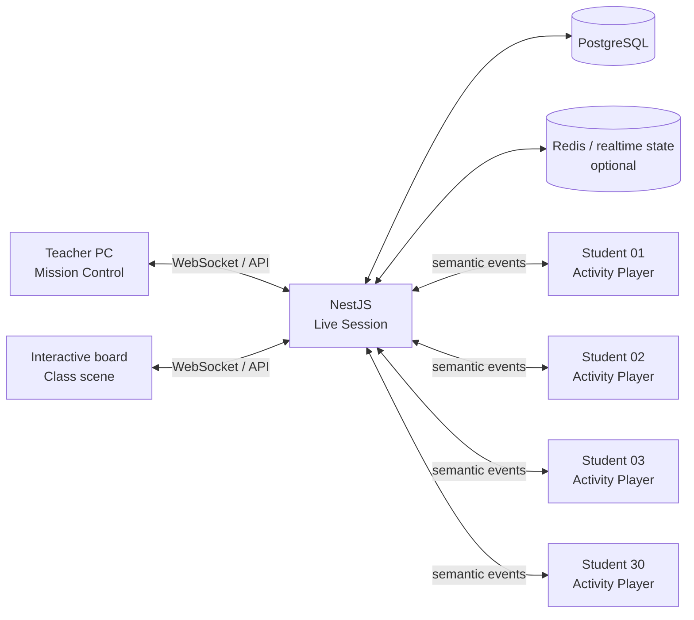
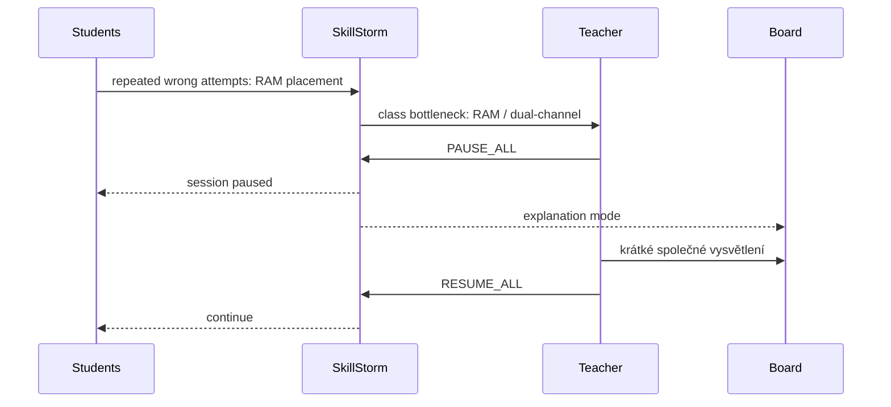
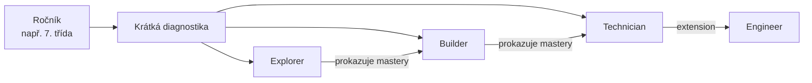
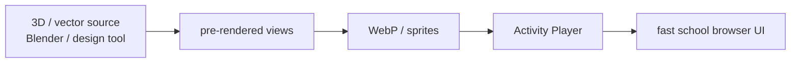
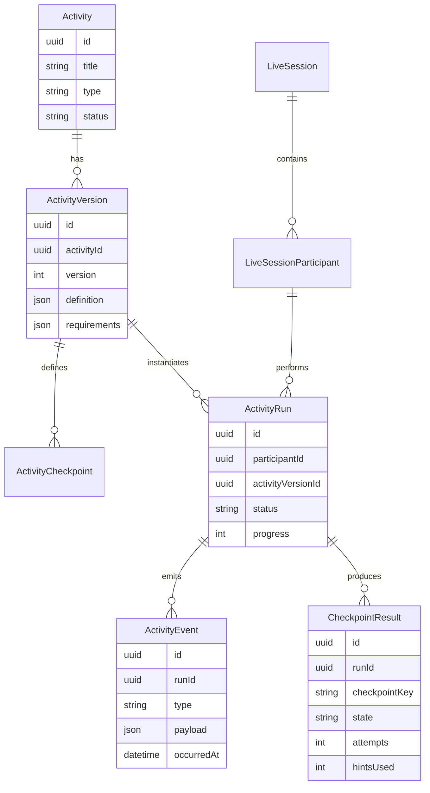

# SkillStorm Interactive IT Lab

> **Status:** product & architecture vision  
> **Target:** dlouhodobý směr nad existujícími Live Sessions  
> **Last review:** 2026-08-07  
> **Princip:** tabule není hlavní zařízení. Tabule je společná scéna, žák pracuje na vlastním zařízení a učitel řídí celou třídu z jednoho dashboardu.

---

## 1. Proč tento směr existuje

SkillStorm nemá být jen knihovna PDF, testů a kvízů. Pro informatiku může vzniknout výrazně silnější vrstva: **interaktivní laboratoř**, ve které celá třída současně řeší praktický problém a učitel v reálném čase vidí průběh všech žáků.

Typická hodina nemá vypadat tak, že jeden žák pracuje na interaktivní tabuli a zbytek třídy čeká. Správný model je distribuovaný:

- **žák** řeší vlastní interaktivní misi,
- **učitel** má Mission Control se stavem celé třídy,
- **tabule** zobrazuje společný postup, vysvětlení a společné zásahy,
- **server** synchronizuje pouze významné události, ne obrazovku nebo pohyb myši,
- **SkillStorm** ukládá výsledky jako důkaz zvládnutých kompetencí.

### Product statement

> **SkillStorm je interaktivní laboratoř informatiky pro celou třídu — praktické simulace, adaptivní obtížnost, živý učitelský dohled a okamžitá zpětná vazba.**

---

## 2. Vazba na současný stav

Tato vize **nenahrazuje** existující Bleskovky / Live Sessions.

Současný režim `BOARD_ONLY` zůstává lehký, rychlý a anonymní režim pro společnou práci na tabuli. Existující interaktivní kola (`MATCH_PAIRS`, `ORDER`, `SORT_BINS`) zůstávají vhodná pro krátké aktivity přímo na projekci.

Nová vrstva navazuje na připravený budoucí režim `DEVICES` a rozšiřuje ho o plnohodnotné interaktivní aktivity.

Související dokumentace:

- [Live Sessions](../live-sessions.md)
- [Live Sessions — interactive rounds](../live-sessions-interactions.md)

### Důležitý invariant

**Nevydávat cílovou architekturu za již implementovanou funkcionalitu.** Každá část tohoto dokumentu je buď:

- `CURRENT` — existuje v mainu,
- `NEXT` — doporučený nejbližší krok,
- `VISION` — cílový stav.

---

## 3. Základní classroom model



### Role zařízení

| Zařízení | Úloha |
| --- | --- |
| Student PC / tablet | vlastní interaktivní aktivita |
| Teacher PC | přehled celé třídy, zásahy, pomoc, řízení tempa |
| Interaktivní tabule | společná mise, agregovaný postup, vysvětlení, demonstrace |
| Backend | autoritativní stav session, persistence, bezpečnost, agregace |

---

## 4. Killer feature: Teacher Mission Control

Hlavní hodnota není samotná hra. Hlavní hodnota je, že učitel **nemusí běhat naslepo mezi 30 monitory**.

Učitel má během hodiny přehled například takto:

```text
┌────────────────────────────────────────────────────────────────────────────┐
│ 7.B · BUILD A PC                                      23:18 remaining      │
│                                                                            │
│ CLASS PROGRESS      63 %        ✅ 5 hotovo   🟢 16 pracuje   🔴 2 stojí   │
├────────────────────────────────────────────────────────────────────────────┤
│ Žák            Stav     Krok                    Chyby   Hinty   Neaktivní   │
│ Adam           72 %     GPU power                   1       0       4 s     │
│ Barbora        68 %     RAM                         0       1      12 s     │
│ David          34 %     CPU                         4       2      18 s     │
│ Eliška         21 %     Motherboard                 6       3    2:13 min   │
│ Filip         100 %     Hotovo                      1       0        —      │
├────────────────────────────────────────────────────────────────────────────┤
│ CLASS BOTTLENECK                                                           │
│ 11 žáků chybuje u RAM / dual-channel                                       │
│                                                                            │
│ [Vysvětlit celé třídě] [Pozastavit] [Poslat nápovědu] [Otevřít detail]     │
└────────────────────────────────────────────────────────────────────────────┘
```

### Dashboard musí odpovídat na čtyři otázky

1. **Kdo právě pracuje?**
2. **Kdo se pravděpodobně zasekl?**
3. **Na čem se zasekla větší část třídy?**
4. **Komu mám jako učitel pomoct jako prvnímu?**

To je vyšší priorita než žebříčky, XP nebo efektní animace.

### Stav žáka

Doporučená jednoduchá klasifikace:

- `WORKING` — postupuje,
- `STRUGGLING` — opakované chyby / více nápověd,
- `IDLE` — dlouho bez významné akce,
- `COMPLETED` — dokončeno,
- `DISCONNECTED` — klient ztratil spojení.

**Pozor:** `IDLE` nesmí vznikat ze sledování pohybu myši nebo klávesnice. Stačí čas od poslední významné aktivity.

---

## 5. Role interaktivní tabule

Tabule nemá zobrazovat seznam nejslabších žáků ani osobní výsledky.

Má být **společnou scénou**.

```text
┌─────────────────────────────────────────────────────────────┐
│                    7.B · BUILD A PC                          │
│                                                             │
│                     CLASS PROGRESS                           │
│                          67 %                                │
│                                                             │
│ CPU            ██████████████████  92 %                     │
│ RAM            ███████████████░░░  78 %                     │
│ GPU            ████████████░░░░░░  61 %                     │
│ POWER          ████████░░░░░░░░░░  39 %                     │
│                                                             │
│ ⚡ BOSS CHALLENGE                                            │
│ Dokáže třída správně zapojit ATX + CPU EPS + GPU power?     │
└─────────────────────────────────────────────────────────────┘
```

Učitel musí být schopen jedním klikem použít:

- `PAUSE_ALL`,
- `RESUME_ALL`,
- `SHOW_CLASS_EXPLANATION`,
- `START_CLASS_CHALLENGE`,
- `SEND_HINT_TO_SELECTED`,
- `END_SESSION`.

### Typický zásah



---

## 6. Obtížnost není Easy / Medium / Hard

Ročník je pouze **doporučený vstupní bod**. Není to důkaz skutečné úrovně konkrétního žáka.

V 7. třídě může jeden žák poprvé slyšet výraz CPU a druhý doma sestavovat vlastní počítač.

Proto musí být obtížnost rozdělena minimálně do dvou nezávislých os:

1. **náročnost kompetence**, kterou žák řeší,
2. **míra scaffolding / pomoci**, kterou SkillStorm poskytuje.

### Doporučené veřejné názvy úrovní

| Úroveň | Interní význam | Příklad |
| --- | --- | --- |
| **Explorer** | úvod / BASIC | pozná CPU, RAM, SSD a jejich základní funkci |
| **Builder** | základní aplikace | sestaví funkční PC podle připravených komponent |
| **Technician** | INTERMEDIATE | řeší kompatibilitu, kabeláž a konfiguraci |
| **Engineer** | ADVANCED | řeší diagnostiku, omezení a optimalizaci |

Nepoužívat vůči dětem označení typu „slabý“, „easy“ nebo „low level“.

### Nezávislá míra pomoci

| Scaffolding | Chování |
| --- | --- |
| Guided | zvýrazněné cíle, vysvětlení komponent, postup krok za krokem |
| Standard | základní instrukce, nápověda na vyžádání |
| Minimal | žádné zvýraznění, obecné zadání, minimum rad |

Dva žáci tak mohou řešit stejnou kompetenci, ale s jinou mírou podpory.

### Adaptivní režim

Doporučený dlouhodobý default:



Adaptace nesmí být neprůhledná. Učitel musí vždy vidět, proč systém doporučil konkrétní úroveň, a musí ji umět ručně změnit.

---

## 7. SVP a accessibility nejsou pozdější addon

Stejný activity engine musí od první verze počítat s tím, že ne každý žák může nebo chce používat stejnou interakci.

### Minimální požadavky

- ovládání myší, dotykem i klávesnicí,
- viditelný focus,
- žádná informace pouze barvou,
- možnost vypnout / omezit pohybové efekty,
- dostatečně velké touch targety,
- textové alternativy k ikonám,
- titulky / textová alternativa k audio feedbacku,
- čitelné rozložení při zvětšení,
- možnost prodlouženého času,
- alternativní interaction mode tam, kde drag & drop není vhodný,
- teacher override jednotlivých podpor.

### Příklad stejného cíle ve třech variantách

**Cíl:** osadit RAM.

- Guided: DIMM slot je zvýrazněný a systém popisuje, co hledat.
- Standard: žák dostane RAM a instrukci „osaď paměť“.
- Minimal: žák má dokončit správnou dual-channel konfiguraci bez zvýraznění.

Kompetence je stejná. Mění se cesta k ní.

---

## 8. První showcase: Build a PC

První velká aktivita má být dost dobrá, aby sama vysvětlila směr produktu.

### Vertical slice

Do první verze patří pouze:

1. rozpoznání základních komponent,
2. motherboard,
3. CPU,
4. cooler,
5. RAM,
6. SSD,
7. GPU,
8. PSU,
9. základní napájecí kabeláž,
10. `POWER ON`,
11. jednoduchý výsledek POST / diagnostiky.

### Co do první verze nepatří

- vodní chlazení,
- šroubování každého jednotlivého šroubku,
- thermal paste fyzika,
- stovky reálných SKU,
- RGB management,
- přesná simulace BIOSu,
- realistická elektrická simulace,
- plné 3D prostředí.

Tyto věci mají nízký poměr pedagogické hodnoty k nákladům vývoje.

---

## 9. Build a PC — progression podle úrovně

### Explorer — „Poznej počítač“

Žák ještě nedostává plně otevřenou sestavu.

Příklady:

- najdi CPU mezi několika komponentami,
- přiřaď komponentu k její funkci,
- najdi správné místo na motherboardu,
- vlož CPU do zvýrazněného socketu,
- vlož RAM do doporučeného slotu.

Chyba není trest. Je to další výukový krok.

> „Tento procesor do dané patice nepasuje. Deska používá jiný typ socketu.“

### Builder — „Sestav funkční počítač“

Žák dostane komponenty, ale sloty nejsou explicitně zvýrazněné.

Musí správně:

- osadit CPU,
- RAM,
- SSD,
- GPU,
- PSU,
- základní kabeláž.

### Technician — „Vyber a sestav kompatibilní konfiguraci“

Žák už komponenty **vybírá**.

Engine kontroluje například:

```text
CPU.socket == motherboard.socket
RAM.type == motherboard.memoryType
GPU.length <= case.maxGpuLength
PSU.wattage >= estimatedSystemLoad
motherboard.formFactor in case.supportedFormFactors
```

Mise například:

> Sestav kancelářský počítač do 15 000 Kč.

> Sestav herní počítač do 25 000 Kč.

> Sestav PC vhodné pro střih videa.

### Engineer — „Najdi závadu“

Počítač už je sestavený, ale nefunguje správně.

Příklady:

- `NO DISPLAY`,
- chybí CPU EPS power,
- GPU není napájená,
- RAM je špatně usazená,
- monitor je připojen do nesprávného výstupu,
- systémový disk není nalezen.

Žák se přesouvá od názvů komponent k **systémovému myšlení a diagnostice**.

---

## 10. Grafický směr: game-like, ne „školní formulář“

Aktivita musí působit jako lehká hra, ne jako test s přetahováním ikon.

### Doporučený vizuální styl

- čisté 2.5D,
- realisticky stylizované komponenty,
- výrazná pracovní plocha,
- inventář komponent,
- jemná hloubka / stíny,
- magnetic snap,
- krátké placement animace,
- decentní zvuky,
- jasný stav `pending / accepted / rejected`,
- minimum textu během manipulace,
- žádný vizuální chaos.

```text
┌────────────────────────────────────────────────────────────┐
│ BUILD LAB                                       Explorer   │
│                                                            │
│      ┌────────────────────────────────────────┐            │
│      │                                        │            │
│      │              PC CASE                   │            │
│      │                                        │            │
│      │       ┌──────────────────────┐         │            │
│      │       │     MOTHERBOARD      │         │            │
│      │       │                      │         │            │
│      │       │      [ CPU ]         │         │            │
│      │       │                      │         │            │
│      │       └──────────────────────┘         │            │
│      └────────────────────────────────────────┘            │
│                                                            │
│ INVENTORY                                                  │
│ [CPU] [RAM] [SSD] [GPU] [PSU] [COOLER]                     │
│                                                            │
│ Mission: Install memory                      64 %           │
│ ███████████████████░░░░░░░░                                │
└────────────────────────────────────────────────────────────┘
```

### 2.5D místo plného 3D

První verze nemá platit cenu plného 3D enginu.

Doporučený asset pipeline:



Výhoda:

- vizuál může působit téměř 3D,
- výrazně menší vývojová složitost,
- lepší výkon na starších školních zařízeních,
- jednodušší touch interaction,
- snazší accessibility.

Plné Three.js / WebGL / WebGPU 3D použít až tam, kde přinese jasnou vzdělávací hodnotu.

---

## 11. Activity Engine

`Build a PC` nesmí být jednorázový hardcoded projekt.

Má být první aktivitou nad obecným **Activity Engine**.

### Typy aktivit

| Typ | Příklady |
| --- | --- |
| `MATCH` | komponenta ↔ funkce |
| `SORT` | input / output / storage |
| `ORDER` | pořadí kroků algoritmu |
| `BUILD` | sestavení PC |
| `CONNECT` | síťová topologie, kabeláž |
| `HOTSPOT` | klikni na správnou část obrázku |
| `DEBUG` | najdi chybu v systému / programu |
| `SIMULATION` | komplexnější scénář s vlastním stavem |

### Další využití stejného enginu

```text
HARDWARE        Build a PC
NETWORKING      Build a Network
ALGORITHMS      Build an Algorithm
DATABASES       Build a Database
CYBERSECURITY   Defend the School
OPERATING SYS   Fix the Computer
PROGRAMMING     Debug the Program
```

---

## 12. Technologie — doporučený směr

Tento stack je cílové doporučení, ne závazek bez prototypu.

| Potřeba | Doporučení |
| --- | --- |
| SkillStorm UI | Next.js + React + Tailwind |
| komplexnější game-like 2D aktivity | Phaser |
| jednoduchý drag & drop | dnd-kit / nativní pointer layer dle accessibility potřeb |
| síťové topologie / diagramy | React Flow |
| 2.5D asset pipeline | Blender / vlastní grafika → WebP sprites |
| plné 3D jen tam, kde dává smysl | Three.js |
| realtime classroom | NestJS WebSocket gateway |
| persistence | PostgreSQL + Prisma |
| ephemeral realtime state | Redis pouze pokud bude skutečně potřeba |

### Open asset knihovny

Lze využít open-source / CC0 zdroje jako prototypovací základ, ale nikdy bez kontroly licence konkrétního assetu.

Možné zdroje:

- Kenney — UI / game utility assets,
- Poly Haven — 3D / textures / HDRI,
- vlastní generické PC komponenty.

**Pravidlo:** žádný externí asset nesmí skončit v produkčním repu bez evidovaného zdroje a licence.

---

## 13. Real-time protocol: posílat význam, ne pixely

Server nepotřebuje sledovat každý pohyb kurzoru.

### Nikdy neposílat

```text
pointerMove x=245 y=483
pointerMove x=246 y=485
pointerMove x=248 y=490
...
```

To je zbytečné, drahé a z hlediska soukromí špatně.

### Posílat sémantické eventy

```text
ACTIVITY_STARTED
CHECKPOINT_STARTED
COMPONENT_SELECTED
COMPONENT_PLACED
PLACEMENT_REJECTED
HINT_REQUESTED
CHECKPOINT_COMPLETED
ACTIVITY_COMPLETED
HEARTBEAT
```

Příklad:

```json
{
  "type": "COMPONENT_PLACED",
  "activityRunId": "...",
  "checkpoint": "INSTALL_MEMORY",
  "component": "DDR5_RAM",
  "target": "DIMM_A2",
  "clientEventId": "...",
  "occurredAt": "2026-08-07T18:00:00.000Z"
}
```

### Teacher commands

```text
PAUSE_ALL
RESUME_ALL
SEND_HINT
OPEN_EXPLANATION
CHANGE_STAGE
END_SESSION
```

### Požadavky

- idempotentní `clientEventId`,
- reconnect bez ztráty postupu,
- server jako autorita pro důležité checkpointy,
- lokální optimistic UI tam, kde je bezpečné,
- žádné correct solution leakage před vyhodnocením,
- rate limiting,
- tenant isolation.

---

## 14. Doménový model — cílový směr

Komplexní simulace se nemají násilně nacpat do současného `Test -> Question -> Response` modelu.

Testování a Activity Engine jsou příbuzné, ale odlišné domény.

### Doporučené entity



### Migrační princip

Současné Live Sessions zachovat kompatibilní.

Doporučená evoluce:

1. `BOARD_ONLY` dál používá dnešní `Test` / rounds model.
2. `DEVICES` nejprve dostane participant realtime vrstvu.
3. Activity Engine vznikne vedle `Test` domény.
4. `LiveSession` dostane bezpečný způsob odkazovat na activity source.
5. Teprve po ověření vertical slice se zobecní další typy aktivit.

**Nepřepisovat fungující Bleskovky jen proto, aby nový model vypadal čistěji.**

---

## 15. Výuková data: evidence mastery

Výstup aktivity nemá být pouze:

> 72 bodů.

SkillStorm má umět říct:

```text
7.B · Hardware

CPU identification           93 %
Memory installation          86 %
Storage                      89 %
Power delivery               54 %
Component compatibility      61 %

Doporučení:
Příští hodinu zopakovat napájení a kompatibilitu.
```

U jednotlivého žáka může být uložené například:

- checkpoint completed,
- počet pokusů,
- použití nápovědy,
- časová náročnost v hrubých intervalech,
- úroveň scaffolding,
- dosažená úroveň kompetence.

Neukládat zbytečnou behaviorální telemetrii jen proto, že je technicky možné ji sbírat.

---

## 16. Ukázková 45minutová hodina

### 0–5 min

Učitel otevře:

> Informatika → Hardware → Build a PC → Spustit živou hodinu

Tabule zobrazí misi.

### 5–20 min

Každý žák pracuje na vlastním zařízení.

Teacher dashboard prioritizuje žáky a bottlenecky.

### ~20 min

SkillStorm upozorní:

> 43 % třídy opakovaně chybuje u napájení CPU.

Učitel použije `PAUSE_ALL`, udělá krátké společné vysvětlení na tabuli a pokračuje.

### 23–35 min

Žáci pokračují.

Rychlejší mohou dostat extension challenge. Žáci, kteří se zasekávají, dostanou více scaffolding.

### 35–40 min

Společná boss challenge.

### 40–45 min

SkillStorm vytvoří učiteli souhrn zvládnutých a problémových kompetencí.

---

## 17. UX spuštění hodiny

Učitel nesmí před každou hodinou konfigurovat dvacet přepínačů.

Doporučený launch flow:

```text
Sestav počítač

Třída: 7.B

Úroveň
● Adaptivní
○ Explorer
○ Builder
○ Technician
○ Engineer

Podpora
● Automatická
○ Guided
○ Standard
○ Minimal

Délka
○ 20 min
● 30 min
○ celá hodina

[ Spustit hodinu ]
```

Advanced settings jsou schované pod sekundární akcí.

---

## 18. Výkonnostní a provozní cíle

Pro školní prostředí je stabilita důležitější než maximální grafický efekt.

Vertical slice má být ověřen minimálně na:

- 30 studentských klientech v jedné session,
- 1 teacher dashboardu,
- 1 projekci / tabuli,
- Chrome / Edge,
- běžném školním Full HD monitoru,
- touch zařízení,
- slabším školním notebooku / desktopu,
- reconnect scénáři,
- krátkém výpadku školní Wi-Fi.

### Produktové SLO cíle pro MVP

- učitel spustí hodinu bez technického nastavování,
- meaningful progress se na dashboardu objeví přibližně realtime,
- reconnect nesmí resetovat aktivitu,
- běžná interakce nesmí čekat na server round-trip,
- server nesmí dostávat raw pointer stream,
- aktivita musí být použitelná i při snížených animacích,
- případný výpadek realtime vrstvy nesmí poškodit uložený výsledek.

---

## 19. Bezpečnost a privacy

### Nikdy nedělat

- screen mirroring všech žáků do teacher dashboardu jako default,
- kontinuální ukládání kurzoru / klávesnice,
- skryté behaviorální profilování,
- veřejné leaderboardy slabších a silnějších žáků,
- posílání solution snapshotu klientovi před správným okamžikem,
- org-agnostic session lookup.

### Zachovat

- organization isolation,
- host / teacher authorization,
- bezpečný join token,
- krátkou životnost session tokenů,
- minimalizaci osobních dat,
- audit administrativních zásahů,
- server-side validation významných výsledků.

---

## 20. Gamifikace: podporuje práci, nenahrazuje ji

Gamifikace může obsahovat:

- progress,
- mission completion,
- class boss challenge,
- kosmetické odměny,
- kolektivní ClassPartak progress.

Nemá obsahovat:

- veřejné pořadí žáků od nejlepšího po nejhoršího,
- penalizaci za použití accessibility support,
- tlak na rychlost tam, kde měříme porozumění,
- XP jako hlavní důvod dokončení aktivity.

---

## 21. Doporučený roadmap slice

### Phase 0 — Specification

- finalizovat Activity schema,
- finalizovat event protocol,
- definovat teacher dashboard state machine,
- definovat accessibility contract,
- připravit Build-a-PC content spec.

### Phase 1 — Live DEVICES foundation

- studentský join / authenticated participant,
- WebSocket gateway,
- reconnect,
- participant state,
- teacher dashboard skeleton,
- `PAUSE_ALL / RESUME_ALL`.

### Phase 2 — Build-a-PC vertical slice

- 2.5D workspace,
- CPU / RAM / SSD / GPU / PSU,
- drag / snap interaction,
- checkpoint engine,
- Explorer + Builder,
- teacher progress telemetry,
- závěrečný report.

### Phase 3 — Adaptivity

- Technician,
- Engineer,
- diagnostic entry,
- scaffolding profiles,
- teacher override,
- class bottleneck detection.

### Phase 4 — General Activity Engine

- authoring model,
- `CONNECT`, `HOTSPOT`, `DEBUG`,
- networking showcase,
- cybersecurity showcase,
- reusable activity library.

---

## 22. MVP acceptance criteria

První vertical slice je úspěšný pouze pokud v reálné třídě platí:

1. nejméně 25–30 žáků může pracovat současně,
2. učitel během několika sekund pozná, kdo se zasekl,
3. učitel může celou aktivitu pozastavit a pokračovat,
4. žák po reconnectu nepřijde o postup,
5. 7. třída zvládne Explorer bez předchozí znalosti názvů komponent,
6. pokročilý žák není nucen čekat na zbytek třídy,
7. tabule zobrazuje společný kontext, ne osobní výsledky,
8. aktivita je použitelná dotykem, myší i alternativním ovládáním,
9. učitel po hodině dostane použitelný přehled kompetencí,
10. pedagog po pilotu řekne, že dashboard skutečně snížil potřebu běhat naslepo po učebně.

Poslední bod je důležitější než počet animací nebo počet podporovaných komponent.

---

## 23. Co bude moat

Samotný drag & drop moat není. Ani hezká 3D základní deska není moat.

Silná kombinace je:

> **kvalitní kurikulum + praktické simulace + adaptivní obtížnost + live teacher intelligence + evidence mastery + školní provozní spolehlivost.**

Pokud SkillStorm zvládne tuto kombinaci kvalitně, přestává soutěžit pouze s testovacími platformami a dostává se blíž k **digitální praktické laboratoři pro informatiku**.

---

## 24. Rozhodovací pravidla pro další vývoj

Při každém návrhu nové funkce položit čtyři otázky:

1. Pomůže to žákovi skutečně něco pochopit nebo procvičit?
2. Pomůže to učiteli lépe vést celou třídu?
3. Je pedagogická hodnota úměrná implementační složitosti?
4. Lze stejnou technologii znovu použít v dalších IT tématech?

Pokud je odpověď převážně „ne“, funkce do Activity Engine nepatří.

---

## 25. Jedna věta pro tým

> **Nestavíme hru na interaktivní tabuli. Stavíme SkillStorm Interactive IT Lab: celá třída pracuje současně, každý na své úrovni, učitel má živý přehled a tabule drží společnou výuku pohromadě.**
